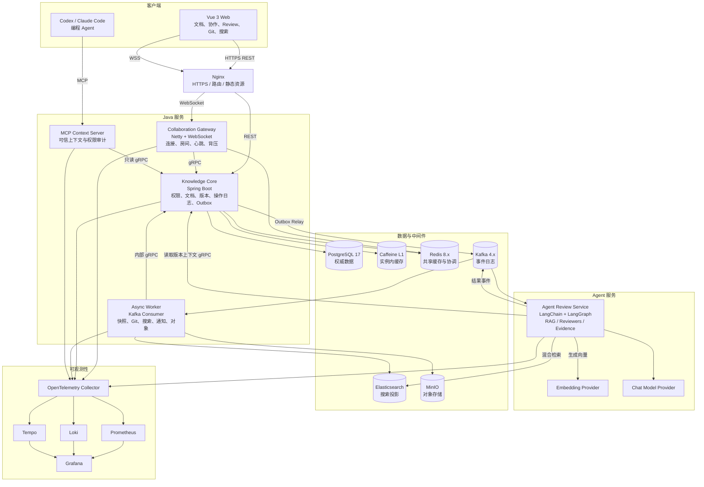
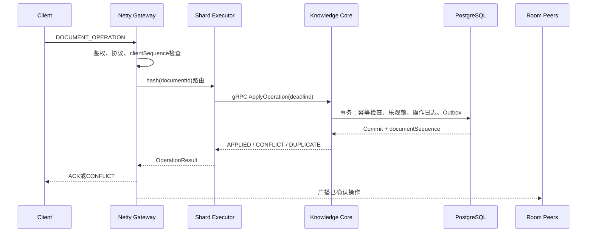
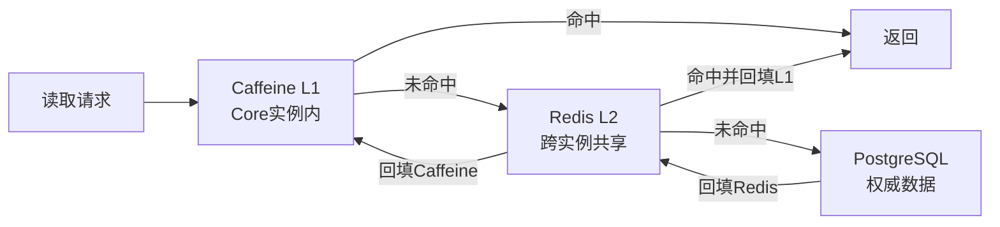
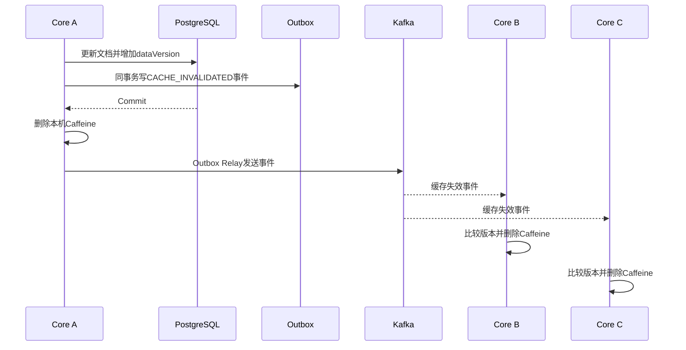
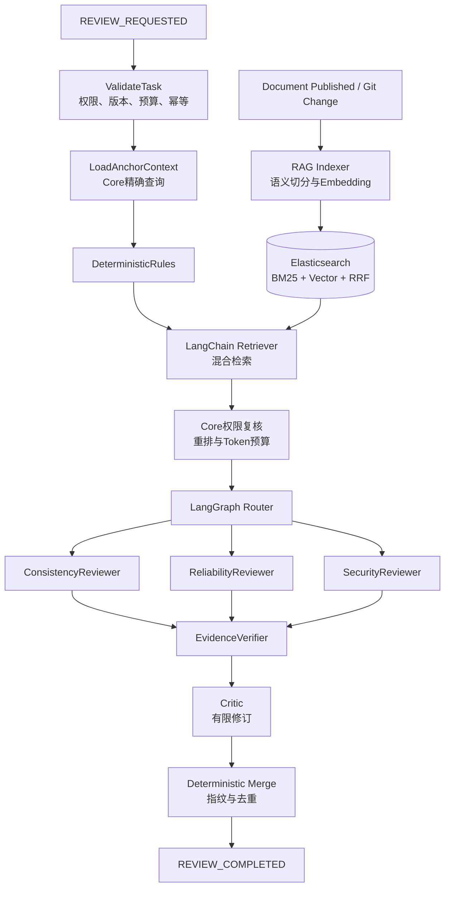

# 02 DevCollab 系统架构设计说明书

## 文档信息

| 项目 | 内容 |
|---|---|
| 系统名称 | DevCollab |
| 文档类型 | 系统架构设计说明书 |
| 文档版本 | V0.3 |
| 文档状态 | 设计基线，待评审 |
| 编制日期 | 2026-07-12 |
| 关联需求 | `01-devcollab-product-requirements-v0.1.md` |
| 架构范围 | Web、实时协作网关、知识核心服务、异步任务、Agent 审阅、MCP 上下文服务及数据基础设施 |

## 1. 项目介绍

### 1.1 系统概述

DevCollab 是面向 2～10 人软件开发团队的实时工程知识协作平台。系统围绕需求说明、架构设计、技术决策、接口契约、数据库设计、测试计划、压测报告和故障复盘等工程资产，提供统一的创建、协作、评审、发布、关联和追溯能力。

与以内容编写和知识分享为主的通用文档平台不同，DevCollab 将“当前有效版本”作为工程协作基线。已发布文档不可原地修改；代码变更、审阅问题、Agent 结论及 MCP 查询均引用明确的文档版本和证据对象，从而避免团队成员或编程 Agent 使用未经确认、已经过期或无权访问的工程信息。

系统由 Web 客户端、实时协作网关、知识核心服务、异步任务服务、Agent 审阅服务和 MCP 上下文服务构成。PostgreSQL 保存权威业务状态；Redis 和 Caffeine 提供受控缓存及协作协调；Kafka 承载可重放的异步事件；Elasticsearch 提供可重建的搜索投影；MinIO 保存附件、快照和报告。各组件按照同步确认、异步派生和只读上下文访问的职责边界协同工作。

### 1.2 核心能力

| 能力域 | 系统能力 | 架构价值 |
|---|---|---|
| 工程文档治理 | 文档类型、状态机、评审发布、不可变版本和历史恢复 | 建立可追溯的正式工程基线 |
| 实时协作 | Block 级并行编辑、乐观冲突、操作幂等和断线恢复 | 在实现复杂度可控的前提下保证协作结果一致 |
| 代码关联 | 文档或 Block 与代码路径、Commit、Pull Request 和 Diff 关联 | 识别代码变化对工程文档的影响 |
| 工程审阅 | 确定性规则、混合检索 RAG、受控 Reviewer、Evidence Verifier 和 Critic | 输出结构化、可验证、可处理的工程问题 |
| 可信上下文 | MCP 按身份、权限、版本和风险状态提供只读查询 | 为编程 Agent 提供受控的工程事实来源 |
| 运行治理 | 全链路追踪、指标、日志、压测和故障恢复 | 验证关键设计并支持问题定位 |

## 2. 立项背景与架构目标

### 2.1 立项背景

在小型软件团队的协作过程中，工程信息通常分散在即时通信、独立文档和代码仓库中。需求及技术决策缺少正式版本，接口或数据库结构变更后关联文档未及时更新，Pull Request 合并也无法证明测试、异常处理和性能验证已经完成。随着编程 Agent 进入开发流程，过期或未经批准的上下文还会进一步放大实现偏差。

DevCollab 致力于解决上述工程知识失真问题。系统将文档版本、代码变化、评审结论和风险证据纳入同一条可追溯链路，使团队能够判断哪一版设计当前有效、某次代码变化影响了哪些工程资料、现有方案仍有哪些未关闭风险，以及编程 Agent 可以安全读取哪些上下文。

### 2.2 架构目标

| 编号 | 目标 | 设计要求 |
|---|---|---|
| AG-01 | 权威状态明确 | 文档正文、版本、权限和审阅状态以 PostgreSQL 为最终事实来源 |
| AG-02 | 协作结果可靠 | 正式操作持久化后再确认和广播；重复、乱序与冲突具有明确处理结果 |
| AG-03 | 异步任务可恢复 | 事件不得永久丢失；重复投递不得产生重复业务效果；派生数据可重建 |
| AG-04 | Agent 结论可验证 | 正式问题必须绑定真实存在的版本、Block、代码差异或 ADR 证据 |
| AG-05 | 故障影响可隔离 | 搜索、缓存、消息消费或模型服务异常不得无边界扩散至核心编辑链路 |
| AG-06 | 权限边界一致 | HTTP、WebSocket、内部服务和 MCP 使用一致的工作空间及文档授权规则 |
| AG-07 | 系统行为可观测 | 关键同步与异步链路能够通过统一标识完成追踪、度量和故障定位 |

### 2.3 产品差异与架构驱动因素

DevCollab 的核心差异不在于增加另一套通用编辑器，而在于构建工程知识的有效性控制链路。系统必须能够确定当前生效版本，将代码变化映射到相关工程资料，对可靠性及一致性缺项执行规则和语义审阅，并向人类成员及编程 Agent 返回带权限、版本、漂移和风险状态的结果。

因此，版本不可变、证据稳定引用、代码—文档关联、同步与异步边界、消费者幂等、搜索可重建及 MCP 逐次授权属于架构级约束，不得作为普通功能实现细节省略。

### 2.4 系统边界

| 边界领域 | 本系统职责 | 非本系统职责及处理方式 |
|---|---|---|
| 内容协作 | 提供工程文档树、Block 级编辑、评论、评审和版本管理 | 不提供面向个人生活记录、内容发布或社区运营的能力 |
| 实时编辑 | 保证 Block 级操作确认、冲突检测、增量同步和恢复 | 不实现字符级 CRDT 或面向超大规模公共文档的协同算法 |
| 项目治理 | 关联需求、设计、代码变化、测试证据和审阅问题 | 不替代完整项目管理、工时、财务、OA 或商业计费系统 |
| 代码集成 | 通过受控 API 或 Webhook 获取仓库元数据及差异 | 不执行不受信任仓库代码，不代替 CI/CD，也不自动合并代码修改 |
| Agent 能力 | 读取受控上下文并生成带证据的审阅建议 | 不允许 Agent 绕过权限、直接修改已发布版本或执行高风险操作 |
| 数据一致性 | 在单部署区域内保证核心业务一致性和异步最终一致性 | 不提供多地域强一致写入能力 |
| 基础设施 | 集成成熟的数据库、缓存、消息、搜索和对象存储产品 | 不自研数据库、消息队列、搜索引擎、对象存储或向量数据库 |

具体功能范围、优先级和验收条件见 `01-devcollab-product-requirements-v0.1.md`。

---

## 3. 身份与授权模型

系统面向 2～10 人的软件项目团队，并以工作空间作为成员、文档、代码仓库及 Agent 配额的一级隔离边界。目标用户细分和角色使用场景见产品需求文档。

### 3.1 工作空间角色

| 角色 | 核心能力 |
|---|---|
| ADMIN | 管理空间、成员、仓库、规则、文档、模板、审阅流程和 Agent 配额 |
| MEMBER | 创建和编辑文档、评论、提交评审 |

无权用户不作为角色入库，而是没有目标工作空间成员关系；所有工作空间、文档、Block、实时协作和 MCP 上下文访问必须先通过成员关系校验。

### 3.2 文档权限

| 权限 | 允许操作 |
|---|---|
| READ | 读取文档元数据及有权访问的版本内容 |
| COMMENT | 创建和处理评论 |
| EDIT | 修改草稿及 Block，不得原地修改已发布版本 |
| REVIEW | 处理审阅问题及评审结论 |
| MANAGE | 管理文档授权、归档、废弃及其他高风险操作 |

最终权限由工作空间角色、文档级授权、分享授权和文档状态共同计算。Core 是授权判定的权威服务，其他入口不得自行实现不一致的权限规则。

---

## 4. 核心业务对象

### 4.1 工程文档类型

```text
Requirement       需求说明
Architecture      架构设计
ADR               技术决策记录
API Contract      接口契约
Database Schema   数据库设计
Test Plan         测试计划
Benchmark         压测报告
Postmortem        故障复盘
Release Note      发布说明
```

### 4.2 文档状态

```text
DRAFT
  ↓ 提交评审
IN_REVIEW
  ↓ 通过
PUBLISHED
  ↓ 新版本替代或主动废弃
SUPERSEDED / DEPRECATED
```

已发布版本不可原地修改。修改必须产生新草稿和新版本，从而保证 Git 关联、Agent Evidence 和 MCP 查询具有稳定引用。

### 4.3 工程关系

```text
Requirement
  └─ implemented_by → Module / Pull Request

Architecture
  └─ contains → Service / Cache / Message / Storage

ADR
  └─ affects → Service / Directory / API / Table

API Contract
  └─ implemented_by → Controller / Handler / DTO

Database Schema
  └─ implemented_by → Entity / Mapper / Migration

Test Plan
  └─ verifies → Requirement / API / Module

Pull Request
  ├─ changes → Code Path
  └─ affects → Document / Block / API / Table
```

### 4.4 核心领域对象

| 对象 | 说明 |
|---|---|
| Workspace | 团队与项目空间 |
| WorkspaceMember | 成员、角色和状态 |
| Document | 工程文档元数据 |
| DocumentBlock | 可独立编辑和冲突检测的内容块 |
| DocumentOperation | 一次正式协作操作 |
| DocumentSnapshot | 指定 documentSequence 的恢复快照 |
| DocumentVersion | 可评审、发布和引用的文档版本 |
| ReviewIssue | 人工或 Agent 生成的审阅问题 |
| ReviewEvidence | Issue 对应的 Block、Diff、ADR 或事件证据 |
| GitChange | Commit、PR 和文件差异 |
| CodeDocumentBinding | 代码路径与文档或 Block 的关联 |
| AgentWorkflow | 一次可追踪 Agent 审阅流程 |
| AgentArtifact | Agent 中间产物与最终产物 |
| OutboxEvent | 与业务事务一起提交的待发送事件 |
| ConsumerInbox | 消费端幂等记录 |
| StoredObject | MinIO 对象元数据和引用关系 |

---

## 5. 业务能力与架构关系

本节仅说明影响系统边界和数据流的业务能力。完整功能需求、优先级及验收标准见 `01-devcollab-product-requirements-v0.1.md`。

| 能力域 | 核心处理 | 主要架构责任 |
|---|---|---|
| 身份与工作空间 | 用户会话、成员生命周期、角色和文档授权 | Knowledge Core 统一计算权限；WebSocket 与 MCP 复用同一授权结果；高风险操作写入审计 |
| 工程文档 | 文档树、Block 操作、文档类型、状态和不可变版本 | PostgreSQL 保存正文及版本；对象存储保存二进制附件；发布事件驱动搜索及后续审阅 |
| 实时协作 | 房间、Presence、操作确认、冲突检测、重试和恢复 | Gateway 管理连接与背压；Core 完成幂等、乐观锁及正式序列分配；快照与增量共同承担恢复 |
| 评论与评审 | 评论、Review Issue、评审指派、发布和废弃 | Issue 与明确版本或 Block 绑定；状态变更纳入事务、事件和审计链路 |
| 代码—文档关联 | 仓库同步、路径绑定、Diff 解析和漂移识别 | Worker 异步同步代码变化；规则及 Agent 生成带代码和文档证据的漂移问题 |
| Agent 工程审阅 | 上下文构建、确定性检查、语义审阅、证据验证和结果合并 | Agent Service 锁定输入版本；模型调用与核心线程隔离；正式结论经 Evidence Verifier 和 Critic 约束 |
| 工程完成度 | 检查必要文档、关联 PR、测试证据和开放风险 | 确定性规则计算完成状态；Agent 仅补充语义风险，不替代事实判断 |
| 搜索与对象 | 授权搜索、附件、快照、导出和报告 | Elasticsearch 为可重建投影；MinIO 保存对象；PostgreSQL 保存对象元数据及引用 |
| MCP 上下文 | 查询有效 API、数据库设计、ADR、关联文档和开放问题 | MCP Server 逐次认证授权，经 Core 只读查询，不直接访问数据库 |

### 5.1 代码—文档漂移处理链路

```text
同步 Commit 或 Pull Request Diff
→ 识别变化文件及工程对象
→ 查询代码路径关联的文档或 Block
→ 执行可确定的结构规则
→ 按需触发 Agent 语义审阅
→ 验证文档、代码和 ADR 证据
→ 创建 DOC_DRIFT Review Issue
→ 负责人处理并关联修复版本
```

### 5.2 MCP 上下文输出约束

MCP 对外提供已批准文档搜索、当前有效接口契约、数据库设计、架构决策、代码路径关联、版本比较及开放问题查询。所有结果必须包含稳定的对象及版本标识，并明确文档状态、漂移状态、未解决风险和废弃标识。工具仅返回调用主体有权访问的内容，且不得提供绕过 Core 权限模型的底层数据访问能力。

---

## 6. 架构原则

1. PostgreSQL 是核心业务和文档状态的权威数据源；
2. Caffeine 和 Redis 只加速读取或保存短期协调状态；
3. Kafka 不进入实时编辑确认主链路；
4. WebSocket 操作必须先由 Core Service 确认持久化，再对房间广播；
5. 数据库事务和 Kafka 通过 Transactional Outbox 协调；
6. Kafka 采用 At-Least-Once，消费者通过 Inbox 和业务约束实现 Exactly-Once Effect；
7. Elasticsearch 是可重建的搜索投影，不是权威数据源；
8. MinIO 保存二进制对象，数据库只保存元数据；
9. Agent 不能直接修改已发布设计和核心数据库；
10. Agent 结论必须绑定 Evidence；
11. MCP 不直连数据库，通过 Core Service 的只读接口访问；
12. 所有缓存必须有容量边界、TTL、主动失效和监控；
13. 所有性能结论必须来自压测；
14. 所有核心技术必须至少具有一个故障实验和恢复验证。

---

## 7. 总体系统架构图



---

## 8. 服务边界与职责

### 8.1 Collaboration Gateway

技术：Java 21、Netty、WebSocket、Protobuf、gRPC、Redis、OpenTelemetry。

职责：

- WebSocket 握手和 JWT 鉴权；
- 连接、会话和房间管理；
- 心跳与失活检测；
- 操作协议解析；
- 客户端序列检查；
- 每连接有界发送队列；
- Presence 和光标广播；
- 基于 documentId 的分片执行；
- gRPC 调用 Core 提交正式操作；
- 只广播 Core 已确认的操作；
- 慢客户端降级和断开；
- Gateway 节点路由与故障接管。

Gateway 不直接写 PostgreSQL，也不直接决定最终 documentSequence。

### 8.2 Knowledge Core

技术：Java 21、Spring Boot、Spring Security、Spring AOP、Spring Transaction、MyBatis-Plus、PostgreSQL、Caffeine、Redis、Kafka、gRPC。

职责：

- 用户、工作空间和成员；
- RBAC 和文档权限；
- 文档、Block、评论和版本；
- 操作幂等与乐观锁；
- documentSequence；
- 操作日志和快照元数据；
- Review Issue；
- Git 关联和漂移状态；
- 工程进度规则；
- Outbox；
- Caffeine、Redis、PostgreSQL 多级读取；
- 内部 gRPC 命令与查询接口。

Core 是业务状态权威来源。

### 8.3 Async Worker

技术：Spring Boot、Kafka、PostgreSQL、Redis、Elasticsearch、MinIO、HTTP/Git API、gRPC。

职责：

- Outbox Relay；
- 文档快照；
-审计投影；
- Elasticsearch 索引；
- MinIO 对象处理；
- Git Commit、PR 和 Diff 同步；
- 漂移检测任务；
- 通知；
- DLQ 和失败重试；
- 重放与重建工具。

### 8.4 Agent Review Service

技术：Python、FastAPI、Pydantic、LangChain、LangGraph、gRPC、Kafka、Elasticsearch、httpx、Embedding Provider 和 Chat Model Provider。

Agent Review Service 是后置建设的工程审阅服务，由 RAG Indexer 和 Review Runtime 两类运行单元组成。RAG Indexer 消费文档发布及 Git 变更事件，从 Core 读取不可变版本，按工程对象语义切分并生成 Embedding，在 Elasticsearch 中维护支持 BM25 与向量检索的可重建知识索引。Review Runtime 使用 LangGraph 编排规则、检索、Reviewer、Evidence Verifier、Critic 和结果合并节点。

服务必须优先通过 Core 获取目标版本、API、Schema、ADR 和 Diff 等精确事实，再使用混合 RAG 检索相关章节及历史风险。Elasticsearch 中的权限元数据只用于候选过滤，任何内容进入模型上下文前仍须由 Core 完成最终授权复核。模型、检索或 Embedding 服务不可用时，核心文档链路保持可用，审阅任务降级为确定性规则结果或明确失败。

Agent Service 不直接修改 Core 业务表。工作流 Checkpoint 和中间 Artifact 使用独立的 `agent_runtime` Schema；正式 Review Issue 通过受控接口或事件写入。详细的入库、切分、检索、状态图、Tool、Evidence、安全和评测设计见 `07-devcollab-agent-rag-architecture-v0.1.md`。

### 8.5 MCP Context Server

技术：Java、MCP SDK、gRPC、JWT/OAuth、OpenTelemetry。

职责：

- MCP 生命周期和工具发现；
- 当前用户认证；
- 工具级授权；
- 只读调用 Core；
- 返回当前生效文档和风险；
- MCP 调用审计；
- 限流、超时和错误映射。

---

## 9. 通信协议与边界

| 调用方 | 被调用方 | 协议 | 原因 |
|---|---|---|---|
| Web | Core | HTTP/JSON | 面向浏览器、调试方便、适合普通 CRUD |
| Web | Gateway | WebSocket/Protobuf | 双向实时协作和增量操作 |
| Gateway | Core | gRPC/Protobuf | 内部强契约、长连接复用、Deadline 和 Metadata |
| Worker | Core | gRPC | 内部写入派生结果和读取业务上下文 |
| Agent | Core | gRPC | 获取指定版本的结构化上下文 |
| Core/Worker/Agent | Kafka | Kafka Protocol | 持久异步事件、广播、积压与重放 |
| Coding Agent | MCP Server | MCP | 标准化工具、资源和可信上下文 |
| Worker | Git 平台 | HTTPS API/Webhook | Commit、PR 和 Diff 集成 |
| Worker | Elasticsearch/MinIO | HTTP SDK | 搜索投影和对象存储 |

HTTP、gRPC、Kafka 和 MCP 不互相替代：

```text
HTTP：外部请求和普通管理接口
WebSocket：实时双向协作
gRPC：内部同步服务调用
Kafka：持久异步事件
MCP：Agent调用受控业务工具
```

---

## 10. 实时协作协议与处理链路

### 10.1 操作协议

```json
{
  "messageType": "DOCUMENT_OPERATION",
  "operationId": "client-a-1008",
  "documentId": "doc-100",
  "clientId": "client-a",
  "clientSequence": 53,
  "operationType": "UPDATE_BLOCK",
  "blockId": "block-101",
  "expectedBlockVersion": 8,
  "payload": {
    "content": "修改后的内容"
  }
}
```

核心字段：

- operationId：客户端重试的业务幂等键；
- clientSequence：发现单客户端消息缺失和乱序；
- documentSequence：同一文档的正式全局操作顺序；
- expectedBlockVersion：检测同 Block 并发覆盖；
- operationType：INSERT、UPDATE、DELETE、MOVE；
- payload：不同操作的结构化内容。

### 10.2 正式操作链路



### 10.3 同文档有序处理

```text
shardIndex = hash(documentId) % shardCount
```

每个分片使用单线程、有界队列：

- 同一文档操作串行；
- 不同文档并行；
- 不为每篇文档创建线程；
- 不为每次操作使用分布式锁；
- 队列满时产生明确背压；
- 热门文档可以迁移至独立分片。

### 10.4 断线恢复

客户端保存 lastConfirmedDocumentSequence：

```text
近期缺失较少：Redis recent-ops或PostgreSQL增量返回
落后过久：最新快照 + 快照后的操作增量
```

Redis 丢失不会导致正文和操作历史丢失。

---

## 11. PostgreSQL 数据架构

### 11.1 选择 PostgreSQL 的理由

DevCollab 的数据同时包含：

- 强关系业务数据；
- Block 和 Agent Artifact 半结构化数据；
- 文档树和工程对象关系；
- Review Issue 状态查询；
- 全文搜索基线；
- 操作日志、版本和 Outbox。

PostgreSQL 适合通过普通关系列保存稳定字段，通过 JSONB 保存 Block Payload 和 Agent Artifact 内容，并使用 B-Tree、GIN、表达式索引和部分索引支持不同查询。

### 11.2 关系建模原则

必须关系化：

- 用户、工作空间、成员和权限；
- 文档和版本；
- Block标识、顺序和版本；
- 操作日志；
- Review Issue状态；
- Evidence引用；
- Git关系；
- Outbox与Inbox；
-对象元数据。

适合JSONB：

- 不同Block的特有属性；
- Agent Artifact内容；
- Git提取结果的扩展字段；
- 规则执行详情；
- 压测报告结构化摘要。

不能将整个Document作为单个JSONB保存，否则会放大并发冲突、难以关联评论和证据，并破坏Block级乐观锁。

### 11.3 核心表

```text
app_user
user_session
workspace
workspace_member
document
document_block
document_comment
document_operation
document_snapshot
document_version
review_issue
review_evidence
git_repository_binding
git_change
code_document_binding
agent_workflow
agent_artifact
stored_object
outbox_event
consumer_inbox
```

### 11.4 关键约束

```sql
UNIQUE(operation_id)
UNIQUE(document_id, document_sequence)
UNIQUE(document_id, block_id)
UNIQUE(consumer_name, event_id)
UNIQUE(document_version_id, issue_fingerprint)
UNIQUE(workspace_id, normalized_name)
```

### 11.5 乐观锁

```sql
UPDATE document_block
SET payload = ?,
    version = version + 1,
    updated_at = NOW()
WHERE document_id = ?
  AND block_id = ?
  AND version = ?;
```

影响行数为0表示版本冲突，服务端返回实际版本和最新内容，不静默覆盖。

---

## 12. Caffeine、Redis、PostgreSQL 多级缓存

### 12.1 总体结构



### 12.2 Caffeine 的业务作用

Caffeine 减少每次热点读取都访问Redis产生的网络开销，并为下列只读或版本化数据提供实例内低延迟访问：

- 工程文档Schema；
- 已发布文档版本；
- 文档元数据；
- 工作空间非敏感配置；
- 已批准ADR摘要；
- MCP和Agent重复加载的不可变版本上下文。

### 12.3 不进入Caffeine的数据

- 实时草稿和Block正文；
- document_operation；
- Presence；
- Review Issue实时状态；
- Outbox、Inbox和Kafka Offset；
- Git Token；
- Agent运行状态；
- Agent配额计数；
- 高风险权限撤销结果。

### 12.4 命名缓存

| Cache | Key | 特性 |
|---|---|---|
| document-schema | type:schemaVersion | 小、稳定、长TTL |
| published-document | documentId:version | 不可变、按重量限制 |
| document-meta | documentId | 短TTL、主动失效 |
| approved-adr | adrId:version | 不可变、按重量限制 |
| workspace-settings | workspaceId:configVersion | 版本化、主动失效 |

### 12.5 Caffeine配置要求

- maximumSize或maximumWeight；
- 自定义Weigher限制大文档占用；
- expireAfterWrite/expireAfterAccess；
- recordStats；
- removalListener；
- 独立加载线程池；
- 加载超时；
- AsyncLoadingCache或Single-Flight回源；
- 禁止无限缓存；
- 禁止将异常结果长期缓存。

### 12.6 Single-Flight防击穿

同一Key失效后，1000个请求同时访问：

```text
第一个请求创建加载Future
其他请求复用同一个Future
只有一个请求访问Redis或PostgreSQL
加载完成后统一返回并回填缓存
```

### 12.7 多节点缓存失效



Redis旧Key同步删除或使用版本化Key自然淘汰。Kafka负责可靠传播，TTL负责Kafka延迟或故障时兜底。

权限撤销等安全敏感操作不只依赖异步失效，关键写操作必须读取当前权限版本或直接校验Redis/PostgreSQL。

### 12.8 缓存监控

```text
cache_requests_total
cache_hit_total
cache_miss_total
cache_load_duration
cache_load_failure_total
cache_eviction_total
cache_estimated_size
cache_weight
cache_invalidation_lag
```

### 12.9 验证要求

缓存层必须验证分层读取收益、热点 Key 击穿、多节点失效延迟、Redis 故障降级及本地缓存容量对 JVM 的影响。具体场景、观测项和通过条件见 `03-devcollab-architecture-verification-v0.1.md`。

---

## 13. Redis 设计

Redis 不保存唯一文档正文。

```text
presence:{documentId}        在线成员
room-route:{documentId}      文档所在Gateway节点
session-route:{userId}       用户连接节点
recent-ops:{documentId}      近期操作缓存
dedup:{operationId}          短期幂等结果
rate-limit:{userId}          操作限流
login-limit:{identity}       登录限流
agent-quota:{workspaceId}    Agent额度
acl-version:{workspaceId}    权限版本
```

Redis 的数据结构及可靠性要求如下：

| 能力 | 设计方式 | 约束 |
|---|---|---|
| Presence 与路由 | Hash、Set、租约及 TTL | 状态允许短暂最终一致，不得作为正文事实来源 |
| 限流与配额 | String、计数器及 Lua 原子脚本 | 所有 Key 必须设置作用域和过期策略 |
| 近期操作与短期去重 | 有界列表或版本化 Key | 仅承担加速和短期协调，丢失后可从 PostgreSQL 恢复 |
| 共享二级缓存 | 版本化 Key、TTL 和主动删除 | 失效延迟必须受监控，安全敏感权限不得只依赖异步缓存 |
| 多节点本地缓存协调 | Kafka 失效事件与 Redis 版本辅助 | 重复失效必须幂等，消息延迟由版本和 TTL 兜底 |

Redis 超时、热点、穿透、击穿、TTL 失效及正文恢复的验证方法见 `03-devcollab-architecture-verification-v0.1.md`。

---

## 14. Kafka、Outbox与异步事件

### 14.1 Kafka职责

Kafka用于持久化、分区、有序、可积压和可重放的异步事件，不用于实时协作ACK。

### 14.2 Topics

```text
devcollab.document.events
devcollab.cache.events
devcollab.git.events
devcollab.review.events
devcollab.agent.events
devcollab.notification.events
devcollab.dead-letter
```

### 14.3 事件类型

```text
DOCUMENT_OPERATION_APPLIED
DOCUMENT_VERSION_PUBLISHED
DOCUMENT_DELETED
CACHE_INVALIDATED
SNAPSHOT_REQUESTED
REVIEW_REQUESTED
REVIEW_COMPLETED
REVIEW_FAILED
GIT_CHANGE_SYNCED
DOC_DRIFT_DETECTED
SEARCH_REINDEX_REQUESTED
ATTACHMENT_UPLOADED
NOTIFICATION_REQUESTED
```

消息Key主要使用documentId；仓库级事件使用repositoryId；工作空间通知可以使用workspaceId。

### 14.4 Transactional Outbox

```text
PostgreSQL事务：
1. 修改文档或创建版本
2. 写outbox_event
3. Commit

Relay：
4. 锁定待发送Outbox
5. 发送Kafka
6. 标记已发送
```

Relay可能重复发送，但不能永久丢失。

### 14.5 Consumer Inbox

消费者在写派生结果前记录：

```text
UNIQUE(consumer_name, event_id)
```

处理成功与Inbox状态在同一事务提交。重复消息返回幂等成功。

### 14.6 消费失败

- 可恢复异常：指数退避重试；
- 业务无效消息：记录失败并进入DLQ；
- 毒消息：隔离，不阻塞整个Partition；
- 消费积压：监控Lag并扩展消费者；
- 修复Bug后：按Offset或事件重放工具重新处理。

---

## 15. gRPC设计

### 15.1 服务

```text
DocumentOperationService
DocumentQueryService
ReviewResultService
AgentContextService
PermissionQueryService
```

### 15.2 统一要求

- Protobuf契约；
- Deadline；
- 连接复用；
- 最大消息尺寸；
- Trace Metadata；
- 用户与Workspace Metadata；
- 错误码映射；
-重试边界；
-熔断和降级；
-幂等请求标识。

非幂等写请求在结果未知时不能无条件自动重试。查询和显式幂等命令可以在Deadline预算内受控重试。

---

## 16. Agent RAG 架构总览

Agent 架构由知识入库、混合检索和受控审阅工作流三部分组成。系统不采用模型自由规划全部步骤的开放式 Agent，也不以 Reviewer 数量作为能力指标。每个模型节点均位于确定性状态图中，输入、Tool、输出 Schema、重试次数和成本预算均受服务端约束。



### 16.1 知识与检索边界

| 层次 | 处理方式 | 约束 |
|---|---|---|
| 锚点事实 | Core gRPC 精确读取目标版本、API、Schema、ADR、Diff 和开放 Issue | 不使用向量相似度推断明确 ID 对象 |
| 相关知识 | Elasticsearch 执行 BM25、向量检索及 RRF 融合 | 默认仅当前有效版本；草稿只进入任务专用上下文 |
| 权限 | 索引元数据预过滤，Core 在模型调用前最终复核 | ACL 索引延迟不得造成内容泄漏 |
| Context Pack | 去重、重排、Token 预算并保存稳定 Evidence ID | 可回放每个 Chunk 的来源、版本和检索方式 |

### 16.2 工作流边界

LangChain 负责模型、Embedding、Retriever、Tool 和结构化输出适配；LangGraph 负责 State、Node、Edge、并行 Worker、Checkpoint 和有限循环。确定性节点负责权限、版本、规则、Evidence、Issue 指纹和持久化，模型节点只生成检索计划或候选审阅结论。

Reviewer 共享经过授权的 Context Pack，并按 Review Profile 动态分派。一致性、可靠性和安全 Reviewer 可以并行，但不直接创建正式 Issue。候选结论必须依次通过 Pydantic Schema、Evidence Verifier、Critic 和确定性去重，才能写入业务系统。

### 16.3 实施顺序

```text
确定性规则
→ RAG入库与检索评测
→ 单Reviewer验证增益
→ 多Reviewer按需并行
→ Critic、人工反馈与持续评测
```

Agent 开发必须晚于文档版本、权限、Git 同步和搜索索引。若单 Reviewer 相比规则版没有可测量增益，或检索权限泄漏不为零，不进入多 Reviewer 阶段。详细设计与验收指标见 `07-devcollab-agent-rag-architecture-v0.1.md`。

---

## 17. Elasticsearch与MinIO

### 17.1 Elasticsearch

Elasticsearch 同时承担用户全文搜索投影和 Agent RAG 检索投影。索引包含已发布文档、标题、正文、代码块、标签、文档类型、状态、Review Issue 摘要，以及经语义切分的知识 Chunk。普通文本字段支持 BM25 和精确工程标识符检索，`semantic_text` 或 `dense_vector` 字段支持语义检索，RRF 用于融合不同检索结果。

Kafka 消费者幂等维护索引；文档删除、废弃和版本替代通过 Tombstone 或显式状态事件处理。Embedding 模型及版本写入 Chunk 元数据，模型变更时建立新索引并通过 Alias 切换，不在同一向量字段中混用不同 Embedding 空间。

Elasticsearch不可用时：

- 文档编辑和发布仍可用；
- 搜索降级为PostgreSQL基础查询；
-恢复后执行增量或全量重建。

### 17.2 MinIO

保存：

- 图片；
-附件；
-导出文件；
-大型快照；
-Agent报告；
-压测和故障证据。

PostgreSQL保存：

- objectKey；
- bucket；
- contentType；
- size；
- checksum；
- owner；
- workspaceId；
-引用对象；
-创建和删除状态。

---

## 18. 安全架构

| 安全域 | 控制措施 |
|---|---|
| 身份与会话 | Access Token 与 Refresh Token 分离；Refresh Session 可撤销；登录及敏感操作限流 |
| 服务入口 | HTTP、WebSocket 和 MCP 分别完成身份校验，内部调用传递可验证的用户及工作空间上下文 |
| 授权 | Workspace 与 Document 双层权限控制；正式操作重新校验关键权限；安全敏感撤权不只依赖异步缓存 |
| 内容与附件 | Markdown/HTML 执行 XSS 清理；分享链接设置有效期；附件限制类型、大小及访问范围 |
| 外部凭证 | Git Token 加密存储，不写入日志、审阅结果或 Agent 上下文 |
| Agent 隔离 | 不提供任意 SQL、系统命令或自动高风险操作；文档内容不得覆盖系统安全指令 |
| MCP 安全 | 工具逐次鉴权、只读访问、限流和审计，不允许绕过 Core 直连数据库 |
| 审计追踪 | 身份、对象、操作结果与 Trace ID 关联，敏感字段在日志和 Artifact 中脱敏 |

---

## 19. 可观测性与JVM

### 19.1 全链路

```text
WebSocket Operation
→ Netty Gateway
→ gRPC Core
→ PostgreSQL Operation Log
→ Outbox
→ Kafka
→ Agent Review
→ Review Issue
```

使用Trace ID、Document ID、Operation ID、Event ID和Workflow ID串联。

### 19.2 指标

```text
collab_active_connections
collab_operation_latency
collab_operation_conflicts
collab_duplicate_operations
collab_send_queue_size
collab_resume_latency
grpc_request_latency
grpc_error_total
cache_hit_rate
cache_load_latency
cache_invalidation_lag
kafka_consumer_lag
outbox_pending_total
agent_review_latency
agent_review_failure_rate
jvm_heap_usage
jvm_direct_memory
jvm_gc_pause
jvm_thread_count
```

### 19.3 运行时验证边界

架构验证覆盖 EventLoop 阻塞、慢客户端、直接内存泄漏、高频对象分配、本地缓存容量、线程池隔离、热文档分片及后台阻塞任务执行模型。JFR、GC 日志、线程及堆转储、Native Memory Tracking、Gatling、JMH 和监控指标作为主要证据来源。具体实验步骤与通过条件见 `03-devcollab-architecture-verification-v0.1.md`。

---

## 20. 技术基线

| 层级 | 技术基线 | 主要用途 |
|---|---|---|
| Web | Vue 3、TypeScript、Tiptap、Pinia、Element Plus、Protobuf JS | 文档编辑、状态管理、实时协议及管理界面 |
| Java 服务 | Java 21、Spring Boot 3.5.x、Spring Security、Netty、gRPC Java、Protobuf | 核心业务、实时连接、内部强契约和 MCP 服务 |
| 数据访问 | MyBatis-Plus、手写 MyBatis SQL、Flyway、HikariCP | 业务访问、复杂查询、模式迁移和连接池管理 |
| 缓存与可靠性 | Caffeine、Spring Data Redis/Lettuce、Resilience4j | 多级读取、共享协调、限流、熔断和降级 |
| 异步事件 | Spring for Apache Kafka、Kafka 4.x | Outbox 事件、异步派生、重放和消费者隔离 |
| 数据基础设施 | PostgreSQL 17、Redis 8.x、Elasticsearch、MinIO | 权威数据、缓存协调、搜索投影和对象存储 |
| Agent 服务 | Python 3.12、FastAPI、Pydantic v2、LangChain、LangGraph、gRPC Python、Kafka Client、Elasticsearch Client、httpx、Embedding/Chat Model Provider | RAG 入库与检索、受控状态图、结构化审阅、证据验证和模型访问 |
| 可观测性 | OpenTelemetry、Prometheus、Grafana、Loki、Tempo、JFR、GC 日志 | 指标、日志、Trace 及 JVM 诊断 |
| 测试 | JUnit 5、Testcontainers、Vitest、Playwright、Gatling、JMH | 单元、集成、端到端、压测和基准测试 |
| 交付 | Maven 多模块、Monorepo、Docker Compose、Nginx、Linux、HTTPS、GitHub Actions | 构建、集成、部署和持续验证 |

---
