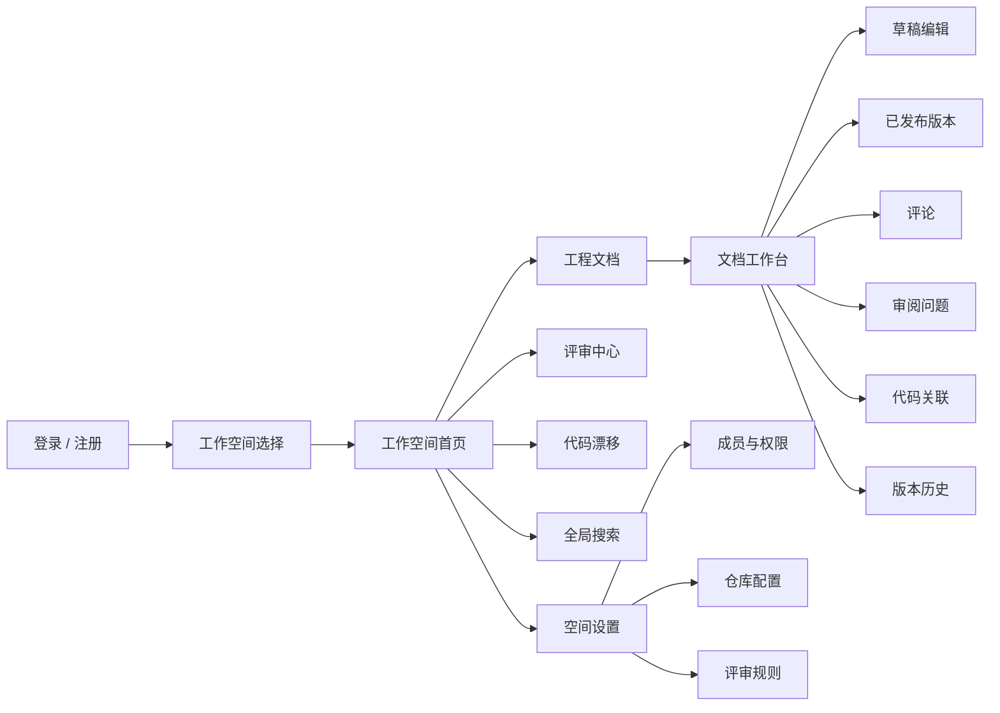
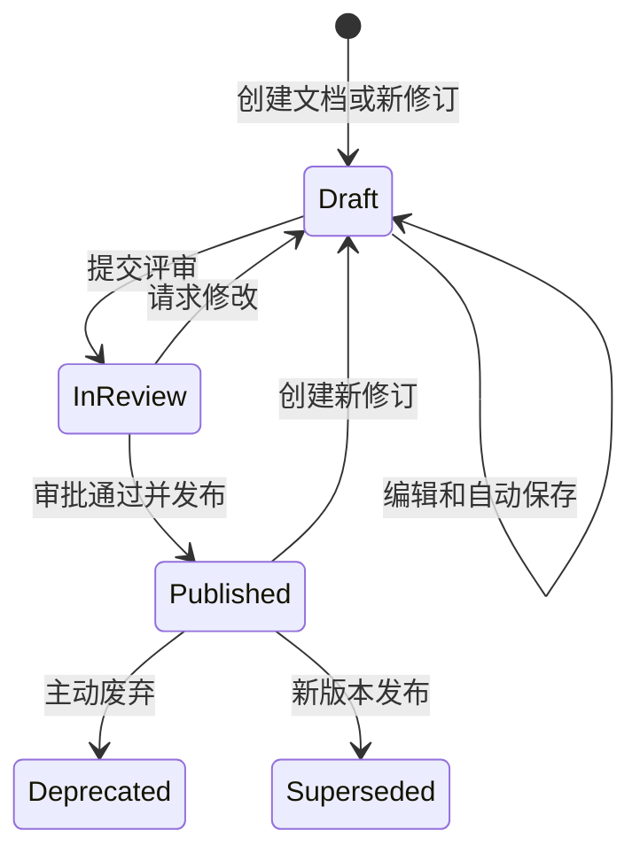
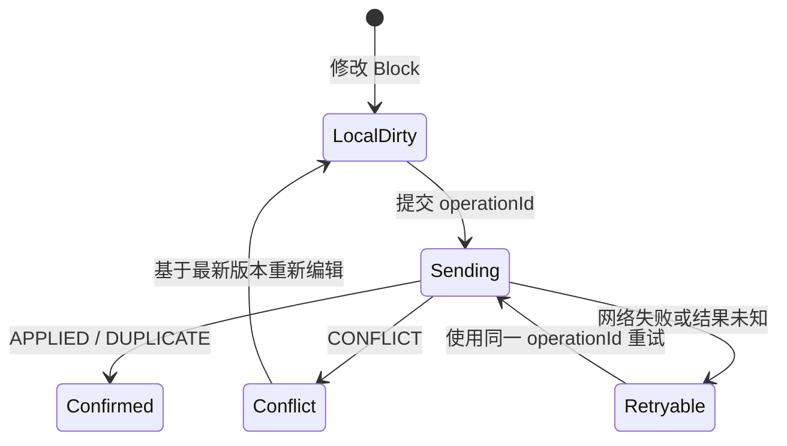
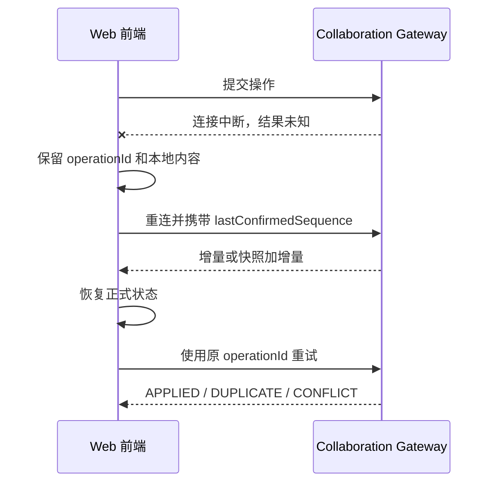
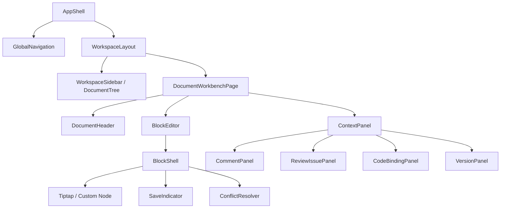

# DevCollab 前端产品与交互设计说明 V0.1

## 文档信息

| 项目 | 内容 |
|---|---|
| 文档类型 | 前端产品、信息架构与交互设计基线 |
| 文档状态 | 草案，待产品与技术评审 |
| 版本/日期 | V0.2 / 2026-07-12 |
| 需求基线 | `01-devcollab-product-requirements-v0.1.md` |
| 架构基线 | `02-devcollab-system-architecture-v0.3.md` |
| 相关决策 | `92-local-frontend-technology-adr-v0.1.md` |

本文定义前端的信息架构、页面职责、关键交互、状态表达以及由界面反推的接口能力；不定义数据库表，也不把页面按钮直接等同于通用 CRUD 接口。

## 1. 设计目标

DevCollab 前端应帮助 2～10 人的软件团队完成以下主闭环：

```text
找到工程文档 → 编辑并协作 → 提交评审 → 处理问题
→ 发布稳定版本 → 关联代码变化 → 持续确认文档仍然有效
```

界面必须持续回答：当前空间和文档是什么、正在看草稿还是发布版、哪个版本正式生效、是否存在冲突或风险、用户可以执行什么、操作是否已被服务端确认。

### 1.1 设计原则

| 原则 | 要求 |
|---|---|
| 状态优先 | 文档版本、保存、连接、权限和风险状态清晰可见 |
| 稳定引用 | 评论、Issue、代码关联和 Evidence 显示其绑定版本或 Block |
| 服务端确认 | 未确认操作不得表现为永久成功 |
| 渐进披露 | 默认展示当前任务信息，复杂证据按需展开 |
| 人机同轨 | 人工、规则、Agent Issue 走同一流程，但明确来源 |
| 桌面优先 | 优先高密度桌面工作台；MVP 不提供移动端完整编辑 |
| 可恢复 | 断线、冲突、权限变化后，用户理解现状并可继续工作 |
| 范围克制 | MVP 先完成文档—协作—评审—发布闭环 |

## 2. 用户任务与优先级

| 任务 | 角色 | 优先级 | 前端结果 |
|---|---|---:|---|
| 登录并进入工作空间 | 全部 | P0 | 进入最近空间或空间选择页 |
| 查找当前有效文档 | 全部 | P0 | 明确有效版本及状态 |
| 创建和组织工程文档 | OWNER/ADMIN/MEMBER | P0 | 文档树创建、移动、归档 |
| 编辑 Block 并自动保存 | OWNER/ADMIN/MEMBER | P0 | 展示编辑中、提交中、已确认、失败 |
| 多人协作和冲突处理 | OWNER/ADMIN/MEMBER | P0 | 不同 Block 并行，同 Block 不静默覆盖 |
| 评论、评审和发布 | 授权成员 | P0 | 有明确状态转换、校验和结果 |
| 集中处理待办 | Reviewer | P0 | 按负责人、状态和文档定位 |
| 处理代码漂移 | 工程成员 | P1 | 从变更进入受影响文档和证据 |
| Agent 工程审阅 | Reviewer | P1 | Agent 是 Reviewer，不是普通聊天窗口 |
| 搜索可信上下文 | 授权成员 | P1 | 结果带状态、版本和风险标记 |

## 3. 信息架构

### 3.1 一级结构示例图



### 3.2 应用外壳

- 全局栏：产品入口、空间切换、搜索、通知、个人菜单。
- 左侧栏：当前空间导航、文档树、最近访问。
- 主内容区：当前页面的主要任务。
- 上下文栏：评论、问题、代码关联和版本。

### 3.3 建议路由

| 路由 | 页面 | 权限 |
|---|---|---|
| `/login`、`/register` | 登录、注册 | 匿名 |
| `/workspaces` | 空间选择 | 已登录 |
| `/w/:workspaceId` | 空间首页 | Workspace READ |
| `/w/:workspaceId/docs/:documentId` | 文档工作台 | Document READ |
| `/w/:workspaceId/reviews` | 评审中心 | Workspace READ |
| `/w/:workspaceId/drifts` | 漂移中心 | Workspace READ，P1 |
| `/w/:workspaceId/search` | 搜索 | Workspace READ，P1 |
| `/w/:workspaceId/settings/members` | 成员管理 | Workspace MANAGE |
| `/w/:workspaceId/settings/repositories` | 仓库设置 | Workspace MANAGE，P1 |

路由只做页面定位和粗粒度进入控制。后端仍须对每次 REST、WebSocket 和 MCP 操作最终授权。

## 4. 文档工作台

### 4.1 可视化静态原型

[打开 DevCollab 文档工作台静态原型](assets/frontend-workbench-static-v0.1.html)

该原型替代字符框图作为页面布局基线，直观展示全局导航、文档树、草稿与发布版状态、Block 编辑区、在线成员、Review Issue 和 Evidence。右侧评论、问题、关联和版本页签可在本地点击切换；所有数据均为设计示例，不代表功能已实现。

### 4.2 区域职责

| 区域 | 设计要求 |
|---|---|
| 顶部文档栏 | 路径、标题、类型、草稿/发布版、保存、连接、在线成员和主操作 |
| 文档树 | 多级组织、最近访问、新建、移动和归档；可折叠 |
| 编辑区 | 保证正文宽度；Block 有稳定边界、状态和操作入口 |
| 上下文栏 | 评论、Issue、代码关联、版本四个稳定页签；可折叠 |

必须明确显示：

```text
正在编辑：草稿 V4
当前生效：已发布 V3
```

### 4.3 Block 设计

MVP 支持 Heading、Paragraph、Code、Quote、Todo、Table、Diagram。每个 Block 具备稳定 `blockId`、类型、Payload、`blockVersion`、操作入口及本地/服务端确认状态。

选中 Block 时，上下文栏显示局部评论、Issue、Evidence 和关联；未选中时显示文档级信息。

### 4.4 布局与响应式

- 设计基线 1280px 及以上，最小可用宽度 1024px。
- 1024px 时右栏默认折叠为抽屉。
- 小于 1024px 允许阅读、评论和处理 Issue，不承诺完整编辑。
- 正文采用最大可读宽度，避免超宽屏铺满。

## 5. 页面设计

### 5.1 登录和注册

必要状态：初始、提交中、字段错误、凭证错误、账户禁用、限流、登录成功、会话过期。接口必须返回稳定错误码，前端不得通过文案猜测失败原因。

### 5.2 空间首页

只展示最近文档、待我评审、分配给我的 Issue、P1 漂移、最近发布和新建入口。不展示没有定义口径的团队效率分或健康分。

### 5.3 评审中心

三个稳定视图：待我评审、分配给我、我发起的。支持状态、文档类型、严重度、负责人和来源筛选。列表显示文档、版本、状态、提交人、评审人、开放问题数和更新时间。

### 5.4 代码漂移中心（P1）

按“变更来源 → 变化文件 → 受影响文档 → 漂移原因 → Evidence → 处理状态”组织。用户可查看 Diff 摘要、打开受影响 Block、确认需更新、判定无影响、创建修订草稿和关闭问题。

### 5.5 Agent 审阅（P1）

Agent 作为 Review Issue 的生产流程，不设计成通用聊天。任务页展示锁定版本、步骤、规则/模型结果、Evidence 验证、最终 Issue、失败或降级原因、模型和用量摘要。模型不可用时明确显示“已降级为规则审阅”。

### 5.6 搜索（P1）

结果显示命中摘要、文档类型、状态、版本、更新时间和风险标记。默认优先已发布有效内容；草稿、被替代和废弃内容必须明显标记。

### 5.7 成员和设置

成员管理支持邀请、调角色、禁用和移除。高风险操作二次确认。仓库 Token 只显示配置状态、掩码或更新时间，不允许前端读取完整密钥。

## 6. 关键交互

### 6.1 草稿—评审—发布



发布确认页至少展示目标版本、审批结果、阻断问题、未处理漂移和变更摘要。

### 6.2 协作操作状态



保存文案统一为“正在编辑、正在保存、已保存、保存失败可重试、存在冲突需处理”。

### 6.3 冲突处理示例图

```text
┌────────────────────────── 此 Block 已被其他成员修改 ──────────────────────────┐
│ 你的未保存内容                         服务端最新内容                         │
│ ┌────────────────────────────┐         ┌────────────────────────────┐         │
│ │ 请求必须包含 requestId。   │         │ 请求包含 idempotencyKey。 │         │
│ │ 超时后客户端可以重试。     │         │ 重复请求返回原结果。       │         │
│ └────────────────────────────┘         └────────────────────────────┘         │
│ [复制我的内容]                [使用服务端版本] [基于最新版本重新编辑]          │
└───────────────────────────────────────────────────────────────────────────────┘
```

MVP 不自动合并文本；保留本地内容供复制，并要求基于服务端最新版本重新编辑。

### 6.4 断线恢复



## 7. 组件与目录设计



```text
frontend/src/
├─ app/                 应用入口、Router、全局 Provider
├─ pages/               路由页面
├─ features/            文档、评审、协作、搜索等业务能力
├─ entities/            Document、Block、Issue 等领域模型和组件
├─ shared/
│  ├─ api/              REST 客户端和错误映射
│  ├─ realtime/         WebSocket、Protobuf 和重连
│  ├─ ui/               基础 UI 封装
│  ├─ styles/           设计令牌和全局样式
│  └─ lib/              无业务依赖工具
└─ generated/           OpenAPI / Protobuf 生成代码
```

`pages` 不编写底层协议，`shared` 不引用具体业务，Feature 不随意访问其他 Feature 内部 Store。

## 8. 状态管理

| 状态类型 | 示例 | 管理方式 |
|---|---|---|
| 身份和应用状态 | 当前用户、空间、权限摘要 | Pinia |
| 服务端业务状态 | 文档、版本、Issue、成员 | API 查询层和页面缓存 |
| 实时状态 | 连接、sequence、Presence、待确认操作 | Realtime Service + 专用 Store |
| 编辑器局部状态 | 选中 Block、浮动菜单、临时输入 | 组件/Composable |
| URL 状态 | documentId、页签、筛选 | Vue Router |
| 界面偏好 | 栏宽、折叠状态 | 受控 localStorage |

不得把令牌、仓库 Token、无限操作日志或完整敏感正文写入 localStorage。

## 9. Tiptap 与 Block 映射

这是前端冻结保存接口前必须验证的最高风险点。

```text
业务 Document                 Tiptap Document
└─ Block[]                    └─ 顶层 Node[]
   ├─ blockId                    ├─ attrs.blockId
   ├─ blockType                  ├─ node.type
   ├─ blockVersion               └─ node.content / attrs
   └─ payload
```

要求：顶层 Node 保持稳定 `blockId`；事务可识别增删改移；远程更新不触发回发循环；复杂表格/图表仍属于一个 Block；版本和 Diff 使用规范化 Payload；不启用与服务端乐观锁冲突的字符级协作扩展。

原型验收：

1. 100 个混合 Block 可打开、编辑和销毁。
2. 准确识别一次事务影响的业务 Block。
3. 远程更新指定 Block 不回发重复操作。
4. Block 移动后 `blockId` 不变。
5. Table、Code、Diagram 可稳定序列化与恢复。
6. 冲突后可替换为服务端最新内容并继续编辑。

## 10. 从页面反推接口能力

| 页面动作 | 所需能力 | 必须返回 |
|---|---|---|
| 进入空间 | 获取身份和导航摘要 | workspace、role、permissions、recentItems |
| 打开文档 | 获取元数据、目标版本和 Block | status、activeVersion、draftVersion、blocks、permissions |
| 编辑 Block | 幂等应用操作 | operationId、result、documentSequence、blockVersion、conflictData |
| 断线恢复 | 按确认序列恢复 | snapshot/operations、latestSequence |
| 提交评审 | 业务命令 | reviewId、version、reviewers、validationIssues |
| 发布版本 | 发布命令 | publishedVersion、previousVersion、blockingIssues |
| 处理 Issue | 状态迁移 | previousStatus、currentStatus、operator、updatedAt |
| 首页摘要 | 当前用户工作摘要 | recentDocs、assignedReviews、issues、drifts |
| Agent 审阅 | 创建锁定版本任务 | workflowId、lockedContext、status、quotaResult |

REST 统一稳定错误码、可展示消息、Trace ID、字段错误、分页、ISO 8601 时间；ID 在 TypeScript 中按字符串处理。权限不足、对象不存在、版本冲突必须区分。

WebSocket 至少支持 `CONNECTION_READY`、`PRESENCE_CHANGED`、`DOCUMENT_OPERATION_RESULT`、`DOCUMENT_OPERATION_BROADCAST`、`DOCUMENT_RESUME_RESULT`、`PERMISSION_REVOKED`、`SERVER_DRAINING`、`ERROR`。操作结果穷举为 `APPLIED`、`DUPLICATE`、`CONFLICT`、`REJECTED`。

## 11. 状态、可访问性和安全

每页必须设计首次加载、空数据、无权限、对象不存在、请求失败、会话过期、服务降级和数据过期。Toast 只用于短暂提示；冲突、权限撤销、未保存和发布阻断必须持续显示。

- 所有图标按钮有可访问名称；表单有 Label、错误和焦点定位。
- 状态不只依赖颜色，目标达到 WCAG 2.1 AA 对比度。
- 支持 `prefers-reduced-motion`。
- 不在客户端、构建变量或日志中保存服务端密钥。
- 富文本、Markdown 和 Diagram 白名单清理后渲染；不直接 `v-html` 未清理内容。
- 附件通过后端授权地址下载；前端权限不替代服务端授权。

## 12. 视觉基线

采用克制的工程工作台风格：中性阅读背景、状态色只表达状态、正文优先于卡片装饰、边界和留白代替过多阴影。Element Plus 用于通用控件；文档树、Block、Issue、Evidence 和冲突处理为业务组件。CSS Variables 统一颜色、间距和圆角，不在业务组件散落常量。

## 13. MVP 前端范围与验收

必须完成：认证、空间选择、简化首页、成员角色、文档树、七类 Block、自动保存、评论、评审发布、双浏览器协作、冲突/重复/断线/权限反馈、版本历史和 P0 端到端测试。

不包含：移动端完整编辑、字符级 CRDT、自定义主题市场、高级仪表盘、Git/Agent/搜索完整页面、Tiptap 商业协作和版本扩展。

验收要求：

- 草稿、发布版、保存、连接、冲突和权限状态可区分；
- 创建到发布闭环可完整执行；
- 两浏览器不同 Block 并行，同 Block 不覆盖；
- 刷新和断线后恢复正式状态；
- 四类角色的界面入口与服务端结果一致；
- 失败、限流、过期、冲突和降级均有可操作反馈；
- 关键组件、状态转换和 P0 路径具备自动化测试。

## 14. 待确认问题

1. 首期浏览器与最小分辨率正式范围。
2. 评审人数、作者能否自行发布及阻断规则。
3. 是否接受 MVP 仅提供手动冲突处理。
4. 文档树有效层级上限。
5. DiagramBlock 首期是否采用 Mermaid 文本。
6. Access/Refresh Token 的浏览器保存策略。
7. 是否提交 OpenAPI/Protobuf 生成代码。
8. Tiptap 顶层 Node 与业务 Block 映射原型是否通过。
