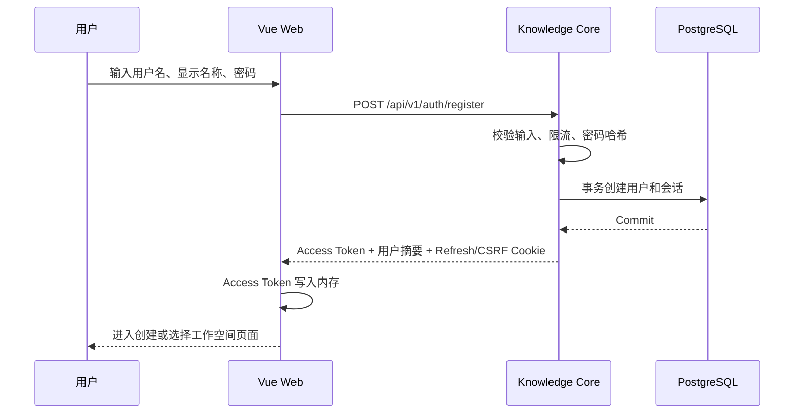
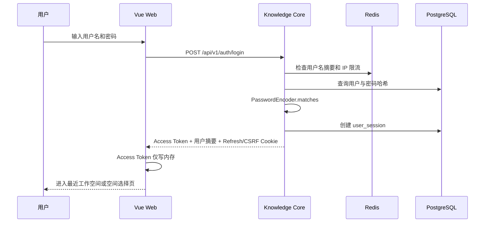

# DevCollab 登录与会话设计 V0.4

## 文档信息

| 项目 | 内容 |
|---|---|
| 文档类型 | 认证专项设计 |
| 文档状态 | 生效，作为阶段一登录实现基线 |
| 版本 | V0.4 |
| 编制日期 | 2026-07-12 |
| 确认日期 | 2026-07-13 |
| 适用范围 | 阶段一切片 A：注册、登录、刷新、当前用户和退出 |
| 需求依据 | `01-devcollab-product-requirements-v0.1.md` 中 FR-AUTH-001、FR-AUTH-005 |
| 架构依据 | `02-devcollab-system-architecture-v0.3.md` 中身份、安全和 Knowledge Core 边界 |
| 前端依据 | `04-devcollab-frontend-design-v0.2.md` |

## 1. 结论

阶段一采用“用户名 + 密码”认证。Knowledge Core 负责校验身份、签发短期 Access Token、管理可撤销 Refresh Session，并向前端提供当前用户信息。

```text
用户名与密码
→ Knowledge Core 验证
→ 返回短期 Access Token
→ 浏览器保存 HttpOnly Refresh Cookie
→ Access Token 过期时刷新
→ 退出或会话失效后撤销 Refresh Session
```

关键决定：

| 决策项 | 结论 |
|---|---|
| 登录标识 | MVP 使用唯一用户名；显示名称独立保存 |
| 注册后行为 | 注册成功后自动登录并进入工作空间引导 |
| Access Token | JWT，前端仅保存在内存，有效期 10 分钟 |
| Refresh Token | 不透明随机值，使用 HttpOnly Cookie，有空闲和绝对过期时间 |
| Token 持久化 | 禁止写入 localStorage、sessionStorage 和前端日志 |
| Refresh 轮换 | 每次成功刷新后更换 Refresh Token，旧 Token 失效 |
| 密码保存 | Spring Security PasswordEncoder；Argon2id 优先，绝不明文或可逆加密 |
| 登录错误 | 用户名不存在、密码错误、账户不可用统一返回“用户名或密码错误” |
| 登录限流 | 按用户名摘要和 IP 双维度限制；阈值可配置 |
| CSRF | Refresh/Logout 使用 SameSite Cookie、Origin 校验和 CSRF Header |
| 多因素认证 | 不进入 MVP |

## 2. 概念说明

### 2.1 认证与授权

- 认证（Authentication）：确认“你是谁”，例如校验用户名和密码。
- 授权（Authorization）：确认“你能做什么”，例如是否能进入某个工作空间。

本文只负责认证和会话。工作空间角色与文档权限在后续 RBAC 设计中处理。

### 2.2 Access Token

Access Token 是短期通行证。前端调用需要登录的 REST 接口时发送：

```http
Authorization: Bearer <access-token>
```

Access Token 只保存在 Vue 应用内存，页面关闭后消失。Token 不直接保存工作空间角色，避免角色变化后仍使用旧权限；接口每次根据当前数据执行授权。

### 2.3 Refresh Token 与 Session

Refresh Token 是换取新 Access Token 的长期凭证。浏览器将其保存在 JavaScript 无法读取的 HttpOnly Cookie 中。服务端用 `user_session` 记录其状态，因此可以退出、禁用、过期和撤销。

Refresh Token 采用不透明随机值，不把用户资料放入 Token。数据库只保存 Token 的哈希，不保存可直接使用的原值。

### 2.4 Cookie 属性

生产环境 Cookie 基线：

```text
名称：__Host-dc_refresh
HttpOnly：是
Secure：是
SameSite：Strict
Path：/
Domain：不设置
```

本地 HTTP 开发环境使用单独的开发配置，不能把生产环境的 `Secure` 要求永久关闭。

## 3. 范围

### 3.1 MVP 包含

- 用户名注册；
- 用户名密码登录；
- 获取当前用户；
- Access Token 自动刷新；
- Refresh Token 轮换；
- 当前会话退出；
- 账户禁用后拒绝刷新和新请求；
- 登录和注册限流；
- 认证审计和安全日志；
- 登录前端页面及会话恢复。

### 3.2 MVP 不包含

- 邮箱验证；
- 找回或重置密码；
- 手机验证码；
- 第三方 OAuth 登录；
- 单点登录 SSO；
- MFA 多因素认证；
- 记住设备；
- 用户自行查看和撤销全部设备；
- CAPTCHA；仅在自动化攻击证明确有需要时评审引入。

## 4. 用户和会话状态

### 4.1 用户状态

```text
ACTIVE      正常使用
DISABLED    管理员禁用
LOCKED      安全事件锁定，MVP 仅保留状态，不由普通失败次数永久触发
```

普通密码错误通过限流控制，不直接把账户永久锁定，避免攻击者利用反复登录把他人账户锁死。

### 4.2 会话状态

```text
ACTIVE → ROTATED    成功刷新后旧 Token 被替换
ACTIVE → REVOKED    用户退出、管理员撤销或检测到异常
ACTIVE → EXPIRED    空闲或绝对有效期结束
```

会话建议时间：

- Access Token：10 分钟；
- Refresh Session 空闲过期：7 天未使用；
- Refresh Session 绝对过期：首次登录后 30 天；
- 具体数值作为配置管理，可在测试和风险评审后调整。

## 5. 用户流程

### 5.1 注册并自动登录



用户名已存在时返回字段错误。注册接口不得返回密码、密码哈希、Refresh Token 或内部会话数据。

### 5.2 登录



失败时前端统一显示“用户名或密码错误”。后端审计可记录真实原因，但日志不得记录密码和 Token。

### 5.3 页面刷新或重新打开

Vue 应用启动时内存中没有 Access Token：

```text
应用启动
→ POST /api/v1/auth/refresh（浏览器自动携带 Refresh Cookie）
→ 成功：获得 Access Token 和当前用户
→ 失败：清理会话视图并进入登录页
```

公开登录页不能因为刷新失败持续弹出错误；只有从受保护页面失去会话时才显示“登录已过期”。

### 5.4 Access Token 过期

```text
业务请求返回 AUTH_ACCESS_EXPIRED
→ 前端只发起一个刷新请求（Single-Flight）
→ 刷新成功后重试安全请求一次
→ 刷新失败则退出登录状态
```

多个同时失败的请求必须复用同一个刷新 Promise，不能同时轮换同一 Refresh Token。非幂等业务请求只有在确认服务端尚未执行时才能自动重试。

### 5.5 退出

```text
用户点击退出
→ POST /api/v1/auth/logout
→ 服务端撤销当前 user_session
→ 清除 Refresh/CSRF Cookie
→ 前端清除内存 Access Token 和用户状态
→ 返回登录页
```

退出接口幂等：会话已经过期或撤销时仍可以安全返回成功。

## 6. 前端设计

### 6.1 登录页面

字段：

| 字段 | 规则 |
|---|---|
| 用户名 | 必填；提交前去除首尾空格；内部按规范化值查询 |
| 密码 | 必填；不自动去除空格；支持显示/隐藏切换 |

页面状态：

```text
IDLE        等待输入
SUBMITTING  提交中，防止重复点击
INVALID     字段格式错误
REJECTED    用户名或密码错误
RATE_LIMITED 请求过多，显示可重试时间
SUCCESS     登录成功，跳转
```

要求：

- Enter 可提交；
- 错误信息与字段关联并可被辅助技术读取；
- 提交中按钮禁用，但页面不清空密码；
- 登录失败后密码字段可由用户决定是否重新输入；
- 不在 URL、埋点、日志或错误上报中记录用户名和密码组合；
- 不提供虚假的“记住我”，因为 Refresh Session 已有明确生命周期。

### 6.2 注册页面

字段：用户名、显示名称、密码、确认密码。密码确认只在前端使用，不发送后端。

密码规则：

- 15～128 个 Unicode 字符；
- 允许空格和常见可打印字符；
- 不强制同时包含大小写、数字和特殊符号；
- 拒绝常见或已知泄露密码，具体 Blocklist 方案在实现时确定；
- 不要求周期性修改密码。

### 6.3 前端会话模块

```text
authStore
├─ currentUser
├─ accessToken（仅内存）
├─ authState
└─ expiresAt

authApi
├─ register
├─ login
├─ refresh
├─ logout
└─ getCurrentUser

requestClient
├─ 注入 Authorization Header
├─ 识别 AUTH_ACCESS_EXPIRED
├─ Single-Flight 刷新
└─ 安全请求最多重试一次
```

## 7. REST 接口契约

### 7.1 注册

```http
POST /api/v1/auth/register
Content-Type: application/json
```

```json
{
  "username": "zhangsan",
  "displayName": "张三",
  "password": "用户输入的完整密码"
}
```

成功：`201 Created`，设置 Refresh/CSRF Cookie，并返回：

```json
{
  "accessToken": "<jwt>",
  "tokenType": "Bearer",
  "expiresInSeconds": 600,
  "user": {
    "id": "user_uuid",
    "username": "zhangsan",
    "displayName": "张三"
  }
}
```

### 7.2 登录

```http
POST /api/v1/auth/login
Content-Type: application/json
```

```json
{
  "username": "zhangsan",
  "password": "用户输入的完整密码"
}
```

成功返回 `200 OK`，响应结构与注册成功一致。

### 7.3 刷新

```http
POST /api/v1/auth/refresh
X-CSRF-Token: <csrf-token>
Cookie: __Host-dc_refresh=<opaque-token>
```

成功返回新 Access Token 和用户摘要，同时轮换 Refresh/CSRF Cookie。Refresh Token 不进入 JSON 响应。

### 7.4 当前用户

```http
GET /api/v1/auth/me
Authorization: Bearer <access-token>
```

返回用户基本信息，不返回密码哈希、会话 Token、登录失败次数和内部安全字段。

### 7.5 退出

```http
POST /api/v1/auth/logout
X-CSRF-Token: <csrf-token>
Cookie: __Host-dc_refresh=<opaque-token>
```

返回 `204 No Content`，撤销当前会话并清除 Cookie。

### 7.6 统一错误

```json
{
  "code": "AUTH_INVALID_CREDENTIALS",
  "message": "用户名或密码错误",
  "traceId": "trace-id",
  "fieldErrors": [],
  "retryAfterSeconds": null
}
```

核心错误码：

| 错误码 | HTTP | 场景 |
|---|---:|---|
| `AUTH_INVALID_INPUT` | 400 | 请求格式或字段不合法 |
| `AUTH_USERNAME_EXISTS` | 409 | 注册用户名已存在 |
| `AUTH_INVALID_CREDENTIALS` | 401 | 登录标识或密码错误、账户不可用于登录 |
| `AUTH_ACCESS_EXPIRED` | 401 | Access Token 已过期 |
| `AUTH_ACCESS_INVALID` | 401 | Access Token 无效 |
| `AUTH_REFRESH_INVALID` | 401 | Refresh Token 无效、撤销或过期 |
| `AUTH_REFRESH_REUSED` | 401 | 已轮换 Token 再次出现，撤销对应会话族 |
| `AUTH_CSRF_INVALID` | 403 | CSRF 校验失败 |
| `AUTH_RATE_LIMITED` | 429 | 请求过多，返回 `retryAfterSeconds` |

## 8. Token 和 Cookie 设计

### 8.1 Access JWT

Access Token 最少包含：

```text
iss  签发方
aud  目标系统
sub  userId
sid  sessionId
iat  签发时间
exp  过期时间
jti  Token 唯一 ID
```

不包含密码、邮箱、工作空间角色和完整用户资料。签名基线采用非对称算法，使后续 Gateway、MCP 等服务可以只持有公钥验证 Token，而不持有签发私钥。算法和密钥轮换在实现 ADR 中最终确认。

阶段一学习实现使用 HMAC256 验证完整认证链路，并通过环境变量提供密钥；该实现不作为多服务生产密钥分发方案。Gateway、MCP 等独立验证方接入前，须迁移到非对称签名并补充密钥轮换 ADR。

### 8.2 Refresh Token

建议格式：

```text
<sessionId>.<randomSecret>
```

- `randomSecret` 使用安全随机生成；
- 数据库只保存 Secret 哈希；
- 每次刷新创建新 Secret 并原子失效旧 Secret；
- 发现已轮换 Token 重用时撤销该会话族并记录安全事件；
- Token、Cookie 和 Authorization Header 均不得进入普通日志。

### 8.3 CSRF

Refresh 和 Logout 依赖浏览器自动发送 Cookie，因此需要防止恶意网站借用用户登录状态发请求。

MVP 采用组合防护：

- Refresh Cookie 使用 `SameSite=Strict`；
- 校验 `Origin`，仅允许正式 Web Origin；
- 拒绝明确的跨站状态修改请求；
- 使用与会话绑定的 CSRF Token；前端通过 `X-CSRF-Token` Header 回传；
- CSRF Token 不是认证凭证，不赋予用户身份。

## 9. 密码设计

- 使用 Spring Security `PasswordEncoder`，不自研密码算法；
- 首选 Argon2id；参数基线不低于 OWASP 当前推荐值，并在目标机器验证登录延迟和内存；
- 每个密码使用独立 Salt，由成熟实现管理；
- 数据库只保存标准格式的密码哈希；
- 禁止明文、可逆加密、MD5、SHA-1 或单独 SHA-256；
- 登录时只用 `PasswordEncoder.matches` 比较，不解密密码；
- 支持未来通过哈希前缀升级算法和参数。

## 10. 限流与防枚举

初始可配置基线：

```text
同一 username 摘要 + IP：5 次失败 / 5 分钟
同一 IP：30 次登录请求 / 10 分钟
同一 IP：5 次注册请求 / 10 分钟
```

阈值是起始配置，不是性能结论，须通过测试和实际风险调整。

规则：

- Redis Key 不保存明文密码；用户名使用规范化摘要；
- 达到阈值返回 429 和可重试时间；
- 登录失败响应不区分“用户不存在、密码错误、已禁用”；
- 响应体、状态码和主要处理时间尽量保持一致，降低账户枚举；
- Redis 不可用时启用实例内有界降级限流并告警，不能无限放开登录；
- 不因普通失败次数永久修改用户状态。

## 11. 最小数据模型

### 11.1 app_user

| 字段 | 说明 |
|---|---|
| `id` | UUID 主键 |
| `username` | 用户原始展示用户名 |
| `normalized_username` | 规范化用户名，唯一索引 |
| `display_name` | 显示名称 |
| `password_hash` | PasswordEncoder 输出 |
| `status` | ACTIVE、DISABLED、LOCKED |
| `token_version` | 全局撤销旧 Access Token 的版本号，按需使用 |
| `created_at`、`updated_at` | 创建和更新时间 |
| `row_version` | 管理操作乐观锁 |

约束：

```text
UNIQUE(normalized_username)
```

### 11.2 user_session

| 字段 | 说明 |
|---|---|
| `id` | sessionId，UUID |
| `user_id` | 所属用户 |
| `refresh_token_hash` | 当前 Refresh Secret 哈希 |
| `status` | ACTIVE、ROTATED、REVOKED、EXPIRED |
| `family_id` | Refresh Token 轮换族 |
| `created_at`、`last_used_at` | 创建和最后使用时间 |
| `idle_expires_at` | 空闲过期时间 |
| `absolute_expires_at` | 绝对过期时间 |
| `revoked_at`、`revoke_reason` | 撤销记录 |
| `replaced_by_session_id` | 轮换后的 Session 记录，具体建模在实现前确认 |
| `client_fingerprint` | 非敏感客户端摘要，可选，不作为唯一认证因素 |

刷新事务必须原子完成：校验当前 Token、失效旧 Token、创建后继 Token。并发刷新只能有一个成功，前端遇到轮换竞争时只允许受控重试一次。

## 12. 服务边界

```text
AuthController
→ AuthenticationApplicationService
   ├─ UserRepository
   ├─ UserSessionRepository
   ├─ PasswordEncoder
   ├─ AccessTokenIssuer
   ├─ RefreshTokenService
   ├─ LoginRateLimiter
   └─ SecurityAuditService
```

- Controller 只负责协议、参数和 Cookie；
- Application Service 负责注册、登录、刷新和退出用例；
- Repository 负责持久化，不负责密码规则；
- Token 签发和验证通过接口隔离，便于测试及轮换；
- 登录事务不写 Kafka Outbox；阶段一先保证数据库会话正确，安全审计使用同步结构化日志或数据库记录，后续再投影事件。

## 13. 审计与日志

记录：

- 注册成功或失败类别；
- 登录成功、失败和限流；
- Refresh 成功、失败、重用检测；
- Logout；
- 用户禁用导致的会话撤销；
- CSRF、Origin 和 Token 校验失败；
- Trace ID、用户 ID（已知时）、Session ID、时间和结果。

禁止记录：

- 密码；
- 完整 Access/Refresh/CSRF Token；
- Cookie Header；
- Authorization Header；
- 未脱敏请求体。

## 14. 验收与测试

### 14.1 功能验收

- 新用户名注册成功并自动登录；
- 重复用户名注册返回字段错误；
- 正确用户名密码登录成功；
- 错误用户名和错误密码对外返回同一类错误；
- 页面刷新后可通过 Refresh Session 恢复登录；
- Access Token 过期后只触发一次刷新；
- Refresh 成功后旧 Token 失效；
- 退出后 Refresh Cookie 被清除且会话不可再用；
- 用户被禁用后，新登录、刷新和受保护请求均失败；
- Token 不出现在 localStorage、sessionStorage、URL 和日志。

### 14.2 安全测试

- 密码哈希不是明文或快速哈希；
- 登录限流在用户名和 IP 两个维度生效；
- 用户枚举响应无明显差异；
- 缺少或错误 CSRF Header 时刷新和退出被拒绝；
- 非允许 Origin 被拒绝；
- 过期、篡改、错误签发方和错误受众 Access Token 被拒绝；
- Refresh 重用触发会话族撤销；
- Cookie 生产配置包含 Secure、HttpOnly、SameSite 和正确作用域；
- 日志扫描不包含 Token 和密码。

### 14.3 集成与端到端

- 使用真实 PostgreSQL 验证用户和会话事务；
- 使用真实 Redis 或 Testcontainers 验证限流；
- Vue 登录页连接真实接口完成注册、登录、刷新和退出；
- 浏览器重新加载和多请求同时过期场景通过；
- 认证失败携带 Trace ID，前后端可以关联诊断。

## 15. 实现验证项

以下事项属于实现级技术验证，不改变本文已经确认的用户流程、接口职责、Token 保存边界和安全要求：

1. Access JWT 的具体非对称签名算法和密钥加载方式；
2. CSRF Token 采用同步 Token 还是与 Session 绑定的签名双提交方案；
3. Refresh Token 轮换表是更新同一 Session 行还是创建后继 Session 行；
4. 多标签页并发刷新采用 BroadcastChannel 协调还是仅依赖服务端竞争处理；
5. 常见/泄露密码 Blocklist 的数据来源和离线更新方式；
6. Argon2id 参数在目标开发机和部署机上的实际耗时与内存基线。

验证结果应通过实现 ADR、测试或基准记录落地；若验证结果要求改变本文基线，必须重新进入文档评审，不能在编码过程中静默修改。

## 16. 阶段一代码落地范围

### 16.1 落地目标

阶段一实现完整的 JWT 登录闭环，使前端可以完成注册、登录、携带 Token 访问当前用户、通过 HttpOnly Refresh Cookie 刷新 Token 和退出当前会话。Refresh Session 首期使用内存仓储验证接口与轮换语义，进入持久化阶段后替换为 PostgreSQL 实现；内存实现不得作为生产部署方案。

本阶段必须包含：

- 用户注册；
- 用户名和密码登录；
- 密码哈希存储；
- JWT Access Token 签发与校验；
- 当前用户接口；
- HttpOnly Refresh Cookie；
- Refresh Token 服务端哈希存储与单次轮换；
- 当前设备退出登录与 Cookie 清理；
- 基础认证过滤器；
- 统一错误响应。

本阶段暂不包含：

- Redis 登录限流；
- Refresh Token 轮换族检测；
- 跨节点 Refresh Session 协调；
- 多设备会话查询与批量撤销界面；
- 验证码、多因素认证和第三方 OAuth 登录。

### 16.2 代码包结构

Knowledge Core 中认证模块按业务边界组织，初始结构如下：

```text
com.devcollab.knowledgecore
├─ auth
│  ├─ api
│  ├─ application
│  ├─ domain
│  └─ infrastructure
├─ security
└─ common
   └─ api
```

职责边界：

| 包 | 职责 |
|---|---|
| `auth.api` | 对外 REST 接口、请求 DTO、响应 DTO |
| `auth.application` | 注册、登录、刷新和退出等认证用例 |
| `auth.domain` | 用户账户、用户状态和仓储接口 |
| `auth.infrastructure` | JWT、密码加密和临时用户仓储实现 |
| `security` | Spring Security 配置、JWT 过滤器和当前用户上下文 |
| `common.api` | 统一错误响应和全局异常处理 |

### 16.3 初始类清单

第一版代码预计包含以下类：

```text
auth/api/
├─ AuthController.java
├─ LoginRequest.java
├─ RegisterRequest.java
├─ AuthResponse.java
├─ CurrentUserResponse.java
└─ RefreshCookieManager.java

auth/application/
├─ AuthenticationApplicationService.java
├─ LoginCommand.java
├─ RegisterCommand.java
└─ AuthenticatedUser.java

auth/domain/
├─ UserAccount.java
├─ UserStatus.java
├─ UserRepository.java
├─ RefreshSession.java
└─ RefreshSessionRepository.java

auth/infrastructure/
├─ InMemoryUserRepository.java
├─ InMemoryRefreshSessionRepository.java
├─ JwtProperties.java
├─ JwtTokenService.java
├─ RefreshTokenProperties.java
├─ RefreshTokenService.java
└─ PasswordConfig.java

security/
├─ SecurityConfig.java
├─ JwtAuthenticationFilter.java
└─ CurrentUser.java

common/api/
├─ ApiErrorResponse.java
└─ GlobalExceptionHandler.java
```

### 16.4 首轮接口契约

首轮实现以下接口：

| 方法 | 路径 | 说明 |
|---|---|---|
| `POST` | `/api/v1/auth/register` | 注册用户并返回 Token |
| `POST` | `/api/v1/auth/login` | 登录并返回 Token |
| `POST` | `/api/v1/auth/refresh` | 校验 Refresh/CSRF Cookie 与 Origin，轮换会话并签发新 Access Token |
| `GET` | `/api/v1/auth/me` | 返回当前登录用户 |
| `POST` | `/api/v1/auth/logout` | 撤销当前 Refresh Session、清除 Cookie 并返回 `204` |

### 16.5 实现约束

- Controller 只处理 HTTP、参数校验和响应，不直接判断密码。
- Application Service 负责编排注册、登录、刷新和退出用例。
- PasswordEncoder 是唯一允许处理密码哈希和比对的组件。
- JWT 签发和解析集中在 `JwtTokenService`，业务代码不拼接 Token。
- 第一版用户仓储可使用内存实现，但接口命名必须允许后续替换为 PostgreSQL。
- Access Token 不写入 localStorage、sessionStorage、URL、日志或错误响应。
- Refresh Token 使用安全随机值，服务端只保存 SHA-256 哈希，原值不得进入 JSON、日志和仓储。
- Refresh 和 Logout 必须同时校验允许的 Origin、CSRF Cookie 与 `X-CSRF-Token` Header。
- 刷新成功后旧 Refresh Token 必须失效，并创建新的 Session、Refresh Token 和 CSRF Token。
- 退出登录撤销当前 Refresh Session 并清除 Refresh/CSRF Cookie；已经签发的 Access Token 在阶段一存活至自身过期。
- 本地开发 Cookie 名称和 `Secure` 属性允许通过环境配置调整；生产配置必须使用 HTTPS、`Secure=true` 和受控 Cookie 作用域。
- 阶段一密码实现使用 BCrypt；迁移 Argon2id 前须完成目标机器参数和延迟验证。

## 17. 官方依据

- Spring Security Authentication：<https://docs.spring.io/spring-security/reference/features/authentication/index.html>
- Spring Security Password Storage：<https://docs.spring.io/spring-security/reference/features/authentication/password-storage.html>
- OWASP Authentication Cheat Sheet：<https://cheatsheetseries.owasp.org/cheatsheets/Authentication_Cheat_Sheet.html>
- OWASP Password Storage Cheat Sheet：<https://cheatsheetseries.owasp.org/cheatsheets/Password_Storage_Cheat_Sheet.html>
- OWASP Session Management Cheat Sheet：<https://cheatsheetseries.owasp.org/cheatsheets/Session_Management_Cheat_Sheet.html>
- OWASP CSRF Prevention Cheat Sheet：<https://cheatsheetseries.owasp.org/cheatsheets/Cross-Site_Request_Forgery_Prevention_Cheat_Sheet.html>
- NIST SP 800-63B-4：<https://pages.nist.gov/800-63-4/sp800-63b.html>
