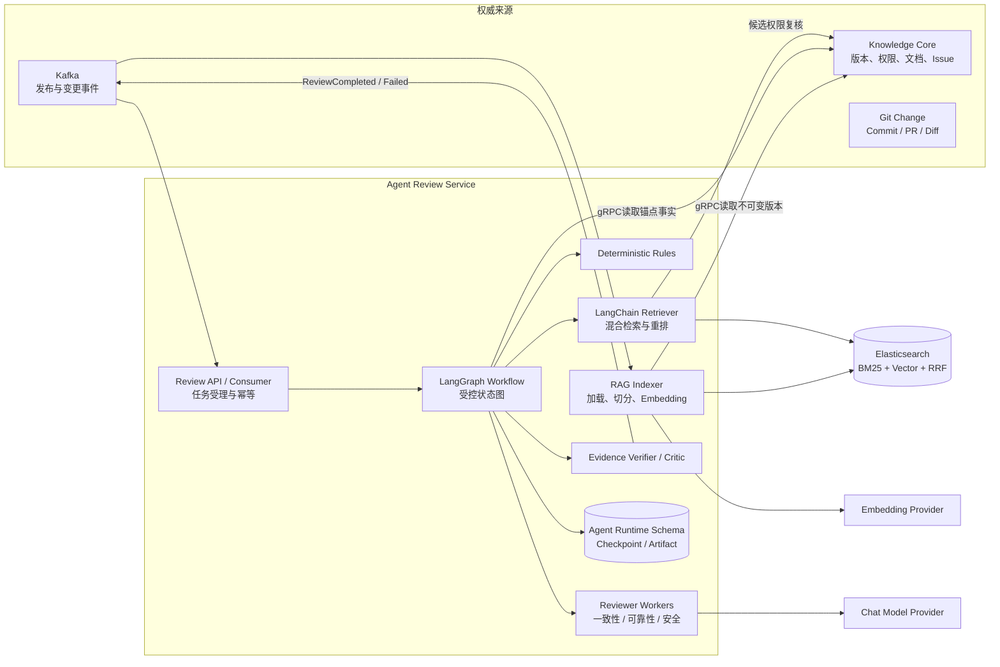
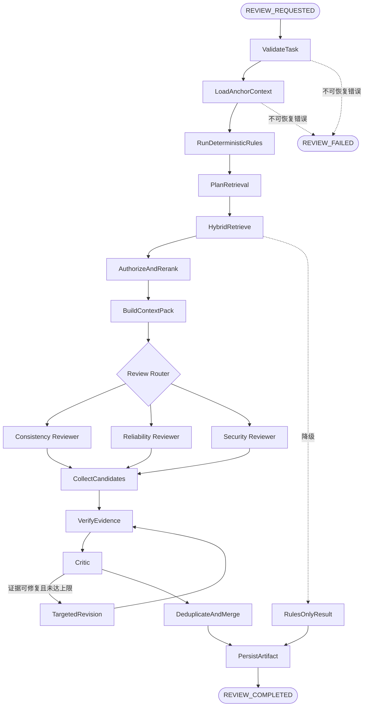

# 07 DevCollab Agent RAG 架构设计 V0.1

## 文档信息

| 项目 | 内容 |
|---|---|
| 文档类型 | Agent 与 RAG 专项架构设计 |
| 文档状态 | 方案基线，Agent 阶段开发前评审 |
| 版本 | V0.1 |
| 更新日期 | 2026-07-12 |
| 关联文档 | `01-devcollab-product-requirements-v0.1.md`、`02-devcollab-system-architecture-v0.3.md`、`03-devcollab-architecture-verification-v0.1.md` |
| 实施阶段 | 核心协作、版本治理、Git 同步和搜索基础稳定后的后置阶段 |

## 1. 设计结论

DevCollab Agent 不是开放式聊天机器人，而是受控的工程审阅工作流。系统采用 LangChain 统一模型、Prompt、Tool、Retriever 和结构化输出接口，采用 LangGraph 编排具有状态、分支、并行 Reviewer、有限重试和人工确认点的审阅流程，采用 Elasticsearch 构建带权限与版本过滤的混合检索 RAG。

框架仅承担通用运行能力，不替代业务设计。文档版本锁定、权限校验、检索范围、Evidence 验证、Issue 幂等和发布边界仍由 DevCollab 自身规则控制。

### 1.1 为什么采用 LangChain 与 LangGraph

| 组件 | 使用范围 | 不承担的职责 |
|---|---|---|
| LangChain | 模型 Provider 适配、Embedding、Retriever、Tool、Prompt Template、结构化输出和回调接口 | 不决定工作空间权限、文档版本、Issue 状态和证据有效性 |
| LangGraph | `StateGraph`、条件边、并行 Worker、Checkpoint、失败恢复和有限修订循环 | 不允许模型自由创建无限步骤或调用未授权工具 |
| Pydantic | 工作流状态、Tool 参数、Reviewer 输出和最终 Artifact 校验 | 不替代 Evidence 对真实业务对象的存在性验证 |
| Elasticsearch | BM25、向量检索、元数据过滤、RRF 融合及候选结果排序 | 不是权威文档源，不负责最终权限判定和版本状态 |

LangGraph 适合本项目的原因是审阅流程同时包含确定步骤和有限的模型判断。确定性节点负责版本、权限、规则、证据和持久化；Reviewer 节点可以并行执行；Critic 只在明确条件满足时触发有限修订。这比一个自由循环的通用 Agent 更容易测试、追踪和降级。

## 2. 实施前置条件

Agent 模块不得与 Core MVP 同期启动。进入 Agent 开发前必须满足：

| 编号 | 前置条件 | 完成证据 |
|---|---|---|
| PRE-01 | 文档、Block、版本和 ADR 具有稳定 ID，已发布版本不可变 | 版本发布与历史恢复测试通过 |
| PRE-02 | 工作空间及文档权限由 Core 统一判定 | REST、WebSocket、内部查询的越权测试通过 |
| PRE-03 | Git Commit、Pull Request、文件 Diff 和代码路径关联可稳定同步 | 真实仓库同步及重复事件幂等测试通过 |
| PRE-04 | Elasticsearch 索引可从 PostgreSQL 和事件重建 | 删除索引后的全量重建测试通过 |
| PRE-05 | 确定性工程规则已有独立结果，不依赖模型 | 模型关闭时规则审阅仍可运行 |
| PRE-06 | 建立最小人工标注集 | 至少覆盖一致性、可靠性、安全性、无问题样本和对抗样本 |

任一前置条件未满足时，只建设索引或评测数据，不实现多 Agent Reviewer。

## 3. 总体架构



Agent Review Service 包含两个相互隔离的运行单元：RAG Indexer 负责知识入库，Review Runtime 负责审阅任务。二者可以位于同一代码仓库，但使用独立消费者组、线程池、限流和失败队列，避免批量重建索引影响在线审阅。

## 4. RAG 知识入库

### 4.1 数据来源

| 来源 | 入库范围 | 入库时机 |
|---|---|---|
| Requirement、Architecture、ADR | 已发布版本；当前任务明确指定的待评审版本 | 版本发布或审阅任务创建 |
| API Contract | Endpoint、请求、响应、错误码和约束 | 版本发布 |
| Database Schema | 表、字段、约束、索引和迁移说明 | 版本发布或 Migration 同步 |
| Test Plan、Benchmark、Postmortem | 与需求、API、模块关联的验证及故障证据 | 版本发布 |
| Git Change | Commit、PR、文件及 Diff Hunk | Git 变更同步完成 |
| Review Issue | 已确认问题、处理结论和修复版本 | Issue 状态变化 |

草稿默认不进入共享知识索引。审阅中的目标草稿通过任务专用上下文加载，不得被其他任务检索。

### 4.2 切分策略

系统不使用固定字符数切分所有内容，而是优先保留工程语义边界。

| 对象 | 切分单元 | 保留上下文 |
|---|---|---|
| 普通工程文档 | Block 或同一标题下的短 Block 组 | 文档类型、标题路径、版本及相邻 Block 引用 |
| ADR | 决策、背景、备选方案、后果分别成块 | ADR 状态、影响服务和代码路径 |
| API Contract | 单个 Endpoint | Method、Path、DTO、错误码和版本 |
| Database Schema | 单表或单次 Migration | 字段、约束、索引和关联实体 |
| 代码块 | 单个 CodeBlock | 语言、所属章节和关联代码路径 |
| Git Diff | 文件级摘要与 Hunk | Commit/PR、文件路径、变更类型和行范围 |
| Review Issue | 单个 Issue | 类别、严重度、Evidence、状态和修复版本 |

超过模型上下文限制的 Block 才执行二次递归切分。代码、表格和接口字段不得与无关自然语言强行拼接。

### 4.3 KnowledgeChunk 元数据

```text
chunkId
workspaceId
sourceType
sourceId
documentId
documentVersionId
blockId
documentStatus
headingPath
codePath
gitChangeId
content
contentHash
embeddingModel
embeddingVersion
indexedAt
deleted
```

`chunkId` 由来源对象、版本及切分位置确定性生成。相同 `contentHash + embeddingVersion` 不重复计算向量。新版本产生新 Chunk；旧版本保留用于审计，但默认检索仅选择当前有效版本或任务明确锁定的版本。删除和废弃通过 Tombstone 事件更新索引。

### 4.4 索引结构

Elasticsearch 同时保存可解释的文本字段和语义向量字段：

| 字段类型 | 用途 |
|---|---|
| `text` / keyword fields | BM25、精确标识符、Endpoint、表名、类名、状态和过滤 |
| `semantic_text` 或 `dense_vector` | 语义相似检索 |
| metadata fields | workspace、版本、状态、类型、代码路径和删除标记过滤 |

初期使用同一 Elasticsearch 集群完成关键词和向量检索，不额外引入独立向量数据库。Embedding Provider 必须可替换，索引记录模型及版本，模型变更通过新索引和 Alias 切换完成，不在原索引中混用不同维度或语义空间。

## 5. 检索与上下文构建

### 5.1 检索原则

精确事实优先走 Core 的结构化查询，语义扩展再使用 RAG。指定文档版本、API ID、表名、ADR ID 和 Git Diff 不通过向量相似度“猜测”；RAG 用于发现相关章节、历史风险和跨文档关联。

### 5.2 检索流水线

```text
锁定审阅任务与用户权限快照
→ 从 Core 加载目标版本、Diff 和显式关联对象
→ 依据审阅类型生成受控子查询
→ Elasticsearch 执行 BM25 + 向量检索
→ RRF 融合候选结果
→ 按 workspace、状态、类型和版本进行元数据过滤
→ Core 批量复核候选对象的当前访问权限
→ 重排、去重并执行上下文 Token 预算
→ 形成带稳定 Evidence ID 的 Context Pack
```

### 5.3 混合检索

| 检索信号 | 适用内容 | 作用 |
|---|---|---|
| BM25 | 类名、表名、Endpoint、错误码、配置项和技术术语 | 保证精确工程标识符召回 |
| 向量检索 | 同义表达、跨文档概念和隐含关联 | 提升语义召回 |
| 元数据过滤 | Workspace、文档状态、版本、类型、路径和删除状态 | 限定合法候选集合 |
| RRF | 合并关键词与向量排名 | 避免直接比较不同分数空间 |
| 可选 Reranker | 小规模候选集 | 在成本预算内改善最终相关性 |

Top-K、候选窗口、RRF 参数、重排数量和 Token 预算均为版本化配置，必须通过离线检索评测确定，不在缺少数据时硬编码为“最佳值”。

### 5.4 权限与版本过滤

Elasticsearch 中的 ACL 元数据只用于缩小候选范围，不作为最终授权依据。Context Builder 在模型调用前必须向 Core 批量复核权限和当前文档状态。权限已撤销、文档已废弃但任务未明确请求、版本与任务锁定范围不一致的 Chunk 必须移除。

最终 Context Pack 保存每个 Chunk 的来源、版本、Block、检索方式和排序位置，以便回放为什么该证据进入模型上下文。

## 6. LangGraph 审阅工作流

### 6.1 状态模型

```text
ReviewState
├─ workflowId / taskId / idempotencyKey
├─ workspaceId / requesterId / permissionSnapshot
├─ targetDocumentVersionId / gitChangeId
├─ reviewProfile / promptVersion / modelConfig
├─ anchorContext / ruleFindings
├─ retrievalQueries / retrievalHits / contextPack
├─ reviewerOutputs
├─ evidenceReport / criticReport
├─ finalIssues
├─ retryCount / revisionCount / tokenUsage
└─ status / errorCode / traceId
```

工作流状态使用 Pydantic 严格校验。Checkpoint 写入独立的 `agent_runtime` PostgreSQL Schema；Agent 凭证只能访问该 Schema，不得访问 Core 业务表。

### 6.2 节点与转移



| 节点 | 类型 | 职责 |
|---|---|---|
| ValidateTask | 确定性 | 校验任务、幂等键、调用者权限、目标版本和预算 |
| LoadAnchorContext | 确定性 Tool | 从 Core 获取目标文档、Diff、显式 ADR/API/Schema 和历史 Issue |
| RunDeterministicRules | 确定性 | 执行格式、必填项及可证明的工程规则 |
| PlanRetrieval | 受约束 LLM/规则 | 按审阅类型生成有限子查询，不允许改变工作空间或目标版本 |
| HybridRetrieve | Retriever | 执行关键词、向量和元数据检索 |
| AuthorizeAndRerank | 确定性 | Core 权限复核、去重、重排和 Token 预算 |
| Reviewer Workers | 结构化 LLM | 并行输出候选 Issue，不直接持久化业务结果 |
| VerifyEvidence | 确定性 Tool | 验证引用对象存在、版本匹配及内容支持关系 |
| Critic | 结构化 LLM + 规则 | 检查过度推断、证据不足、重复和严重度偏差 |
| TargetedRevision | 有限 LLM | 只修订被拒绝且可修复的候选项 |
| DeduplicateAndMerge | 确定性 | Issue 指纹、去重、规则优先级和最终排序 |
| PersistArtifact | 确定性 | 保存 Artifact 并发布完成或失败事件 |

### 6.3 Reviewer 设计

| Reviewer | 输入范围 | 主要检查 |
|---|---|---|
| Consistency Reviewer | 目标设计、ADR、API、Schema、缓存和消息上下文 | 状态、事务、缓存、消息、版本和文档之间的一致性 |
| Reliability Reviewer | 调用链、Diff、重试、消息及故障证据 | Deadline、幂等、重试、积压、熔断、降级、补偿和恢复 |
| Security Reviewer | 权限模型、接口、内容、外部凭证及 Tool 定义 | 越权、敏感信息、XSS、提示词注入和工具边界 |

Reviewer 不是三个无限自主 Agent，而是共享同一 Context Pack、使用不同 Prompt 和输出 Schema 的受控 Worker。只有审阅类型确实需要时才分派对应 Reviewer，避免固定三次模型调用。

## 7. Tool 与输出契约

### 7.1 只读 Tool

| Tool | 数据来源 | 约束 |
|---|---|---|
| `get_document_version` | Core gRPC | 必须指定稳定版本 ID |
| `get_active_architecture_decisions` | Core gRPC | 限定 Workspace、服务或代码路径 |
| `get_api_contract` | Core gRPC | 返回当前有效或任务指定版本 |
| `get_database_schema` | Core gRPC | 返回结构化表、字段、约束和版本 |
| `get_git_diff` | Core/Worker gRPC | 必须指定 GitChange ID，限制最大内容 |
| `search_engineering_knowledge` | Elasticsearch Retriever | 必须携带工作空间、状态和任务范围 |
| `list_open_review_issues` | Core gRPC | 只读且按权限过滤 |
| `verify_evidence_refs` | Core gRPC | 批量验证来源对象、版本和内容摘要 |

Tool 使用 LangChain Schema 定义参数，但鉴权、超时、返回大小和调用次数由服务端强制执行。模型不得拼接任意 SQL、Elasticsearch DSL、文件路径或外部 URL。

### 7.2 Issue 输出

```text
ReviewIssueCandidate
├─ category
├─ severity
├─ title
├─ description
├─ impact
├─ recommendation
├─ evidenceRefs[]
├─ confidence
├─ reviewerType
├─ promptVersion
└─ fingerprintInput
```

模型输出只是候选项。Evidence Verifier 通过、Critic 检查完成并由确定性合并节点生成指纹后，候选项才可写入正式 Review Issue。

## 8. 安全与提示词注入防护

| 风险 | 控制措施 |
|---|---|
| 检索越权 | Workspace 预过滤、Core 最终授权、权限撤销即时复核 |
| 过期上下文 | 默认仅检索当前有效版本；任务版本和每个 Chunk 版本显式记录 |
| 文档提示词注入 | 检索内容以数据区传入；系统指令与内容分离；内容中的工具调用要求不执行 |
| Tool 越权 | Tool 白名单、强类型参数、服务端鉴权、调用次数及结果大小限制 |
| 敏感信息泄露 | 入库前分类与脱敏；Git 凭证、Token、环境变量和密钥不进入索引 |
| 无限循环和成本失控 | 最大节点次数、修订次数、Token、时间和并发预算 |
| 模型供应商故障 | Provider 隔离、超时、熔断；降级为规则结果 |
| Artifact 污染 | Pydantic 校验、Evidence 校验、Prompt/模型/Embedding 版本记录 |

## 9. 幂等、恢复与降级

| 场景 | 处理方式 |
|---|---|
| 重复 Review 事件 | `idempotencyKey` 命中已有 Workflow，返回既有状态，不重复创建 Issue |
| 节点执行中断 | 从最近 Checkpoint 恢复；具有外部副作用的节点使用步骤幂等键 |
| Elasticsearch 不可用 | 跳过语义 Reviewer，保留确定性规则结果并标明 `RAG_UNAVAILABLE` |
| Embedding Provider 不可用 | 入库事件重试并进入 DLQ；旧索引继续服务，不写入无向量的半成品版本 |
| Chat Model 不可用 | 返回规则结果或明确失败，不阻塞文档评审和发布主链路 |
| Core 权限复核失败 | Fail Closed，不向模型发送候选内容 |
| Reviewer 部分失败 | 保留成功 Worker 结果并标明覆盖范围；是否形成正式结果由 Review Profile 决定 |

## 10. 评测体系

### 10.1 检索评测

| 指标 | 说明 |
|---|---|
| Recall@K | 标注证据是否进入候选集合 |
| MRR / nDCG@K | 相关证据的排序质量 |
| Exact Identifier Recall | Endpoint、表名、类名和错误码的精确召回 |
| Version Accuracy | 命中版本与任务锁定版本的一致率 |
| Permission Leakage | 越权 Chunk 进入 Context Pack 的数量，目标必须为 0 |
| Context Utilization | 最终结论实际引用的检索证据比例 |

### 10.2 审阅评测

| 指标 | 说明 |
|---|---|
| Issue Recall / Precision | 对人工标注问题的召回率和准确率 |
| Evidence Validity | 正式 Issue 的证据存在且支持结论的比例 |
| Unsupported Claim Rate | 无证据或证据不支持结论的比例 |
| Duplicate Issue Rate | 同任务内重复问题比例 |
| Structured Output Success | 输出通过 Schema 校验的比例 |
| Degraded Success Rate | 模型或检索异常时规则结果可用比例 |
| Cost and Latency | 单任务模型调用、Token、检索和总耗时分布 |

评测集按正常样本、已知缺陷、跨文档冲突、Git 漂移、权限隔离、过期版本和提示词注入样本分层维护。Prompt、模型、Embedding、检索参数或 Chunk 策略变更时必须运行回归评测。

## 11. 分阶段交付

| 阶段 | 范围 | 退出条件 |
|---|---|---|
| A：规则审阅 | 确定性规则、结构化结果、Issue 幂等 | 关闭模型后仍能完成规则任务 |
| B：RAG 索引 | 入库、切分、Embedding、混合检索、权限复核 | 检索评测达标，权限泄漏为 0，索引可重建 |
| C：单 Reviewer | 一个可靠性 Reviewer、Evidence Verifier、结构化输出 | 相比规则版产生可测量增益，误报在批准范围内 |
| D：多 Reviewer | 按 Profile 动态并行一致性、可靠性和安全 Reviewer | 并行结果可合并，重复与成本受控 |
| E：Critic 与人工闭环 | 有限修订、反馈回流和回归评测 | 结论可追溯，用户反馈可形成评测样本 |

不得直接从阶段 A 跳到多个 Reviewer。若阶段 C 未证明相对规则版的有效增益，停止扩展 Agent 数量，优先修复检索和评测数据。

## 12. 明确不做

本阶段不实现开放式聊天记忆、跨工作空间长期记忆、自动修改或发布文档、自动执行仓库代码、任意互联网检索、模型生成 SQL、模型自由决定无限 Tool 链，以及在未通过人工确认时阻断核心文档发布。

## 13. 参考依据

| 来源 | 本设计采用的能力 |
|---|---|
| [LangChain Retrieval](https://docs.langchain.com/oss/python/langchain/retrieval) | 知识库、切分、Embedding、Vector Store、Retriever 及 Hybrid RAG 组成方式 |
| [LangGraph Graph API](https://docs.langchain.com/oss/python/langgraph/graph-api) | 基于 State、Node、Edge 和条件转移构建有状态工作流 |
| [LangGraph Workflows and Agents](https://docs.langchain.com/oss/python/langgraph/workflows-agents) | 并行 Worker、Orchestrator-Worker 和 Evaluator-Optimizer 模式 |
| [Elasticsearch Hybrid Search](https://www.elastic.co/docs/solutions/search/hybrid-search) | 全文与向量检索组合及 RRF 排名融合 |
