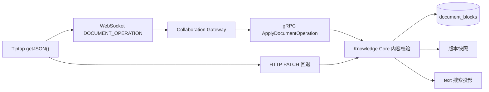

# DevCollab 结构化 Block 数据与接口契约 V0.2

## 文档信息

| 项目 | 内容 |
|---|---|
| 文档类型 | 数据与接口专项设计 |
| 文档状态 | 当前实现基线 |
| 版本 | V0.2 |
| 日期 | 2026-07-18 |
| 前置版本 | `10-devcollab-structured-block-contract-v0.1.md` |
| 适用范围 | Knowledge Core、Collaboration Gateway、gRPC Contract、Vue 文档工作台 |
| 关联文档 | `02-devcollab-system-architecture-v0.3.md`、`04-devcollab-frontend-design-v0.2.md` |

## 1. 结论与边界

Document Block 采用“双表示”模型：`content_json` 是编辑结构，`text` 是由服务端从结构中派生的纯文本投影。前端不得把两者作为两个独立权威来源。

V0.2 将业务类型与 Tiptap 顶层 Node 建立确定映射：`PARAGRAPH → paragraph`、`HEADING → heading`、`CODE → codeBlock`、`TODO → taskList/taskItem`。Core 校验业务类型、节点形状和有限属性，前端不能只改标签而提交另一种结构。

本版本不包含：HTML 持久化、任意扩展节点、图片、链接、Mark、OT/CRDT 字符级合并及整篇单 Editor 事务。

## 2. 权威数据模型

`document_blocks` 在原字段基础上增加：

| 字段 | 类型 | 约束与用途 |
|---|---|---|
| `content_schema_version` | INTEGER | 非空，当前为 `1` |
| `content_json` | TEXT | Tiptap JSON；迁移前旧记录允许为空 |
| `text` | TEXT | 服务端从结构提取，用于搜索、摘要和旧客户端兼容 |

采用扩展式迁移，不原地删除 `text`：旧数据或旧请求只有 `text` 时，Core 自动合成 Schema V1 文档；新请求提交 `document` 时，Core 校验后重新派生 `text`。因此迁移期间搜索和旧客户端不会同时失效。

## 3. HTTP 内容契约

新请求示例：

```json
{
  "content": {
    "schemaVersion": 1,
    "document": {
      "type": "doc",
      "content": [
        {
          "type": "paragraph",
          "content": [{ "type": "text", "text": "示例内容" }]
        }
      ]
    }
  },
  "expectedVersion": 3
}
```

兼容请求仍可使用：

```json
{
  "content": { "text": "旧客户端内容" },
  "expectedVersion": 3
}
```

响应始终返回 `text`、`schemaVersion` 和 `document`。当数据库旧行的 `content_json` 为空时，响应层从 `text` 合成结构，但不在读事务中隐式回写。

## 4. Schema 白名单与安全限制

Core 是结构合法性的最终裁决者，执行以下限制：

- 根节点必须为 `doc`，顶层节点按照业务类型固定映射；除 `PARAGRAPH` 外每个业务 Block 只允许一个顶层节点；
- `paragraph` 与 `heading` 只能包含 `text`、`hardBreak`；`codeBlock` 只能包含 `text`；
- `taskList` 只能包含 `taskItem`；每个 `taskItem` 只包含一个 `paragraph`；
- `heading.attrs` 只允许 `level: 1 | 2 | 3`，`taskItem.attrs` 只允许布尔值 `checked`；其他节点禁止 `attrs`；
- 允许字段仅为 `type`、`content`、`text`、`attrs`；未知字段、`marks` 或节点直接拒绝；
- 当前 Schema 版本必须为 `1`；
- JSON 最大 64 KiB、最多 512 个节点、最大深度 8；
- 派生纯文本最大 20,000 字符且不能为空白。

该白名单阻止客户端把未评审扩展、HTML 或任意属性直接写入权威数据。它不能替代输出转义、CSP 等页面安全措施。

## 5. REST、WebSocket 与 gRPC 一致性



gRPC 保留原 `text` 字段并追加 `content_schema_version` 与 `content_json`，避免破坏已有字段编号。Gateway 对 HTTP 与 gRPC 使用同一内容语义，不在边缘层复制业务 Schema 校验。

## 6. 一致性与冲突规则

- `expectedVersion` 仍是 Block 级乐观锁条件；结构化升级不改变冲突语义；
- 一次更新在同一 SQL 中写入 `text`、Schema 版本、JSON 并递增 `version`；
- 协作操作指纹包含文本、Schema 版本和 JSON，重复 `clientOperationId` 携带不同结构时拒绝复用；
- 发布快照同时记录文本和结构字段，历史版本不会只剩搜索投影。

## 7. 验收条件

- V16 能在 Flyway 测试数据库完成迁移；
- 旧 `text` 请求创建后返回合法 Schema V1 JSON；
- Tiptap JSON 经 REST 和 gRPC 保存后可原样回读，`text` 由 Core 派生；
- 四种业务 Block 分别保存为 paragraph、heading、codeBlock、taskList/taskItem，类型与节点不一致时返回 `INVALID_INPUT`；
- 版本快照用白名单 Vue 组件按语义只读渲染，不使用 `v-html`；旧纯文本快照仍可展示；
- 非法 Schema、未知节点或字段返回 `INVALID_INPUT`；
- `content_json` 为空的历史行仍可读取；
- 旧版本更新仍返回 409，不因结构化内容绕过乐观锁；
- 前端类型检查与生产构建通过。

## 8. 后续演进

后续可按业务评审增加代码语言、行内 Mark 与链接，但每项都必须先定义字段、服务端白名单、历史快照兼容和安全渲染。图片等对象内容还需定义 MinIO 对象引用和权限规则。OT/CRDT 属于独立协作协议升级，不纳入本契约。
