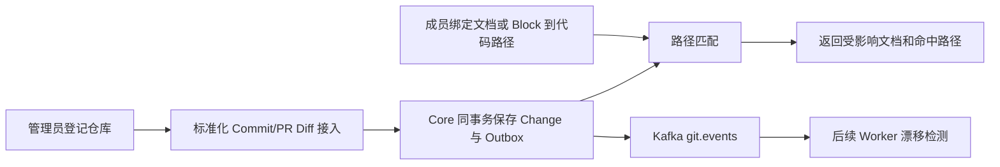

# DevCollab Git 工程知识关联设计 V0.1

## 文档信息

| 项目 | 内容 |
|---|---|
| 文档类型 | Git 工程知识专项设计 |
| 文档状态 | 生效 |
| 版本 | V0.1 |
| 日期 | 2026-07-21 |
| 适用范围 | Knowledge Core、Web、Outbox/Kafka 与后续 Git Worker Adapter |
| 依据 | `01-devcollab-product-requirements-v0.1.md`、`02-devcollab-system-architecture-v0.3.md` |

## 1. 结论与边界

本阶段建立“代码变更可以追溯到工程文档”的最小闭环：工作区管理员登记代码仓库并接入标准化 Commit/PR Diff，成员把文档或 Block 绑定到仓库路径，系统据此查询某次变更影响的文档。

当前 Core 只保存供应商无关的仓库元数据和标准化变更，不保存 Git Token、不执行 `git clone`，也不在 HTTP 请求线程调用 GitHub/GitLab。Webhook 验签、供应商 API、增量拉取和漂移 Issue 自动生成属于后续 Worker Adapter。

## 2. 业务链路

## 3. 数据模型

| 表 | 权威内容 | 关键约束 |
|---|---|---|
| `git_repositories` | 工作区仓库元数据 | 工作区内远程地址唯一 |
| `git_changes` | 标准化 Commit/PR | `repository + type + externalId` 唯一，保证接入幂等 |
| `git_file_diffs` | 文件级变更摘要 | 隶属一次 Git Change |
| `code_document_bindings` | 文档/Block 与路径模式 | 仓库、目标与路径模式唯一 |

路径模式首期只支持精确路径、`directory/**` 和 `**/*.ext`。输入必须是仓库内相对路径；拒绝绝对路径、父目录跳转和非白名单通配形式。

## 4. 权限与接口

| 操作 | 权限 |
|---|---|
| 登记仓库、接入标准化变更 | 工作区 ADMIN |
| 查看仓库、变更和影响文档 | 工作区成员 |
| 创建、查看、删除代码关联 | 工作区成员 |

主要接口：

- `POST/GET /api/v1/workspaces/{workspaceId}/git/repositories`
- `POST/GET /api/v1/workspaces/{workspaceId}/git/repositories/{repositoryId}/changes`
- `GET /api/v1/workspaces/{workspaceId}/git/changes/{changeId}/affected-documents`
- `POST/GET /api/v1/documents/{documentId}/code-bindings`
- `DELETE /api/v1/code-bindings/{bindingId}`

重复接入相同外部变更时返回既有结果和 HTTP 200；首次创建返回 HTTP 201。跨工作区访问统一按资源不可见或权限不足处理。

## 5. 一致性与异步边界

Git Change、文件 Diff 和 `GIT_CHANGE_SYNCED` Outbox 事件在同一 PostgreSQL 事务中提交。Relay 只在 Kafka ACK 后将 Outbox 标为已发布；Git 事件进入 `devcollab.git.events`。本阶段尚无 Git Topic 消费者，因此不能宣称已经自动创建文档漂移 Issue。

## 6. 验收条件

- 管理员可登记仓库并接入 Commit/PR 文件变更；普通成员不能执行管理操作。
- 重复外部事件不会产生第二条 Git Change。
- 文档与 Block 可关联合法代码路径，跨文档 Block 被拒绝。
- 变更影响查询返回命中的文档、Block、规则和路径。
- Flyway 在 H2 测试与 PostgreSQL 本地启动中均能执行 V17。
- 前端可完成仓库登记、调试接入和代码关联操作。

## 7. 后续升级

1. Worker 增加 GitHub/GitLab Adapter、Webhook 验签和凭据托管。
2. 消费 `devcollab.git.events`，对发布版本运行确定性漂移规则。
3. 将漂移结果写入 Review Issue，并提供 PR 与文档版本双向链接。
4. 对大仓库改用数据库辅助匹配或倒排索引；在测量前不宣称性能收益。

## 8. 相关文档

- [系统架构](02-devcollab-system-architecture-v0.3.md)
- [架构验证](03-devcollab-architecture-verification-v0.1.md)
- [文档治理](05-devcollab-document-governance-v0.1.md)

