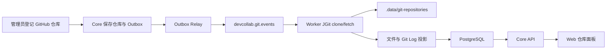

# DevCollab Git 工程知识设计 V0.2

## 文档信息

| 项目 | 内容 |
|---|---|
| 文档状态 | 已被 V0.3 替代 |
| 版本 | V0.2 |
| 日期 | 2026-07-21 |
| 替代版本 | `12-devcollab-git-knowledge-design-v0.1.md` |
| 后继版本 | `12-devcollab-git-knowledge-design-v0.3.md` |
| 适用范围 | Knowledge Core、Worker、Kafka、PostgreSQL、Web、本地数据目录 |

## 1. 目标与边界

本阶段让工作区管理员能够登记、同步和删除公开 GitHub 仓库，并在前端查看仓库文件与 Git Log。系统为后续“代码文件与文档关联”和 Agent 项目分析提供可信工程数据，但本阶段不做语义分析、私有仓库凭证、Webhook 或自动生成文档。

首期只接受 `https://github.com/...` 公共地址。Core 不在 HTTP 线程执行 Git 操作；耗时的克隆、拉取、文件扫描和提交投影由独立 Worker 完成。

## 2. 业务链路

同步状态为 `REGISTERED / SYNC_PENDING / SYNCING / READY / FAILED`。登记 GitHub 仓库后进入 `SYNC_PENDING`；Worker 开始处理时进入 `SYNCING`；投影完成后记录 HEAD 并进入 `READY`；失败时保留错误原因，管理员可以重新同步。

## 3. 数据与存储

| 位置 | 内容 | 说明 |
|---|---|---|
| `git_repositories` | 远端地址、默认分支、同步状态、HEAD、错误 | 权威元数据 |
| `git_repository_files` | 文件路径、Blob SHA、大小、语言 | 文件树投影 |
| `git_changes` / `git_file_diffs` | Commit 与文件变更 | Git Log 投影 |
| `.data/git-repositories/{workspaceId}/{repositoryId}/repository` | 本地克隆 | 运行数据，必须忽略提交 |
| `consumer_inbox` | 已消费事件 | Worker 幂等依据 |

路径只由服务端生成的 UUID 组成，并在文件操作前校验目标仍位于数据根目录内。删除时只允许删除对应仓库 UUID 目录，Windows 下先清除 Git 文件的只读属性。

## 4. 接口与权限

- `POST /api/v1/workspaces/{workspaceId}/git/repositories`：登记仓库，ADMIN。
- `POST /api/v1/workspaces/{workspaceId}/git/repositories/{repositoryId}/sync`：重新同步，ADMIN。
- `DELETE /api/v1/workspaces/{workspaceId}/git/repositories/{repositoryId}`：删除元数据并异步删除本地目录，ADMIN。
- `GET /api/v1/workspaces/{workspaceId}/git/repositories`：仓库列表，成员。
- `GET /api/v1/workspaces/{workspaceId}/git/repositories/{repositoryId}/files`：文件投影，成员。
- 既有 Change、Diff、代码路径绑定与影响查询接口继续保留。

删除请求先在 Core 事务中写入 `GIT_REPOSITORY_DELETE_REQUESTED`，再删除仓库元数据；Outbox 事件独立保存并由 Worker 清理本地目录。

## 5. 可靠性与限制

- Outbox 只在 Kafka ACK 后标记发布；Worker 用 `consumer_inbox` 跳过重复消息。
- Outbox 默认每秒处理最多 500 条，避免大量编辑事件使新 Git 任务长期饥饿；生产值仍需按压测调整。
- 远端地址限制为 HTTPS、无用户信息、无自定义端口且主机位于白名单。
- 默认限制：20,000 文件、100 条提交、500 MB、本次 Git 网络操作 60 秒。
- 文件和 Git Log 是可重建投影；本地克隆不是权威数据，丢失后可重新同步。
- 当前 Worker 直接写投影表是同库部署的 MVP 边界；服务进一步独立后应改为专用写入接口或独立投影库。

## 6. 验收结果

使用 `tools/e2e-git-repository-check.mjs` 对公开仓库 `octocat/Hello-World` 完成真实验收：登记后进入队列，Worker 克隆并得到 HEAD，Core 返回 1 个文件与 3 条提交，删除后数据库元数据和 `.data` 仓库目录均消失。一次完整验收耗时约 7.7 秒；该数字只代表本机与该小仓库，不作为生产性能结论。

## 7. 后续升级

1. 增加 GitHub App/私有仓库凭证托管和 Webhook 增量同步。
2. 在前端增加文件内容预览、Diff 详情和文档绑定入口。
3. 由确定性规则建立代码路径与文档的关联，再由 Agent 做项目理解和漂移分析。
4. 增加仓库级配额、任务取消、浅克隆与大仓库压力测试。
