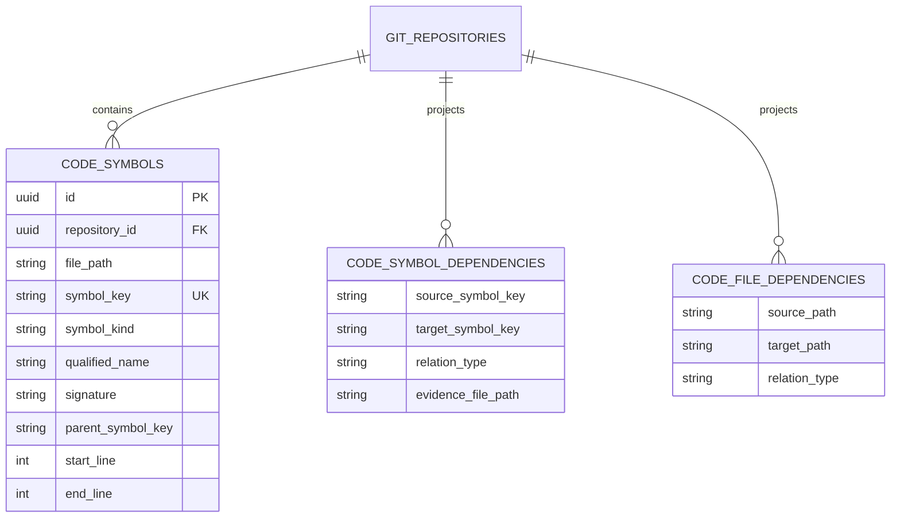
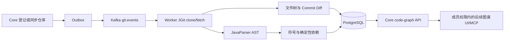

# DevCollab Git 工程知识与代码图设计 V0.4

## 文档信息

| 项目 | 内容 |
|---|---|
| 文档类型 | Git 工程知识专项设计 |
| 文档状态 | 生效 |
| 版本 | V0.4 |
| 日期 | 2026-07-21 |
| 替代版本 | `12-devcollab-git-knowledge-design-v0.3.md` |
| 适用范围 | Knowledge Core、Worker、Kafka、PostgreSQL、代码—文档关联与后续影响分析 |

## 1. 结论与边界

仓库同步除文件树、Commit 身份和真实 Diff 外，新增 Java 抽象语法树（AST）投影，形成代码符号、类继承/接口实现关系和显式内部文件导入关系。PostgreSQL 保存权威图数据，Core 提供成员权限保护的只读查询接口。

本阶段不生成方法调用图，不解析 Kotlin、TypeScript、Vue 或 Python，不接入向量数据库、MCP 或 Agent，不自动创建影响 Issue。无法可靠证明的关系不写入图，避免为了“图看起来完整”制造错误依赖。

## 2. 权威数据模型



V20 创建 `code_symbols`、`code_symbol_dependencies` 和 `code_file_dependencies`。同步时按仓库整体替换三类投影，防止已删除文件或符号继续残留。

## 3. 符号与稳定键

首期符号类型包括 `CLASS`、`INTERFACE`、`ENUM`、`RECORD`、`ANNOTATION`、`METHOD`、`CONSTRUCTOR` 和 `FIELD`。行号只用于展示证据，不能作为绑定主键。

同一仓库可能在多个模块、教程阶段或 main/test 源集中声明相同全限定名，因此类型键采用：

```text
java:{qualifiedName}@{filePath SHA-256 前 16 位}
```

成员键在类型键后追加方法签名、构造签名或字段名。文件移动会改变键，后续需要通过 Git rename 与限定名对绑定进行迁移；首期不隐藏这一事实。

## 4. 依赖语义

- `EXTENDS`：仓库内部类型之间的继承关系。
- `IMPLEMENTS`：仓库内部类型之间的接口实现关系。
- `IMPORTS`：Java 文件显式导入了仓库内另一个类型所在文件。
- 通配符 import 不展开成“依赖整个包”，因为它不能证明所有类型都被使用。
- 同包类型使用、静态 import、方法调用和运行时反射关系暂不投影。

JavaParser 只负责语法结构。解析器可能在报告问题的同时恢复出部分 AST；Worker 保留可恢复的符号并记录解析问题，单个异常源码不应阻断整个仓库的基础 Git 同步。

## 5. 同步与查询链路



查询接口：

```text
GET /api/v1/workspaces/{workspaceId}/git/repositories/{repositoryId}/code-graph
GET .../code-graph?filePath={repositoryRelativePath}
```

不传 `filePath` 返回仓库当前代码图；传入路径时返回该文件符号、以该文件为证据的符号关系，以及该文件的入向或出向文件依赖。调用者必须是工作区成员，空间外用户返回 403。

## 6. 失败与容量策略

- Git 路径必须保持仓库内相对路径，防止目录逃逸。
- AST 分析在 Worker 执行，不占用 Core HTTP 线程。
- 单个 Java 源文件超过 2 MiB 时跳过 AST 分析并记录问题，避免异常文件独占解析内存。
- 每次分析创建独立 JavaParser，避免多分区并发消费共享非线程安全解析状态。
- Commit 标题写入前按 Unicode code point 截断至 500，异常历史标题不能拖垮仓库同步。
- 代码图当前整体替换，适合首期规模；大仓库后续改为按变更文件增量投影。
- 当前数量验收不代表吞吐或延迟基准，性能仍待专项测量。

## 7. 验收证据

- Flyway 在 H2 集成测试中成功执行至 V20。
- 自动测试覆盖符号键、方法/字段、继承实现、显式内部 import、重复全限定名、异常源码恢复、成员读取和空间外 403。
- 全模块 174 项测试通过，0 Failure、0 Error、0 Skipped。
- `spring-guides/gs-rest-service` E2E 投影 59 个文件和 15 个符号。
- `spring-projects/spring-petclinic` E2E 投影 130 个文件、311 个符号、24 条内部文件依赖和 100 个 Commit，并验证安全删除。

## 8. 后续升级

1. 使用 JavaSymbolSolver 加入方法调用、字段类型和同包使用关系，并记录解析置信度。
2. 将代码绑定从路径扩展到 `symbol_key`，同时实现 rename 后绑定迁移。
3. 基于 Git Diff 与有限深度依赖传播生成确定性影响候选。
4. 使用 Elasticsearch 混合检索补充候选文档，再通过 MCP 向 Agent 提供受控证据。
5. Agent 只创建带证据的影响建议或 Issue，不直接修改并发布文档。

## 9. MCP 只读投影边界

MCP Context Server 只读取 Worker 已写入 Knowledge Core 的 Git 仓库、文件和代码图投影，不直接读取 clone 目录，也不执行 JGit。`devcollab.code.read` 返回真实 `commitHash`、仓库相对 `path`、`language`、受预算限制的文本内容、实际行范围以及显式 `truncated`/`omittedLineCount`。

MCP 接入不得修改现有仓库登记、Outbox、Kafka、clone、fetch 和 scan 流程；路径始终按仓库相对路径校验，二进制及不支持的文件类型拒绝读取。

## 10. 相关基线

- `02-devcollab-system-architecture-v0.3.md`
- `03-devcollab-architecture-verification-v0.1.md`
- `07-devcollab-agent-rag-architecture-v0.1.md`
- `12-devcollab-git-knowledge-design-v0.3.md`
- JavaParser 官方仓库：`https://github.com/javaparser/javaparser`
