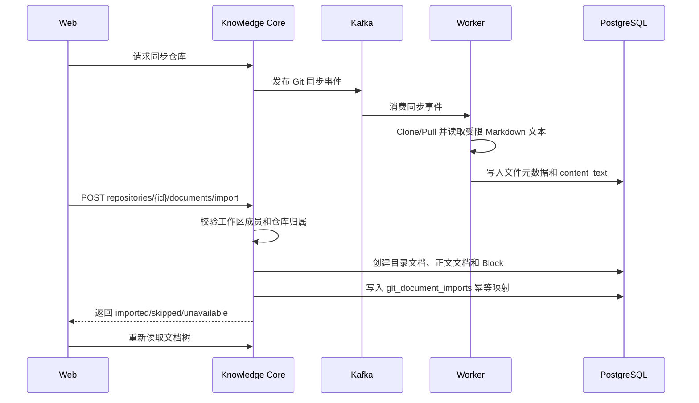

# DevCollab Git Markdown 文档导入设计 V0.1

## 文档信息

| 项目 | 内容 |
|---|---|
| 文档类型 | Git 文档导入专项设计 |
| 文档状态 | 生效 |
| 版本 | V0.1 |
| 日期 | 2026-07-21 |
| 需求来源 | 工作区文档树自动接入已同步仓库中的现有 Markdown 文档 |
| 适用范围 | Knowledge Core、Worker、PostgreSQL、Web 工作区页面 |
| 相关设计 | `04-devcollab-frontend-design-v0.2.md`、`12-devcollab-git-knowledge-design-v0.4.md` |

## 1. 结论与边界

已同步仓库中的 `.md`、`.markdown` 文件可以导入工作区文档树。Worker 在仓库同步阶段保存受限大小的 Markdown 文本快照；Core 负责权限校验、目录层级转换、文档与 Block 创建以及幂等记录；前端在空文档树场景自动导入，也保留人工导入入口。

本阶段不导入无扩展名 README、不解析二进制或非 UTF-8 文本、不自动覆盖用户已编辑的文档，也不实现仓库后续变更与已导入文档的双向同步。

## 2. 业务链路

## 3. 数据设计

`git_repository_files.content_text` 只保存 Markdown 文本快照。Worker 仅读取扩展名为 `.md` 或 `.markdown` 且不超过 256 KiB 的文件，避免无边界占用数据库和 Worker 内存。

`git_document_imports` 保存 `repository_id + source_path -> document_id` 映射，并通过唯一约束保证同一路径重复导入不会创建重复文档。`source_blob_sha` 记录本次导入来源，为后续增量同步和漂移检测保留依据。

## 4. 映射规则

- 仓库目录转换为容器文档，保持原始层级。
- Markdown 文件转换为业务文档，第一条 H1 优先作为标题，缺失时使用文件名。
- 标题移除常见构建徽章后按 200 个字符截断，满足领域和数据库边界。
- ADR、API、架构、部署、测试和数据库路径按确定性规则推断 `DocumentType`，其余使用 `REQUIREMENT`。
- 正文按 19,000 字符切分为 `PARAGRAPH` Block，避免超过单 Block 存储边界。

## 5. 前端交互

进入工作区后，若文档树为空，前端查询状态为 `READY` 的仓库并尝试导入；成功后立即刷新树。已有业务文档时不自动修改结构，用户可点击“导入仓库文档”。对于旧版本已经同步但没有 `content_text` 的仓库，界面提示重新同步。

全局导航采用固定视口高度和可收起布局：展开宽度 248px，收起宽度 72px，状态由受控 `localStorage` 偏好保存。页面纵向滚动不移动导航，收起时内容区自动获得释放的宽度。

## 6. 一致性与失败处理

- PostgreSQL 业务文档仍是文档树权威数据；Git 文件快照只是导入来源。
- Core 导入接口复用现有工作区权限和文档应用服务，不允许前端直接写表。
- 唯一映射负责重复请求幂等；已导入文档不会因再次点击而复制。
- 单个文件创建失败时事务回滚，不留下半条映射。
- 仓库未就绪或正文不可用时返回可解释计数，不伪装成成功导入。

## 7. 验收标准与证据

1. 同步包含 `README.md` 的公开仓库后，工作区文档树能显示对应文档。
2. 打开导入文档后能读取由 Markdown 创建的 Block 正文。
3. 第二次导入同一仓库时 `imported=0` 且 `skipped>0`。
4. 页面滚动后全局导航仍覆盖完整视口高度。
5. 导航收起后宽度为 72px，内容区扩展；重新展开恢复 248px。
6. 后端全量测试和前端生产构建通过。

## 8. 后续演进

后续以 `source_blob_sha` 对比仓库新版本，产生“来源已变化”提醒，由用户选择覆盖、新建修订或忽略；只有明确建立冲突策略后才允许自动更新。代码—文档语义关联和 Agent 分析不属于本阶段。
