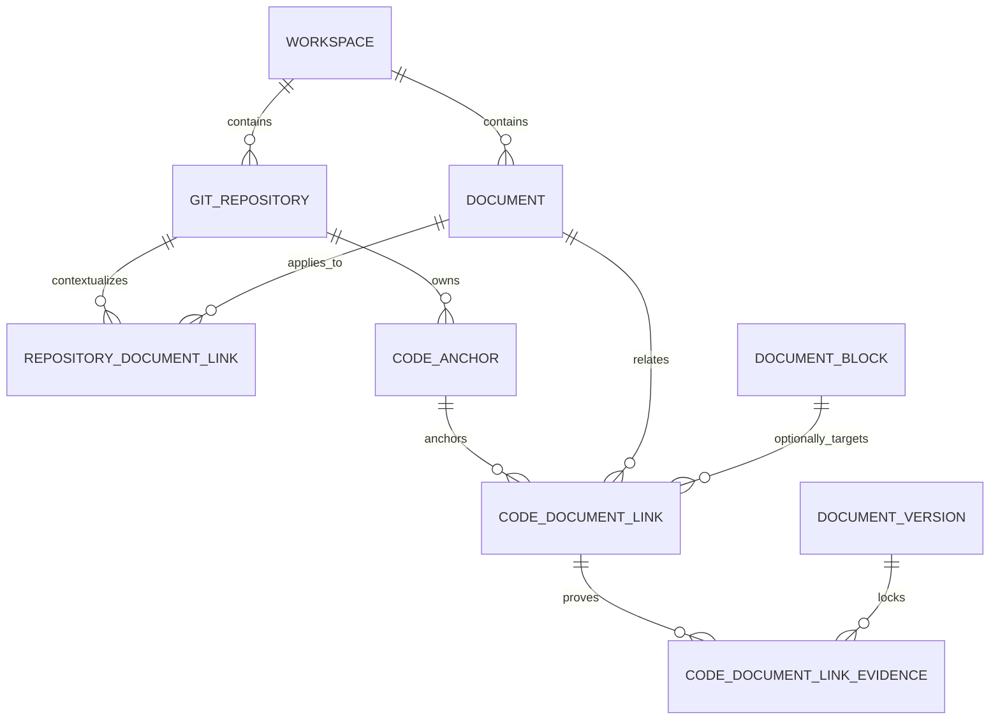
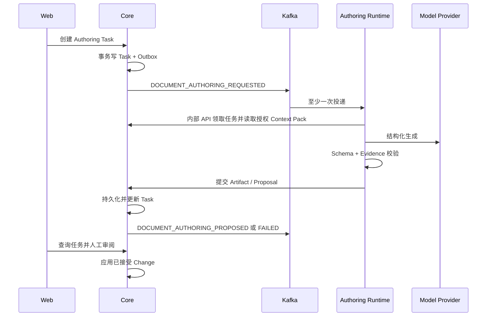
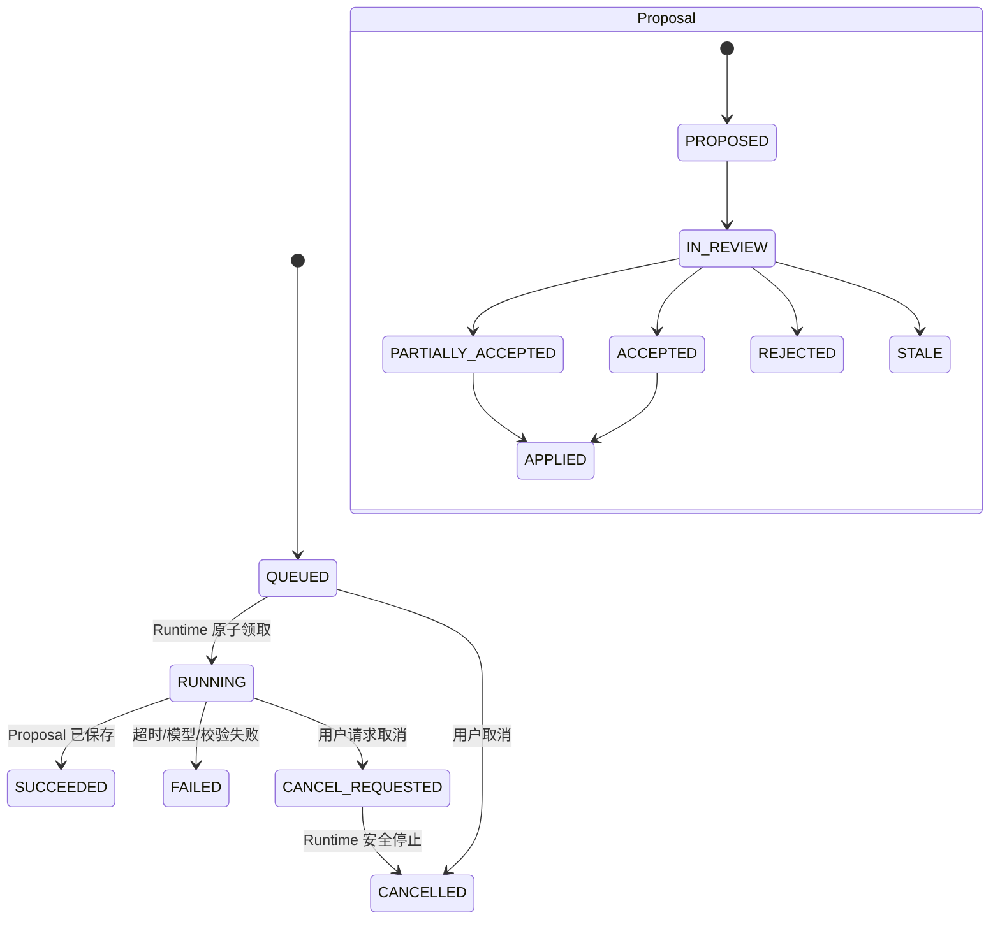

# DevCollab 代码—文档关联与异步文档施工设计 V0.1

## 文档信息

| 项目 | 内容 |
|---|---|
| 文档类型 | 代码—文档关联与异步文档施工专项设计 |
| 文档状态 | Slice 1 已批准实施；Slice 2–7 仍为设计草案 |
| 版本 | V0.1 |
| 日期 | 2026-07-22 |
| 适用范围 | Web、Knowledge Core、Worker、Agent Review Service、PostgreSQL、Kafka、MinIO |
| 需求来源 | 对现有真实关联、Linked Workbench Mock 与后续文档施工能力的专项审计 |
| 相关基线 | `02-devcollab-system-architecture-v0.3.md`、`07-devcollab-agent-rag-architecture-v0.1.md`、`12-devcollab-git-knowledge-design-v0.4.md`、`design/code-doc-linked-workbench/DESIGN_SPEC.md` |

## 实施批准状态

已批准：

- Repository ↔ Document；
- File ↔ Document；
- File ↔ Block；
- FILE Anchor；
- PostgreSQL 持久化；
- 创建、聚合查询和软解除；
- 旧 `code_document_bindings` 保留为 Path Rule；
- Linked Workbench 移除生产 Fixture；
- 权限、幂等、刷新恢复和 E2E。

尚未批准实施：

- SYMBOL/RANGE Anchor；
- 完整 Evidence；
- 漂移计算；
- Agent；
- MCP；
- RAG；
- Sandbox。

## 1. 当前现实

结论：DevCollab 已有真实 Git、文档和粗粒度路径绑定能力，但新版 Linked Workbench 展示的 Anchor、Link、Issue 和 Evidence 仍由前端 Fixture 临时生成。当前不是“数据库完全没有关联”，而是“旧路径绑定没有接入新版工作台，且数据模型尚不能表达提交、符号、范围、关系类型、状态和版本证据”。

已确认的代码证据：

- V17 已创建 `code_document_bindings`，包含 `repository_id`、`document_id`、可选 `block_id` 和 `path_pattern`。
- `GitKnowledgeController` 已提供绑定创建、按文档查询和删除 API。
- `GitKnowledgeApplicationService` 已校验 Workspace、Repository、Document 和 Block 归属，并用路径规则计算变更影响。
- V20 已创建 `code_symbols`、`code_symbol_dependencies` 和 `code_file_dependencies`；Worker 使用 JavaParser 生成 Java 符号和确定性依赖。
- `CodeWorkbenchView.vue` 调用真实仓库、文件、源码、文档和版本 API，但调用 `buildLinkedWorkbenchFixture()`生成联动关系。
- `CodeBindingPanel.vue` 能操作旧路径绑定，但新版 Linked Workbench 没有读取 `listCodeBindings()`。
- `agent-review-service` 只有确定性规则 FastAPI 接口，不调用模型、不消费 Kafka，也不回写 Core。
- 当前没有 Authoring Task、Artifact、Proposal、Evidence 持久化或 MCP 服务。

验证证据：

- Core 联动构建后 `GitKnowledgeIntegrationTests` 6 项通过，Flyway 成功执行 V1–V21。
- Worker Git 存储与 Java AST 8 项测试通过。
- Linked Workbench 状态与双向定位 6 项前端测试通过，但验证的是 Fixture 交互，不是数据库关系。
- Agent Review 确定性规则 4 项测试通过。
- 单独执行 `-pl knowledge-core` 曾因本地 gRPC 生成产物过期而测试编译失败；使用 `-am` 同步重建契约后通过。这是模块独立构建的工具链风险，不是 Git 绑定用例失败。

## 2. 产品边界

本能力的目标不是让模型自动维护全部文档，而是建立以下受控闭环：

```text
真实 Repository / Commit / File / Symbol
  -> 显式代码—文档关系
  -> 可解释 Context Manifest
  -> 异步生成结构化 Proposal
  -> Evidence 校验
  -> 人工逐项审阅
  -> Core 使用现有 Block、版本和协作链路应用
```

首期原则：

- 显式关系优先于语义猜测。
- 逻辑关系与版本证据分离。
- Agent 只能提出修改，不能直接改 Block 或发布文档。
- 人类确认和 Core 权限校验是最终写入边界。
- 第一垂直切片不调用模型。

## 3. 能力现实矩阵

状态含义：`DONE` 有实现和测试证据；`PARTIAL` 有部分链路；`MOCK` 仅前端演示；`MISSING` 未找到实现；`UNKNOWN` 未取得足够证据。

| 能力 | 状态 | 当前证据与断点 |
|---|---|---|
| Workspace | DONE | Core 工作区、成员和权限链路已存在 |
| Workspace ↔ Git Repository | DONE | `git_repositories.workspace_id` |
| Workspace ↔ Document | DONE | `documents.workspace_id` |
| Git Repository 注册 | DONE | Controller、Service、V17、集成测试 |
| Git Repository 同步 | DONE | Outbox → Kafka Git Topic → Worker JGit |
| Repository File | DONE | `git_repository_files` 与文件列表 API |
| 文件内容读取 | DONE | 受限 UTF-8 文本快照，最大 512 KiB |
| Commit | DONE | `git_changes` 与真实 Git Log 投影 |
| Diff | DONE | `git_file_diffs`，含 rename、binary、patch excerpt |
| Java Code Symbol | DONE | V20、JavaParser、源码 API 返回 symbols |
| Code Symbol Dependency | DONE | 首期支持仓库内 EXTENDS/IMPLEMENTS |
| Code File Dependency | DONE | 首期支持显式内部 IMPORTS |
| Document | DONE | Core 文档领域与 API |
| Document Tree | DONE | 树 API、层级和前端 |
| Document Version | DONE | 不可变发布快照与版本状态 |
| Document Block | DONE | 结构化 Block 与专用 Node |
| Block 稳定 ID | DONE | UUID Block ID |
| Block 编辑 | DONE | Tiptap + Core Command |
| Block 自动保存 | DONE | 前端保存状态与乐观锁 |
| Block 协作 | DONE | WebSocket、Gateway、gRPC、操作日志 |
| Review Issue | DONE | V11、CRUD、状态事件与面板 |
| Review Evidence | MISSING | 只有 Fixture `LinkedEvidence`，没有权威表/API |
| `code_document_bindings` | DONE | V17、JDBC Repository、API、集成测试 |
| pathPattern → Document | DONE | `block_id` 为空时表示整篇文档 |
| pathPattern → Block | DONE | 可选 `block_id` 且校验归属 |
| Repository → Document | PARTIAL | 可用任意 pathPattern 间接表达，缺少明确项目适用关系 |
| File → Document | PARTIAL | 精确路径可表达，但不验证文件存在且无 scope/status/commit |
| Symbol → Document | MISSING | `code_symbols` 未连接绑定表 |
| Symbol → Block | MISSING | 无 symbol/anchor link 表与 API |
| CodeAnchor | MOCK | 只有前端类型和 Fixture，无持久化 |
| CodeDocumentLink | MOCK | 只有前端类型和 Fixture，无持久化 |
| 关联创建 API | PARTIAL | 仅旧 pathPattern 绑定 |
| 关联删除 API | PARTIAL | 物理删除且任意成员可删除，缺少审计状态 |
| 关联查询 API | PARTIAL | 仅按 Document 查询；缺按 Repository/File/Context 聚合 |
| 关联前端入口 | PARTIAL | Document Workbench 有旧面板；Linked Workbench 无入口 |
| 刷新后关联保留 | PARTIAL | 旧面板可保留；Rail 刷新后仍重建 Fixture |
| 漂移检测 | MISSING | Fixture 人工制造 DRIFTED；后端无状态计算 |
| Agent Workflow | MISSING | 规则服务不是异步施工 Runtime |
| Agent Artifact | MISSING | 无表、对象或 API |
| 文档生成 | MISSING | 无任务与 Proposal |
| 文档修改提案 | MISSING | 无 Block Change 契约 |
| 人工审阅提案 | MISSING | Review Issue 不能替代 Proposal |
| MCP | MISSING | 无模块与服务 |
| Search / RAG | PARTIAL | PG/ES 搜索存在，RAG 未实现且首期不需要 |
| Sandbox | MISSING | 未实现，首期也不需要 |

## 4. 关系模型

采用三层关系，不把 Workspace 归属误当成工程语义：

1. Repository / Project Context：表示文档适用于哪个仓库。
2. File Association：表示精确文件与 Document 或 Block 的关系。
3. Symbol / Range Association：表示符号或范围与 Block 的精确关系。



`RepositoryDocumentLink` 需要独立存在，但只表达“整篇文档适用于仓库”的项目级语义，不为每条 File Link 自动复制一行。Workspace 只解决租户与权限边界，不能回答一篇文档适用于工作区内哪个仓库。

## 5. Repository / File / Symbol / Block 层级

### 5.1 RepositoryDocumentLink

- 绑定 `repositoryId + documentId`。
- 支持 `ARCHITECTURE_OF`、`REQUIREMENT_FOR`、`TEST_PLAN_FOR`、`OPERATES` 等项目级关系。
- 绑定逻辑 Document，不绑定版本。

### 5.2 CodeAnchor

`scope` 为 `FILE`、`SYMBOL` 或 `RANGE`：

- FILE：`repositoryId + lockedCommitSha + filePath + fileBlobSha`。
- SYMBOL：在 FILE 上增加 `symbolKey`，Java 首期复用 V20 符号键。
- RANGE：在 FILE 上增加 `startLine + endLine + contentHash`；用于非 Java 或无解析器场景。

行号只用于定位和校验，不作为长期身份。`fileBlobSha`、`symbolKey` 和 `contentHash` 共同提供迁移和漂移判断依据。

### 5.3 CodeDocumentLink

- 指向逻辑 `documentId` 和可选稳定 `blockId`。
- `blockId` 为空表示整篇文档。
- 允许一个 Anchor 关联多个 Block，也允许一个 Block 关联多个 Anchor。
- 逻辑关系不锁定 `documentVersionId`；证据快照锁定版本。
- `relationType` 首期使用 `DESCRIBES, IMPLEMENTS, CONFIGURES, TESTS, MIGRATES, DEPLOYS, EVIDENCE, CONFLICTS_WITH`。
- `sourceType` 使用 `HUMAN, IMPORT, RULE, AGENT_PROPOSED`；Agent 候选只存在 Proposal 中，人工接受后才由 Core 创建真实 Link 并保留该来源。
- Anchor 状态由确定性校验产生 `VALID, DRIFTED, BROKEN`；Link 审阅状态使用 `PENDING_REVIEW, ACTIVE, REJECTED, SUPERSEDED`，不能由模型自行设为 ACTIVE。

## 6. 数据模型

不建议继续把 `code_document_bindings` 扩展成大量可空字段。该表当前是“路径匹配规则”，兼顾变更影响计算；Anchor/Link 是“精确关系与证据”。二者语义不同。

推荐采用方案 B：新增领域专用表，旧表作为兼容路径规则保留一段迁移期。

| 维度 | 扩展旧表 | 专用表（推荐） |
|---|---|---|
| 领域语义 | path rule、anchor、link 混合 | Project Link、Anchor、Link、Evidence 分离 |
| 外键/约束 | 大量条件可空字段 | 可按对象建立明确约束 |
| 查询 | 早期少表，后期条件复杂 | 聚合 API 负责组装，查询稳定 |
| rename/drift | 难区分规则命中与锚点失效 | Anchor 独立维护状态 |
| Agent Context | 需解释一张多态表 | 可直接按显式对象装配 |
| 兼容性 | API 改动小 | 用适配器保留旧 API，精确路径可迁移 |

建议表：

### 6.1 `repository_document_links`

核心字段：`id, workspace_id, repository_id, document_id, relation_type, status, source_type, created_by, created_at, validated_at`。

唯一约束：`(repository_id, document_id, relation_type)`；索引：`repository_id,status` 与 `document_id,status`。

### 6.2 `code_anchors`

核心字段：`id, workspace_id, repository_id, scope, branch, commit_sha, file_path, file_blob_sha, language, symbol_key, qualified_symbol, start_line, end_line, content_hash, parser_version, status, created_at, validated_at`。

约束：

- FILE/SYMBOL/RANGE 必须有 `file_path` 和 `commit_sha`。
- SYMBOL 必须有 `symbol_key`。
- RANGE 必须有合法行范围和 `content_hash`。
- 业务幂等键由 scope 对应字段计算 `anchor_fingerprint`，数据库唯一约束 `(repository_id, anchor_fingerprint)`。

索引：`repository_id,file_path,status`、`repository_id,symbol_key`、`commit_sha`。

### 6.3 `code_document_links`

核心字段：`id, workspace_id, code_anchor_id, document_id, block_id, relation_type, status, source_type, created_by, reviewed_by, created_at, reviewed_at, validated_at`。

唯一约束使用标准化 `target_key`：Block 时为 Block UUID，整篇文档时为固定 `DOCUMENT`，形成 `(code_anchor_id, document_id, target_key, relation_type)`。

### 6.4 `code_document_link_evidence`

核心字段：`id, link_id, evidence_type, repository_id, commit_sha, file_path, file_blob_sha, symbol_key, start_line, end_line, content_hash, document_id, document_version_id, block_id, block_version, excerpt_hash, rationale, created_at`。

Evidence 不被后续版本覆盖。新版本沿用逻辑 Link，但创建新的证据记录；已删除 Block 使 Link 进入 `BROKEN`，不级联物理删除审计证据。

### 6.5 旧表迁移

- 精确路径绑定可迁移为 FILE Anchor + CodeDocumentLink。
- `directory/**` 与 `**/*.ext` 继续留在旧表，明确命名为 Path Rule，用于影响候选，不直接成为 Rail 精确关系。
- 新 UI 不再把 Path Rule 伪装成精确 Anchor。
- 迁移完成前旧 API 保持兼容，只读返回中增加 `bindingKind=PATH_RULE`。

## 7. API

### 7.1 原子创建真实关联

```http
POST /api/v1/workspaces/{workspaceId}/code-document-links
Idempotency-Key: <uuid>
```

请求包含：

```json
{
  "repositoryId": "uuid",
  "source": {
    "scope": "FILE",
    "branch": "main",
    "commitSha": "...",
    "filePath": "src/main/java/OrderService.java",
    "fileBlobSha": "...",
    "symbolKey": null,
    "startLine": null,
    "endLine": null,
    "contentHash": null
  },
  "target": { "documentId": "uuid", "blockId": null },
  "relationType": "IMPLEMENTS",
  "sourceType": "HUMAN"
}
```

Core 在一个事务中校验并 upsert Anchor、创建 Link、记录操作日志。前端不能分别调用两个无事务 API。

### 7.2 查询工作台上下文

```http
GET /api/v1/workspaces/{workspaceId}/code-document-context
  ?repositoryId=...
  &commitSha=...
  &filePath=...
  &documentId=...
```

返回 Repository、Source、Symbols、相关 Documents、Anchors、Links、Evidence、Issues 和 Link 状态。Linked Workbench 使用这一聚合查询替换 Fixture，避免多次请求产生不一致选择。

### 7.3 解除关联

```http
DELETE /api/v1/workspaces/{workspaceId}/code-document-links/{linkId}
```

首期语义为状态改为 `SUPERSEDED` 并写操作日志，不物理删除 Evidence。只有 ADMIN、Link 创建者或具备文档管理权限的成员可操作；现有“任意成员可删除”需要收紧。

### 7.4 错误码

- `CODE_ANCHOR_SOURCE_NOT_FOUND`
- `CODE_ANCHOR_COMMIT_MISMATCH`
- `CODE_ANCHOR_RANGE_INVALID`
- `CODE_LINK_TARGET_INVALID`
- `CODE_LINK_ALREADY_EXISTS`
- `CODE_LINK_STALE`
- `CODE_LINK_ACCESS_DENIED`
- `DOCUMENT_PROPOSAL_STALE`
- `DOCUMENT_PROPOSAL_ALREADY_APPLIED`

## 8. 异步任务

仅设计一个 Document Authoring Runtime，支持三种 `taskType`：

- `GENERATE_DOCUMENT_FROM_CODE`
- `UPDATE_DOCUMENT_FROM_CODE`
- `REVIEW_CODE_DOCUMENT_CONSISTENCY`



Runtime 不持有 Core 数据库凭证，不自由扫描仓库，不直接写文档表，不执行 Shell，不调用互联网，不自动发布。

最小事件集合：

- `DOCUMENT_AUTHORING_REQUESTED`：必须，驱动 Runtime。
- `DOCUMENT_AUTHORING_PROPOSED`：必须，用于通知和观测。
- `DOCUMENT_AUTHORING_FAILED`：必须，明确终态。
- `DOCUMENT_PROPOSAL_APPLIED`、`DOCUMENT_PROPOSAL_REJECTED`：建议，用于审计与通知。
- `DOCUMENT_AUTHORING_STARTED` 不必首期进入 Kafka；由任务领取接口原子更新状态即可。

## 9. Document Change Proposal

模型不得只返回 Markdown 字符串。Core 接受经过 Pydantic 和服务端 Schema 双重校验的结构化对象。

`DocumentChangeProposal` 关键字段：

- 身份：`proposalId, taskId, taskType, workspaceId, repositoryId`。
- 锁定上下文：`lockedCommitSha, filePath, symbolKey, targetDocumentId, baseDocumentVersionId`。
- 描述：`title, summary, changes[], evidenceRefs[]`。
- 可追溯：`modelProvider, modelName, promptVersion, schemaVersion, tokenUsage, traceId`。
- 生命周期：`status, createdAt, expiresAt, appliedAt`。

`DocumentBlockChange` 关键字段：

- `changeId, operation, targetBlockId, insertAfterBlockId`。
- `proposedBlockType, proposedContent, expectedBlockVersion`。
- `rationale, evidenceRefs, confidence`。
- `reviewStatus, reviewerId, reviewerComment, reviewedAt`。
- `finalAcceptedContent`，保存人类编辑后接受的最终内容。

首期仅允许 `CREATE_DOCUMENT`、`ADD_BLOCK`、`UPDATE_BLOCK`、`INSERT_AFTER_BLOCK`。禁止 `DELETE_BLOCK`、`MOVE_BLOCK` 和整篇覆盖。

任务状态：`QUEUED, RUNNING, SUCCEEDED, FAILED, CANCEL_REQUESTED, CANCELLED`。

提案状态：`PROPOSED, IN_REVIEW, PARTIALLY_ACCEPTED, ACCEPTED, REJECTED, STALE, APPLIED, EXPIRED`。

Change 审阅状态：`PENDING, ACCEPTED, EDITED_AND_ACCEPTED, REJECTED, APPLIED, STALE`。

## 10. Evidence

Evidence 是可应用提案的强制条件，不是说明文字。Verifier 必须检查：

- Repository 属于 Workspace，用户仍有权限。
- Commit、File、Blob 和 Symbol 存在。
- 行范围合法且 `contentHash` 匹配。
- Document、Version 和 Block 存在且归属一致。
- Proposal 未过期、未重复应用。
- Base Document/Block Version 未变化。

逻辑 Link 绑定 Document/Block；Evidence 锁定 `documentVersionId + commitSha`。草稿没有发布版本时，Evidence 记录 `blockVersion` 和草稿快照哈希。

## 11. 人工审阅

复用 Linked Inspector 和现有 Review 区，新增“提案”标签，不新建聊天页面。

展示内容：任务状态、生成摘要、Block 级原文/建议 Diff、Evidence、冲突/过期提示，以及 `接受`、`编辑后接受`、`拒绝`、`全部接受`、`全部拒绝`。

Review Issue 表示“发现了什么问题”；Document Change Proposal 表示“建议如何修改”。二者可以通过 ID 关联，但不能共用同一状态机或同一表。

## 12. Agent Runtime

第一批真实关联不需要 Agent。进入 Slice 3 时，推荐扩展现有 `agent-review-service` 为唯一 Python Document Authoring Runtime，而不是再创建第二套 Agent 服务。

职责：

- 消费受控任务。
- 从 Core 内部 API 领取 Context Pack。
- 调用 Model Provider Adapter。
- 使用 Pydantic 校验结构化输出。
- 执行 Evidence 预校验。
- 将 Artifact/Proposal 提交给 Core。

最终权限、数据库写入和 Proposal 应用仍归 Core。

## 13. SDK 选择

| 方案 | 结论 | 原因 |
|---|---|---|
| Java Worker + Provider Client | 不作为首选 | 会把模型运行时与现有投影 Worker 混合，且浪费已有 Python 服务 |
| Python + FastAPI + Pydantic + 简单状态机 | 推荐 | 当前流程线性，结构化输出强，部署边界清晰 |
| Python + LangGraph | 暂缓 | 首期没有复杂分支、循环、持久化图检查点或 Runtime 内人工暂停 |
| OpenAI Agents SDK/其他 Agent SDK | 暂缓 | 首期不是工具自主决策或多 Agent 协作问题 |

最小依赖集合建议：FastAPI、Pydantic、官方模型 SDK、薄 Provider Adapter、成熟 HTTP/Kafka Client、现有 OpenTelemetry 接入。重试使用 SDK或成熟重试库，不自研协议解析和退避框架。

明确决策：

- 第一版不需要 LangGraph，普通持久化任务状态机更简单。
- 保留薄 Provider Adapter，避免业务契约绑定模型厂商。
- Pydantic 必须用于严格结构校验，但 Core 仍需二次校验。
- 第一版不需要 LangChain，也不需要 Agents SDK。
- 避免同时运行多个 Agent Runtime。
- 当流程出现可恢复多阶段分支、工具循环、长时间暂停/恢复和可重放 Checkpoint 时，再评估 LangGraph。

## 14. Context Manifest

`AuthoringContextManifest`：

```text
workspaceId, repositoryId, branch, commitSha,
filePath, fileBlobSha, language, selectedSymbolKey,
codeAnchorIds, targetDocumentId, baseDocumentVersionId,
selectedBlockIds, relationIds, taskType, requesterId,
permissionSnapshot, tokenBudget, traceId
```

Context Pack 分级：

- Level 0：Manifest 与关系摘要。
- Level 1：当前文件或受限片段、当前 Symbol、目标 Document/Blocks、显式 Relations。
- Level 2：仅用户明确选择的一跳确定性依赖。

建议首期限制（待验证后调整）：

- 只接受 Core 已投影为可读的 UTF-8 文本；原始文件上限沿用 512 KiB。
- 默认只装配 128,000 字符代码和 120,000 字符文档正文；超限优先按 Symbol/Block 边界裁剪，不静默截断 Evidence 范围。
- 文档最多 200 个 Block；Level 2 最多 10 个用户确认文件。
- 默认输入预算 32k tokens，可配置但不可由模型自行扩大。
- 拒绝二进制、私钥、证书、`.env*`、凭证目录和命中敏感信息策略的内容。
- `permissionSnapshot` 只供审计；领取任务和应用 Proposal 时必须重新鉴权。

## 15. 状态机



## 16. 幂等

- 创建 Task 使用客户端 `Idempotency-Key`，唯一约束 `(workspace_id, requester_id, idempotency_key)`。
- Kafka 消费沿用 Consumer Inbox，消费者名和 eventId 唯一。
- Runtime 领取使用状态条件更新，防止两个实例同时执行。
- Proposal 提交唯一约束 `task_id`；同一任务只接受一个当前 Proposal 版本。
- 每个 Change 有稳定 `changeId`；应用记录唯一 `(proposal_id, change_id)`。
- Core 应用时再次检查 `expectedBlockVersion`，冲突即标记 STALE，不自动重试覆盖。

## 17. 权限

- Repository/Document/Block 必须属于同一 Workspace。
- 创建人工关系至少要求 Workspace MEMBER；删除他人关系或项目级关系建议要求 ADMIN。
- 创建 Authoring Task 要求用户可读源代码并可编辑目标文档。
- Runtime 只使用短期内部服务身份和 Task Scope，不继承用户 Access Token。
- 提案审阅遵循文档编辑权限；发布仍遵循既有文档评审规则。
- 每次读取 Context、提交 Proposal、应用 Change 都重新校验当前权限。

## 18. 安全

- 不向模型传递 Refresh Token、Cookie、Git Token、数据库凭证或环境秘密。
- Context Builder 使用路径白名单、敏感路径拒绝和内容扫描。
- 模型输出视为不可信输入，执行 Schema、长度、Block 类型、HTML/链接和 Evidence 校验。
- Runtime 无 Shell、无 Core DB、无仓库文件系统自由访问。
- 日志只记录 ID、状态、耗时、Token 使用和哈希，不记录完整源码、Prompt 或密钥。
- Artifact 过期后按保留策略清理；Evidence 与审计记录保留。

## 19. 可观测性

建议指标：

- `authoring_tasks_total{type,status}`
- `authoring_task_duration_seconds{type}`
- `authoring_context_chars/tokens`
- `authoring_model_requests_total{provider,result}`
- `authoring_schema_validation_failures_total`
- `authoring_evidence_validation_failures_total{reason}`
- `document_proposal_changes_total{operation,reviewStatus}`
- `document_proposal_apply_conflicts_total`
- `code_links_total{scope,status,relationType}`
- `code_anchor_validation_total{result}`

Trace 贯穿 Web 请求、Task、Outbox Event、Kafka Consumer、模型调用、Proposal 和应用操作。不得把源码正文放入 span attribute。

## 20. 分阶段计划

| Slice | 前置与主要交付 | 测试/验收 | 明确不做 | 主要风险 |
|---|---|---|---|---|
| 0 现实审计 | 本文、矩阵、断点、契约 | 文档证据检查 | 不改生产代码 | 把 Mock 误判为完成 |
| 1 真实 File ↔ Document | 新关系表/API、旧绑定兼容、Linked Workbench 接入 | DB/API/权限/刷新/E2E | 不调用模型 | 数据迁移与权限过宽 |
| 2 Symbol/Anchor ↔ Block | Java symbolKey、Anchor、Rail、Evidence、VALID/BROKEN | Symbol、范围、双向定位、失效 | 不做语义检索 | rename 与符号键变化 |
| 3 新文档 Proposal | Task、Context、Runtime、结构化 Draft、人工接受后建 DRAFT | 幂等、失败、取消、Schema/Evidence、人工门禁 | 不用 RAG | 模型不确定性与敏感上下文 |
| 4 更新文档 Proposal | Block Diff、逐项审阅、乐观锁、STALE | 并发编辑、部分接受、重复应用 | 不删/移 Block | 覆盖人类编辑 |
| 5 确定性漂移 | 新 Commit 对 Anchor 校验、状态与 Issue | rename/hash/symbol 迁移 | 不让模型决定状态 | 误报与批量重算 |
| 6 Context/MCP | 统一 Manifest、外部 Agent 只读上下文 | 权限、审计、最小披露 | 不写 Core | 外部身份与泄露 |
| 7 检索增强 | BM25/Vector/RRF 补充候选 | 离线检索评测、权限过滤 | 不替代显式关系 | 相关性不可量化 |

## 21. 第一垂直切片

推荐 1–2 周只完成“现有 path binding 接入新版 Linked Workbench，并补足精确 File Link 和真实 Block Link”。

交付顺序：

1. 新增关系表与迁移，但保留旧 API。
2. 实现原子创建、聚合查询和软解除 API。
3. 用真实 Repository、Commit、File、Document、Block 创建关系。
4. Linked Workbench 移除 `buildLinkedWorkbenchFixture()`的生产路径。
5. Sidebar 仅展示真实相关文档；Rail 仅展示真实 Link。
6. 刷新后从数据库恢复；空数据时显示“尚未建立关联”，不生成假 Issue。
7. 增加创建/解除入口、权限拒绝和冲突提示。
8. 完成 DB、API、前端状态和浏览器 E2E。

## 22. 验收条件

- 一个真实文件可关联多个文档，一个文档可关联多个文件。
- 一个文件可关联整篇 Document 或指定 Block。
- 关系写入 PostgreSQL，刷新页面后仍存在。
- Linked Sidebar、Rail、Inspector 使用同一批后端 Link ID。
- 未关联时不出现 Mock Anchor、Mock Issue 或 Mock Evidence。
- 点击代码、Rail、Block 仍保持双向定位和四种模式共享选择。
- 非 Workspace 成员返回 403；非法 Block 归属、Commit 或文件返回明确错误。
- 重复创建幂等；解除后 Rail 更新且审计可查。
- Core API/数据库测试、前端测试、浏览器 E2E 通过。
- 本 Slice 不发起模型请求。

## 23. 暂不实现

- LangGraph、多 Agent、LangChain、Agents SDK。
- MCP Context Server。
- RAG、向量数据库和 ES 语义检索。
- Sandbox、构建、测试执行和补丁验证。
- 全仓库自由扫描和自动依赖扩展。
- 自动修改、自动发布、自动删除/移动 Block。
- 私有仓库凭证与互联网工具调用。

## 24. 待确认决策

1. 是否批准采用专用 `repository_document_links + code_anchors + code_document_links + evidence`，而不是继续膨胀旧表。
2. 是否批准旧 `code_document_bindings` 仅保留为 Path Rule 并做兼容迁移。
3. RepositoryDocumentLink 是否作为独立的项目适用关系进入 Slice 1。
4. 解除 Link 是否统一采用软失效并保留审计。
5. 关系创建/删除权限是否采用“成员创建，创建者或管理员删除”。
6. 首期上下文 32k token、单文件原始 512 KiB 与装配字符上限是否接受为待压测默认值。
7. Slice 3 是否扩展现有 Python `agent-review-service`，不新建第二 Agent Runtime。
8. Proposal 小结构存 PostgreSQL JSONB、大 Artifact/原始响应存 MinIO 的分层是否接受。
9. 首期更新操作是否明确禁止 DELETE_BLOCK、MOVE_BLOCK 和整篇覆盖。
10. 是否批准先完成 Slice 1/2，再评审模型接入。

## 相关文档

- `02-devcollab-system-architecture-v0.3.md`
- `03-devcollab-architecture-verification-v0.1.md`
- `07-devcollab-agent-rag-architecture-v0.1.md`
- `10-devcollab-structured-block-contract-v0.2.md`
- `12-devcollab-git-knowledge-design-v0.4.md`
- `13-devcollab-git-markdown-import-design-v0.1.md`
- `design/code-doc-linked-workbench/DESIGN_SPEC.md`
