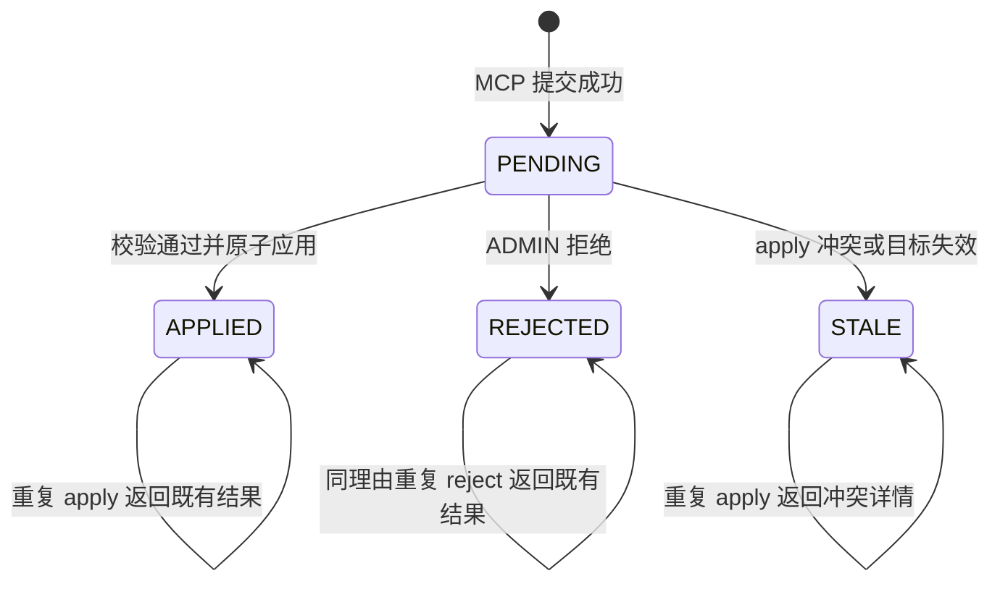
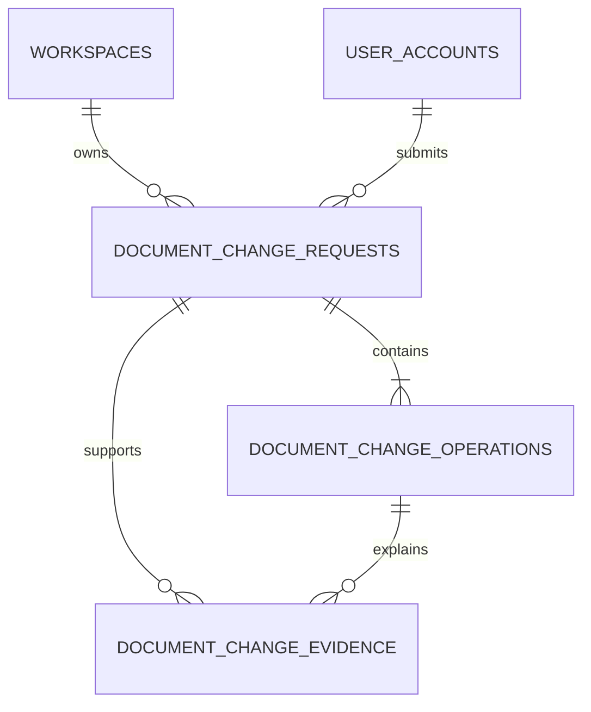
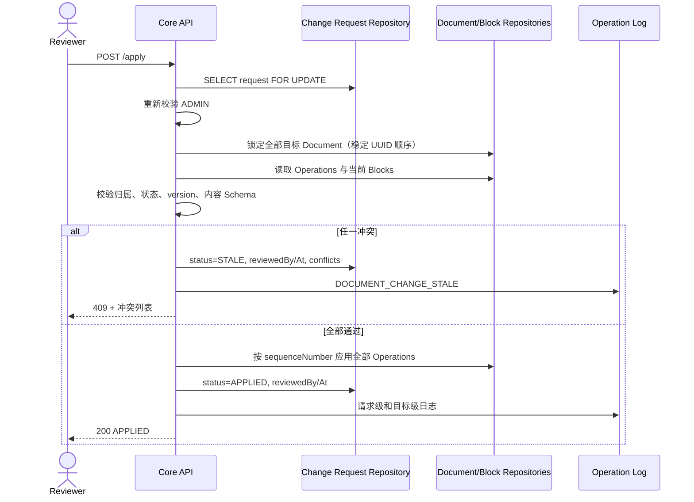

# DevCollab 文档变更待评审闭环设计 V0.1

## 文档信息

| 项目 | 内容 |
|---|---|
| 文档类型 | 前后端业务与接口专项设计 |
| 文档状态 | 待评审 |
| 版本 | V0.1 |
| 日期 | 2026-07-26 |
| 适用范围 | Knowledge Core、MCP Context Server、Vue Web、PostgreSQL |
| 设计阶段 | 第三阶段；仅形成施工基线，不代表生产能力已实现 |
| 依据 | `02-devcollab-system-architecture-v0.3.md`、`10-devcollab-structured-block-contract-v0.2.md`、`12-devcollab-git-knowledge-design-v0.4.md`、`14-devcollab-code-document-authoring-design-v0.1.md`、`15-devcollab-mcp-context-server-implementation-plan-v0.1.md` |
| 原型 | `design/document-change-review/devcollab-document-change-review.html` |

## 1. 结论与产品目标

第三阶段建立一条“Agent 只能提案，人类决定是否写入正式文档”的受控写入链路：

```text
Agent 读取受权限控制的代码、文档和绑定
→ 生成结构化 Operations 与 Evidence 引用
→ MCP 创建 PENDING 变更请求
→ ADMIN 在 Web 中对照原文、建议和代码证据
→ Core 重新鉴权并检查真实 Block version
→ 无冲突则在单个事务内应用全部 Operations 并标记 APPLIED
→ 有冲突则不应用任何 Operation，并标记 STALE
→ 拒绝则保留提案与证据并标记 REJECTED
```

`APPLIED` 而不是 `APPROVED` 是终态名称，因为本阶段不允许出现“已批准但尚未写入”的中间状态。批准与应用属于同一个 Knowledge Core 事务；事务提交才表示决定已经产生业务效果。

本设计不引入 LangGraph、DeepSeek、自动 Agent 调度、多 Agent、自动批准、向量数据库、新 Elasticsearch 索引、评论讨论、多人实时评审、复杂审批流或移动端。MCP Tool 不直接修改 `documents` 或 `document_blocks`。

## 2. 真实实现基线

### 2.1 可复用的真实能力

| 能力 | 当前真实实现 | 第三阶段用法 |
|---|---|---|
| 文档模型 | `Document` 含 `id/workspaceId/parentDocumentId/title/documentType/reviewStatus/createdBy/createdAt/updatedAt` | 创建新 DRAFT 文档；不把 `updatedAt` 伪装为文档版本 |
| Block 模型 | `DocumentBlock` 含结构化内容、`sortOrder` 和真实 `version` | UPDATE/DELETE 冲突检查的权威版本 |
| Block 类型 | `PARAGRAPH/HEADING/CODE/TODO` | proposedBlockType 白名单 |
| 内容契约 | Schema V1 Tiptap JSON + 服务端派生 `plainText` | proposedContent 必须通过现有 `DocumentBlockContentCodec` |
| Block 更新 | `updateContentIfVersionMatches` | UPDATE_BLOCK 的原子 compare-and-set |
| Block 删除 | `deleteIfVersionMatches` | DELETE_BLOCK 的原子 compare-and-delete |
| Block 新增 | 当前 `create` 默认追加，版本从 0 开始 | 第一版 ADD_BLOCK 仅支持按 Operation 顺序追加 |
| 工作区权限 | MEMBER 可读写普通文档；文档批准/拒绝由 ADMIN 执行 | MCP 提交要求成员；人工 apply/reject 要求 ADMIN |
| 操作日志 | `operation_logs`，可记录 workspace/document/target/operator | 记录请求创建、应用、拒绝、失效及逐目标变更 |
| Git 证据 | Repository 有 `lastSyncedCommit`，文件投影有 path/blob/language/content | Core 在提交时校验证据并固化代码片段 |
| MCP 身份 | Bearer Access Token 映射为真实 `McpUserIdentity.userId`，Core 二次鉴权 | `submittedBy` 使用真实用户 ID，不接受客户端传 userId/role |

### 2.2 当前前端空壳

浏览器和源码审计确认：

- “待我评审”位于 `LinkedWorkspaceNavigation.vue`；
- 当前没有 `/reviews` 路由；
- 当前徽标来自 `CodeWorkbenchView.vue` 中 Typed Mock Issue 的 OPEN 数量；
- 点击入口仅把当前 Linked Workbench Inspector 切到 Mock 问题，不展示请求列表；
- “联动对照”和“待我评审”本来就是同一工作区导航下的两个功能入口，Review 不得被设计为离开工作区后的独立后台；
- 当前 AppSidebar 宽度可拖动且可整体收起，内部包含真实 Repository 选择、branch/commit 和仓库文件树；Review 必须原样复用，不得用“当前工作区”摘要卡替代；
- 当前 Linked Workbench 已具备浅色代码窗格、当前正式文档 Block、双向定位、Rail 和可折叠 Inspector。Review 模式复用代码窗格和文档窗格，但不显示 Code Anchor Rail；
- 当前 Inspector 展开后约 270–310 px；Review Inspector 建议 320–380 px，可折叠到约 42 px，承载建议、Operation、Evidence 索引、警告和审核操作，不承载源码编辑器；
- Review 详情中代码与正式文档必须同时可见：代码 Evidence 固定位于左中区域，正式文档与内联 Diff 位于视觉中心；
- 当前 `DocumentWorkbenchView` 的文档评审是“整篇文档提交/发布”状态机，与本设计的“Agent 文档变更请求”不是同一聚合，不共用表或状态。

### 2.3 不得伪造的能力

- `Document` 当前没有 revision/version 字段；本设计不增加或输出假的 documentVersion。
- `DocumentVersion` 是发布快照版本，不是草稿并发版本，不能用于草稿 Block 修改冲突检查。
- `DocumentBlock` 没有 `parentBlockId`；本阶段 Block 仍是文档顶层有序列表。
- 当前 UPDATE API 不支持更改 Block 类型；UPDATE_BLOCK 的类型固定不变。
- 当前 Git 投影只保证当前已同步 Commit 可读；历史 Commit 代码必须由提交时 Evidence 快照保证可评审。

## 3. 第三阶段产品边界

### 3.1 必须实现

1. MCP 提交结构化文档变更请求；
2. PostgreSQL 持久化请求、Operations 和 Evidence；
3. PENDING 数量、分页列表和详情；
4. CREATE_DOCUMENT、ADD_BLOCK、UPDATE_BLOCK、DELETE_BLOCK；
5. 原内容、建议内容和语义化 Diff；
6. 可定位到代码文件及行范围的 Evidence；
7. ADMIN 批准并原子应用；
8. ADMIN 拒绝并保留理由；
9. Block version 冲突检测和 STALE；
10. 幂等、并发决策防护、审计记录和刷新恢复。

### 3.2 明确不实现

- Agent Runtime、模型供应商和 Prompt；
- 自动生成提案、自动批准或 Agent 直接写正式文档；
- partial apply、逐 Operation 接受、编辑后接受；
- MOVE_BLOCK、任意位置插入、Block 层级、整篇 Markdown 覆盖；
- Repository 历史对象存储、RAG、Embedding、向量数据库；
- WebSocket 徽标推送、实时多人评审、评论线程、多级审批。

## 4. 状态模型

### 4.1 状态定义

| 状态 | 含义 | 允许动作 |
|---|---|---|
| `PENDING` | 已持久化且等待 ADMIN 决策；尚未修改正式文档 | 查看、apply、reject |
| `APPLIED` | ADMIN 已批准，且所有 Operations 已在同一事务中成功写入 | 只读查看 |
| `REJECTED` | ADMIN 明确拒绝；Operation 和 Evidence 继续保留 | 只读查看 |
| `STALE` | apply 时发现目标缺失、Block version 不一致或证据上下文失效 | 只读查看；Agent 必须基于新上下文提交新请求 |

`STALE` 不可重新激活。重新生成时创建具有新 `clientRequestId` 的请求，避免旧 base version 被重新利用。

### 4.2 状态转换



| 当前状态 | apply | reject |
|---|---|---|
| PENDING | 校验并进入 APPLIED 或 STALE | 进入 REJECTED |
| APPLIED | 200 返回既有结果，不重复执行 | 409 `REQUEST_ALREADY_APPLIED` |
| REJECTED | 409 `REQUEST_REJECTED` | 同一 reason 返回既有结果；不同 reason 返回 409 |
| STALE | 409 返回冲突列表，不自动重试 | 409 `REQUEST_STALE` |

工作区删除沿用工作区聚合的硬删除语义，请求随工作区删除，不再出现在任何列表。文档或 Block 删除不会物理删除请求；apply 时目标缺失并将请求置为 STALE。

## 5. 变更 Operation 模型

一个 Change Request 包含一个或多个按 `sequenceNumber` 严格有序的 Operation。所有目标必须属于同一工作区；允许跨多个文档，且 apply 维持跨文档单事务原子性。

### 5.1 通用字段

| 字段 | 约束 |
|---|---|
| `id` | 服务端生成 UUID |
| `changeRequestId` | 所属请求 |
| `clientOperationId` | 调用方在单次请求内提供的稳定标识，1–100 字符且唯一；用于提交阶段关联 Evidence 和新文档目标 |
| `sequenceNumber` | 从 1 开始，在请求内唯一且连续 |
| `operationType` | 四种白名单之一 |
| `documentId` | 现有文档目标；与 `createdDocumentOperationId` 二选一 |
| `createdDocumentOperationId` | 引用本请求中更早的 CREATE_DOCUMENT Operation |
| `blockId` | UPDATE/DELETE 必填；其他为空 |
| `baseBlockVersion` | UPDATE/DELETE 必填；ADD 为空 |
| `originalBlockType/plainText/content` | Core 在提交时读取并保存的原快照；UPDATE/DELETE 使用 |
| `proposedDocumentTitle` | CREATE_DOCUMENT 使用 |
| `proposedDocumentType` | CREATE_DOCUMENT 使用，默认 `REQUIREMENT` |
| `proposedParentDocumentId` | CREATE_DOCUMENT 可选；仅引用现有父文档 |
| `proposedBlockType/plainText/content` | ADD/UPDATE 使用 |

外部创建 DTO 使用 `createdDocumentClientOperationId` 引用同一请求中更早的 CREATE_DOCUMENT；Core 校验后将其解析为持久化的 `createdDocumentOperationId`。`createdDocumentOperationId` 不是 `parentBlockId`，也不是尚不存在的领域对象。Core 在 apply 事务中维护“CREATE Operation ID → 新 Document ID”映射。

### 5.2 操作契约

| 操作 | 必填 | 可选 | apply 语义 |
|---|---|---|---|
| CREATE_DOCUMENT | title | documentType、parentDocumentId | 创建 DRAFT；标题 1–200 字符，父文档必须同工作区 |
| ADD_BLOCK | documentId 或 createdDocumentOperationId、blockType、content | plainText 兼容输入 | 按 sequenceNumber 追加到目标文档末尾；同一请求内顺序稳定 |
| UPDATE_BLOCK | documentId、blockId、baseBlockVersion、content | plainText 兼容输入 | 只更新内容；不允许更改 blockType |
| DELETE_BLOCK | documentId、blockId、baseBlockVersion | 无 | 版本匹配后删除并规范化 sortOrder |

第一版不支持任意 `sortOrder`、`insertAfterBlockId` 或 Block 层级。这样与当前 Block 顶层列表及 `create()` 追加语义一致，也避免虚构 `parentBlockId`。若产品必须指定任意插入位置，应在后续先为所有结构变更统一增加文档级结构并发控制，再单独设计。

### 5.3 原快照

UPDATE_BLOCK 和 DELETE_BLOCK 在请求创建时由 Core 保存：

- 原 Block 类型；
- 原 `plainText`；
- 原 Schema 版本；
- 原结构化 `content`；
- 原 `version`；
- 原 `sortOrder`。

快照服务于 Diff 和审计，不是新的权威内容。apply 始终重新读取当前 Block 并比较 `baseBlockVersion`。

## 6. 数据模型

### 6.1 DocumentChangeRequest

| 字段 | 建议类型 | 约束 |
|---|---|---|
| id | UUID | PK |
| workspace_id | UUID | FK workspaces，ON DELETE CASCADE |
| status | VARCHAR(20) | PENDING/APPLIED/REJECTED/STALE |
| summary | VARCHAR(300) | 必填 |
| rationale | TEXT | 必填，建议最大 10,000 字符 |
| source_type | VARCHAR(30) | 首期固定 MCP |
| submitted_by | UUID | FK user_accounts；来自认证身份 |
| client_request_id | VARCHAR(100) | 与 workspace_id/submitted_by 唯一 |
| created_at | timestamptz | 必填 |
| reviewed_by | UUID | nullable，来自认证身份 |
| reviewed_at | timestamptz | nullable |
| rejection_reason | VARCHAR(2000) | REJECTED 必填 |

不新增 `requestVersion`。决策时对请求行执行 `SELECT ... FOR UPDATE`，状态即并发门；创建幂等由唯一键承担。

### 6.2 DocumentChangeOperation

除第 5 节字段外，建议把结构化 `original_content_json` 和 `proposed_content_json` 存为 JSONB；纯文本单独保存以支持列表摘要和 Diff。`document_id`、`block_id` 作为历史目标标识保留，不对可被硬删除的目标配置级联删除，完整归属和存在性由 Core 在创建与应用时校验。

约束：

- `UNIQUE(change_request_id, sequence_number)`；
- `UNIQUE(change_request_id, client_operation_id)`；
- `created_document_operation_id` 只能引用同请求、更小 sequence 的 CREATE_DOCUMENT；
- UPDATE/DELETE 的 `base_block_version >= 0`；
- proposed content 使用现有 Schema V1 白名单、64 KiB、512 节点、深度 8、20,000 字符限制；
- 一个请求最多 50 个 Operations；总结构化内容建议最大 512 KiB，作为待验证默认值。

### 6.3 DocumentChangeEvidence

| 字段 | 说明 |
|---|---|
| id | UUID PK |
| change_request_id | 所属请求 |
| operation_id | 可选 FK；为空表示请求级证据，非空表示只证明该 Operation |
| repository_id | 必须属于同一 workspace |
| commit_hash | 仅由 Core 从当前 `GitRepository.lastSyncedCommit` 补全；当前投影可可靠取得时保留 |
| file_path | 仓库相对路径，复用现有路径验证 |
| start_line/end_line | 可同时为空；出现时必须同时存在，形成正整数闭区间 |
| description | Evidence 与建议的关系说明，最大 1000 字符 |
| blob_sha | 来自当前文件投影 |
| excerpt_text | Core 根据行范围读取并固化的只读快照 |
| excerpt_hash | Core 对快照计算的哈希 |

`operation_id` 非空时 Evidence 只证明该 Operation；为空时是整个 Change Request 的请求级证据，例如解释一次影响多文档的架构重构。Evidence 和 Operation 必须属于同一 Change Request，Core 创建请求时通过 `clientOperationId → operationId` 映射验证并落库，引用不存在或属于其他请求的 Operation 必须拒绝。

行号只是审核证据，不创建 Code ↔ Doc Binding。Agent 只提交引用；Core 校验 repository 属于 workspace，`filePath` 通过已有统一仓库相对路径校验，`startLine/endLine` 同时出现或同时缺失；出现时 `startLine >= 1` 且 `endLine >= startLine`。Core 再生成 `commit_hash/blob_sha/excerpt_text/excerpt_hash`，不能信任客户端传入的 Commit 或代码正文。

当前 `commitHash` 真实可从仓库同步投影获得。由于现有文件投影不保证保留历史 Commit，Evidence 必须固化受限代码片段，确保后续仓库同步后详情仍可读。单条 Evidence 建议最多 200 行、16,000 字符；每请求最多 50 条。

Operation 在请求创建后不可单独删除或重排。请求硬删除时 Operation 与 Evidence 随请求级联删除；若维护工具必须删除单个 Operation，则 `operation_id` 外键使用 `ON DELETE CASCADE` 同事务删除其专属 Evidence，禁止把它们静默降级为请求级 Evidence。

API 详情按两层返回：每个 Operation 内嵌自己的 `evidence`，请求级证据单独置于顶层 `requestEvidence`。前端不再从全局 Evidence 列表自行分组。

### 6.4 关系和索引



推荐索引：

- `(workspace_id, status, created_at DESC, id DESC)`：数量和列表；
- `(workspace_id, submitted_by, client_request_id)` 唯一：MCP 重试幂等；
- `(change_request_id, sequence_number)` 唯一：稳定执行顺序；
- `(change_request_id, operation_id)`：详情组装；
- `(repository_id, commit_hash, file_path)`：Evidence 追溯。

本轮不创建 Migration；实施时只能增加下一个新版本，不能修改 V1–V21。

## 7. 权限与可信身份

| 操作 | 权限 |
|---|---|
| MCP 创建请求 | 当前 Bearer 用户是 workspace MEMBER 或 ADMIN；所有文档、Block、Repository 必须同空间 |
| pending-count/list/detail | ADMIN；非成员 404，普通 MEMBER 403 |
| apply/reject | ADMIN；决策事务内重新查询当前角色 |
| Evidence 读取 | 随详情权限，不提供绕过详情的公开接口 |

客户端和 MCP 参数中不得出现 `userId` 或 `role`。MCP Gateway 使用当前 `McpUserIdentity.userId` 作为 `submittedBy`，转发原 Bearer Token；Knowledge Core 再次执行成员、资源归属和权限校验。

首期没有独立 Agent 服务身份，因此不能把 `submittedBy` 声称为 Agent ID。`sourceType=MCP` 表示提交通道；具体 MCP 调用通过 Tool 审计中的 session、trace 和 `clientRequestId` 关联。

## 8. Knowledge Core API

所有路径均为：

```text
/api/v1/workspaces/{workspaceId}/document-change-requests
```

### 8.1 创建请求

```http
POST /api/v1/workspaces/{workspaceId}/document-change-requests
```

请求摘要：

```json
{
  "clientRequestId": "agent-run-20260726-001",
  "summary": "同步宠物类型校验说明",
  "rationale": "代码新增枚举校验，现有文档未说明失败语义。",
  "operations": [
    {
      "clientOperationId": "update-pet-api-block",
      "sequenceNumber": 1,
      "operationType": "UPDATE_BLOCK",
      "documentId": "uuid",
      "blockId": "uuid",
      "baseBlockVersion": 3,
      "proposedContent": {
        "schemaVersion": 1,
        "document": { "type": "doc", "content": [] }
      }
    }
  ],
  "evidence": [
    {
      "clientOperationId": "update-pet-api-block",
      "repositoryId": "uuid",
      "filePath": "src/main/java/example/PetType.java",
      "startLine": 18,
      "endLine": 34,
      "description": "枚举校验与异常分支"
    }
  ]
}
```

`operations[].clientOperationId` 在请求内必须唯一。`evidence[].clientOperationId` 可空：非空时关联对应 Operation，为空时形成请求级 Evidence。调用方不能提交数据库 `operationId`；Core 在同一创建事务中先持久化 Operation，建立 `clientOperationId → operationId` 映射，再校验并持久化 Evidence。引用不存在、重复或跨请求的标识返回 `400 DOCUMENT_CHANGE_EVIDENCE_OPERATION_INVALID`，整个请求不落库。

响应 `201 Created`：

```json
{
  "id": "uuid",
  "workspaceId": "uuid",
  "status": "PENDING",
  "summary": "同步宠物类型校验说明",
  "createdAt": "2026-07-26T10:00:00Z"
}
```

相同 `(workspaceId, submittedBy, clientRequestId)` 且规范化请求指纹相同，返回既有请求 `200 OK`；内容不同返回 `409 IDEMPOTENCY_CONFLICT`。参数或资源不合法返回 400/404，非成员返回 404。

### 8.2 待评审数量

```http
GET /api/v1/workspaces/{workspaceId}/document-change-requests/pending-count
```

```json
{ "count": 3 }
```

只计算 PENDING。成功 200；普通 MEMBER 403；非成员/空间不存在 404。

### 8.3 分页列表

```http
GET /api/v1/workspaces/{workspaceId}/document-change-requests
  ?status=PENDING&page=0&size=20&sort=createdAt,desc
```

允许状态单选；默认 PENDING。`page >= 0`，`1 <= size <= 100`；首期 sort 只允许 `createdAt,asc|desc`。响应：

```json
{
  "items": [],
  "page": 0,
  "size": 20,
  "totalElements": 0,
  "totalPages": 0
}
```

列表项包含 id、summary、status、sourceType、submittedByDisplayName、createdAt、reviewedAt、operationCount、evidenceCount、affectedDocumentTitles。

### 8.4 详情

```http
GET /api/v1/workspaces/{workspaceId}/document-change-requests/{requestId}
```

request 不属于 workspace 时返回 404。详情一次返回完整审核视图，前端不得为每个 Operation 发独立请求：

```json
{
  "request": {
    "id": "uuid",
    "workspaceId": "uuid",
    "status": "PENDING",
    "summary": "同步宠物类型校验说明",
    "rationale": "代码行为已经变化。",
    "sourceType": "MCP",
    "submittedBy": { "id": "uuid", "displayName": "Codex User" },
    "createdAt": "2026-07-26T10:00:00Z",
    "reviewedBy": null,
    "reviewedAt": null,
    "rejectionReason": null
  },
  "operations": [
    {
      "operationId": "uuid",
      "clientOperationId": "update-pet-api-block",
      "sequenceNumber": 1,
      "operationType": "UPDATE_BLOCK",
      "target": {
        "documentId": "uuid",
        "documentTitle": "Pet API 设计",
        "blockId": "uuid",
        "blockType": "PARAGRAPH"
      },
      "baseSnapshot": {
        "blockVersion": 7,
        "blockType": "PARAGRAPH",
        "plainText": "原内容",
        "content": {}
      },
      "proposal": {
        "blockType": "PARAGRAPH",
        "plainText": "建议内容",
        "content": {}
      },
      "currentBlockVersion": 7,
      "conflict": {
        "conflicted": false,
        "reason": null,
        "expectedVersion": 7,
        "actualVersion": 7
      },
      "evidence": [
        {
          "id": "uuid",
          "repository": { "id": "uuid", "name": "spring-petclinic" },
          "filePath": "src/main/java/example/PetType.java",
          "commitHash": "9f6c12a4e8",
          "startLine": 18,
          "endLine": 34,
          "description": "枚举校验与异常分支",
          "excerptText": "..."
        }
      ]
    }
  ],
  "requestEvidence": []
}
```

`baseSnapshot` 是请求创建时固化的审核快照，`currentBlockVersion` 和 `conflict` 是详情查询时的当前视图；apply 事务仍重新加锁和校验，不能把详情页结果当作写入前最终判定。

### 8.5 批准并应用

```http
POST /api/v1/workspaces/{workspaceId}/document-change-requests/{requestId}/apply
```

无请求体；当前用户来自 Security Context。成功返回 200 与最新请求详情。冲突被成功记录为 STALE 时返回 `409 CHANGE_REQUEST_STALE`，响应包含每个冲突的 operationId、documentId、blockId、expectedVersion、actualVersion 和 reason。

重复 APPLIED 返回 200 且 `replayed=true`；并发 apply 只有一个事务执行 Operations。

### 8.6 拒绝

```http
POST /api/v1/workspaces/{workspaceId}/document-change-requests/{requestId}/reject
Content-Type: application/json

{ "reason": "证据不足，未覆盖异常处理测试。" }
```

reason 去除首尾空格后必填，1–2000 字符。成功 200；重复同理由返回既有结果；不同理由、APPLIED 或 STALE 返回 409。

### 8.7 错误结构

沿用现有 `ApiError`，建议新增稳定 code：

- `DOCUMENT_CHANGE_REQUEST_NOT_FOUND`
- `DOCUMENT_CHANGE_REQUEST_INVALID`
- `DOCUMENT_CHANGE_REQUEST_STATE_CONFLICT`
- `DOCUMENT_CHANGE_REQUEST_STALE`
- `DOCUMENT_CHANGE_OPERATION_INVALID`
- `DOCUMENT_CHANGE_EVIDENCE_INVALID`
- `DOCUMENT_CHANGE_EVIDENCE_OPERATION_INVALID`
- `IDEMPOTENCY_CONFLICT`
- `WORKSPACE_ACCESS_DENIED`

400/403/404 不可重试；Core 5xx 和连接失败可重试；409 是否重试由 code 决定，STALE 不可直接重试。

## 9. MCP Tool 契约

### 9.1 定义

```text
name: devcollab.review.submit_document_change
title: Submit document change for review
description: Create a persistent PENDING DevCollab document change request from structured operations and code evidence. This tool never applies changes to formal documents.
```

annotations：

```text
readOnlyHint=false
destructiveHint=false
idempotentHint=true
openWorldHint=false
```

`idempotentHint=true` 的前提是 `clientRequestId` 必填并由 Core 唯一约束；没有该约束时必须为 false。

### 9.2 inputSchema

必填：workspaceId、clientRequestId、summary、rationale、operations。Evidence 可为空，但每个 UPDATE/DELETE 和基于代码的 ADD/CREATE 建议至少一条；是否强制由业务校验按 Operation 类型决定。

Schema 必须：

- `additionalProperties=false`；
- operations 1–50；
- 每个 Operation 必须提供 `clientOperationId`，请求内唯一且匹配 `^[A-Za-z0-9][A-Za-z0-9._-]{0,99}$`；
- sequenceNumber 连续且唯一；
- oneOf 按 operationType 约束字段；
- ADD_BLOCK 若目标是同请求新文档，使用 `createdDocumentClientOperationId` 引用更早的 CREATE_DOCUMENT；
- UUID 使用 format uuid；
- proposedContent 使用明确对象 Schema，不接收 Markdown 大字符串；
- evidence 0–50；`clientOperationId` 可空，非空时必须引用本请求 Operation；
- `startLine/endLine` 同时出现或同时缺失，出现时为正整数闭区间；
- 不接受 submittedBy、reviewedBy、role、status、originalContent、excerptText 或 commitHash。

示例：

```json
{
  "operations": [
    {
      "clientOperationId": "update-auth-block",
      "sequenceNumber": 1,
      "operationType": "UPDATE_BLOCK",
      "documentId": "uuid",
      "blockId": "uuid",
      "baseBlockVersion": 4,
      "proposedContent": {}
    }
  ],
  "evidence": [
    {
      "clientOperationId": "update-auth-block",
      "repositoryId": "uuid",
      "filePath": "src/main/java/example/UserService.java",
      "startLine": 91,
      "endLine": 118,
      "description": "认证失败分支"
    },
    {
      "repositoryId": "uuid",
      "filePath": "docs/architecture.md",
      "description": "解释整个请求的架构背景"
    }
  ]
}
```

Core 在创建事务中验证 `clientOperationId` 唯一，持久化 Operation，建立临时映射，再校验 Evidence 关联并落库。幂等指纹必须覆盖规范化后的 `clientOperationId`、Operation 顺序、Evidence 归属和全部业务字段；相同 `clientRequestId` 但 Evidence 归属变化属于 `IDEMPOTENCY_CONFLICT`。Core 根据当前投影补全可信原快照和 Evidence 快照。

### 9.3 outputSchema

成功至少包含：

```json
{
  "changeRequestId": "uuid",
  "status": "PENDING",
  "createdAt": "date-time",
  "replayed": false
}
```

错误沿用第二阶段结构化模型：

```json
{
  "error": {
    "code": "PERMISSION_DENIED",
    "message": "Workspace access was denied",
    "retryable": false,
    "details": {}
  }
}
```

### 9.4 Context Budget 与审计

- 请求 JSON 建议上限 1 MiB；
- summary 300、rationale 10,000、Operation 50、Evidence 50；
- Core 生成 Evidence excerpt，不把任意客户端正文写入审计；
- Tool 审计记录 toolName、userId、workspaceId、clientRequestId 哈希、operation/evidence 数量、结果、耗时、traceId；
- 不记录 Access Token、完整 proposedContent、源码片段、Header、SQL、堆栈或本地路径。

权限链：

```text
MCP Transport JWT
→ McpUserIdentity
→ MCP Gateway 转发原 Bearer Token
→ Core Security Context
→ workspace membership + 资源归属
→ PostgreSQL 保存 PENDING
```

## 10. apply 事务设计



详细规则：

1. 锁请求行，非 PENDING 按状态幂等表处理；
2. 事务内重新校验 reviewer 仍为 ADMIN；
3. 收集现有目标文档，按 UUID 排序后加行锁，避免多请求交叉锁死；
4. CREATE_DOCUMENT 的新 ID 在事务内生成，并映射到对应 Operation；
5. 预检所有 Operation，不边检边写；
6. UPDATE/DELETE 比较真实 Block `version`，目标缺失也属于 STALE；
7. ADD 仅追加；同请求顺序由 sequenceNumber 决定；
8. 全部预检通过才开始执行；
9. 任一执行异常回滚全部业务写入，请求仍为 PENDING；只有确定性冲突才提交 STALE；
10. 成功后沿用现有内容校验、操作日志、Outbox 和缓存失效能力；
11. 多文档仍是一个 PostgreSQL 事务，不做“部分成功”；
12. 并发 apply 由请求行锁串行化，第二个调用读到 APPLIED 后返回 replay。

为保证多实例下结构操作可靠，Slice C 需要让 ADD/DELETE/MOVE 和提案 apply 对同一 Document 使用一致的数据库行锁规则；不能只依赖当前 JVM `synchronized`。

## 11. reject 流程

- 只有 ADMIN 可拒绝；
- reason 去除首尾空格后必填，最大 2000 字符；
- 锁定请求行，PENDING 才能进入 REJECTED；
- `reviewedAt` 同时表示 applied/rejected/stale 的决策时间，不另造 rejectedAt；
- 保留全部 Operations、原快照和 Evidence；
- 写 `DOCUMENT_CHANGE_REJECTED` 操作日志；
- 提交后 pending-count 自然减 1；
- Web 成功后更新本地列表，并重新拉 pending-count；不等待 WebSocket。

## 12. 前端信息架构

### 12.1 Review 是工作区模式

Review 与“联动对照”共享同一个 App Shell、`LINKED_WORKBENCH` sidebar variant、Repository 选择、branch/commit、仓库树、浅色代码查看器、正式文档查看器和可折叠 Inspector。它不是离开工作区后的独立后台，也不存在“返回工作区”动作。

- 点击左侧“联动对照”切换到当前工作区的 Code ↔ Doc Linked Workspace；
- 点击左侧“待我评审”或其子状态切换到当前工作区的 Review 模式；
- 详情页点击轻量面包屑“待我评审”或左侧当前状态子项返回该状态列表；
- 左侧导航是工作区功能切换的唯一入口，顶部不重复放模式切换、返回工作区或返回列表按钮；
- Review 列表与详情都保留真实 Repository、branch/commit 和文件树。

### 12.2 路由与恢复

当前 Router 使用明确 path segment 和命名路由。第三阶段统一采用：

```text
/workspaces/:workspaceId/reviews/pending
/workspaces/:workspaceId/reviews/applied
/workspaces/:workspaceId/reviews/rejected
/workspaces/:workspaceId/reviews/stale
/workspaces/:workspaceId/reviews/:status/:requestId
```

路由名建议 `workspace-reviews` 与 `workspace-review-detail`，均使用 `LINKED_WORKBENCH` sidebar variant。`:status` 只允许四个小写枚举。

- 左侧状态子项与 `:status` 一一映射，首次进入“待我评审”跳转 `pending`；
- 详情 URL 保留来源状态，面包屑返回同一状态列表；
- `operation`、`evidence`、`documentView=current|inline|preview` 和 `inspector=collapsed` 使用 query 恢复当前审核上下文；
- 点击 Inspector Evidence 只更新 query 和代码/仓库树选择，不创建第二个代码路由；
- 点击“联动对照”进入既有 `/workspaces/:workspaceId/code`；若再次进入 Review，按 Review 路由恢复；
- 切换 workspace 时清空旧 request/operation/evidence，进入目标 workspace 的 `pending`，禁止跨空间复用。

### 12.3 待评审列表

列表页的区域 1 保留真实工作区导航和仓库树，区域 2—4 合并展示请求列表。唯一状态入口为：

```text
待我评审                         3
├─ 待处理                        3
├─ 已应用                       12
├─ 已拒绝                        4
└─ 已失效                        2
```

- 一级入口点击展开/收起，徽标只显示 PENDING 数量；
- 子项分别显示对应服务端数量，刷新后根据路由保持选中；
- 不存在独立“评审队列”模块和列表顶部状态 Tab；
- 列表顶部仅保留当前状态标题、搜索、排序和刷新；
- 行展示摘要、状态、Operation/Evidence 数量、影响文档、来源和提交时间；
- 每页 20 条并支持 skeleton、请求失败重试和按状态空列表；
- 点击请求在同一工作区进入 Review Detail，不离开 App Shell。

### 12.4 评审详情四区域

1536×960 下的最终结构为：

```text
区域 1：工作区导航 / Repository / branch / 仓库树
区域 2：浅色只读代码 Evidence
区域 3：当前正式文档与文档上下文内联 Diff
区域 4：Review Inspector
```

建议宽度：

- 区域 1：280–310 px，复用现有拖宽与整体收起机制；
- 区域 2：剩余内容宽度约 34%，与区域 3 之间可拖动；
- 区域 3：剩余内容宽度约 42%，始终是最大视觉中心；
- 区域 4：320–380 px，可折叠到约 42 px。

页面不得出现独立 Operations 列、Code Anchor Rail、按需滑出的黑色 Evidence 面板或横向页面滚动。

### 12.5 区域 1：仓库树

- 完全复用 `AppSidebar` 与 `LinkedWorkspaceNavigation`；
- 显示工作台、联动对照、待我评审、文档漂移、Repository、branch/commit 和真实文件树；
- Evidence 对应目录自动展开并选中文件；
- 用户可手动浏览文件，但当前 Evidence 选择仍由路由保存；
- 切换 Evidence 只改变仓库树选中项和区域 2，不改变四区域布局。

### 12.6 区域 2：浅色代码 Evidence

区域 2 永久保留并复用 `LinkedCodePane` 的浅色只读风格：

- 顶部展示 repository、branch/commit、filePath、语言和 `startLine–endLine`；
- 行号、缩进、等宽字体和滚动条延续现有代码查看器；
- Evidence 行范围以浅蓝或浅黄色背景高亮，不使用大片深色背景；
- 支持上一条/下一条 Evidence；
- Operation 级和请求级 Evidence 都在此查看；
- 点击 Inspector 中的 Evidence 后，区域 1 定位文件，区域 2 加载并滚动到范围；
- 无 Evidence 时显示明确空状态，但代码区域不消失；
- Evidence commit 与当前 commit 不同时，Inspector 显示警告，代码区域仍使用提交时可信快照。

### 12.7 区域 3：当前正式文档与内联 Diff

区域 3 显示数据库中的当前正式文档，而不是脱离上下文的原文/建议卡片。它默认定位目标 Block，并保留上下相邻 Block。

三种视图：

1. **当前文档**：只显示当前数据库正式内容；
2. **内联差异**：在目标 Block 的原位置标记删除、新增、类型变化、新增位置或删除位置；
3. **建议预览**：展示批准后的局部结果，并明确“尚未应用”。

四类 Operation 的表达：

| Operation | 区域 3 表达 |
|---|---|
| CREATE_DOCUMENT | 显示当前不存在、预计文档树位置、建议标题/类型和完整 Block 结构预览 |
| ADD_BLOCK | 在当前正式文档的相邻 Block 之间显示建议插入位置与新增 Block |
| UPDATE_BLOCK | 在目标 Block 原位置显示 plainText 内联增删、base/current version 和结构化摘要 |
| DELETE_BLOCK | 在目标 Block 原位置显示删除标记，并保留删除前后相邻 Block 以表达衔接 |

当前能力不允许 UPDATE 改变 blockType，因此首期只显示原类型并标注“类型不变”。原始 JSON 不作为用户界面。

### 12.8 区域 4：Review Inspector

Inspector 统一承载评审管理信息，而不承载源代码：

- 请求概要：状态、summary、rationale、来源、提交时间、Operation/Evidence/文档数量；
- Operation 列表：sequenceNumber、operationType、文档、Block、baseBlockVersion、Evidence 数量和冲突；
- 建议内容：proposed title/blockType/plainText、结构化摘要、Agent rationale、clientOperationId；
- Evidence 索引：当前 Operation Evidence 与请求级 Evidence 分组；
- 警告：版本冲突、目标/路径不可定位、commit 不一致以及 STALE/APPLIED/REJECTED；
- 底部固定审核操作：拒绝、批准并应用。

切换 Operation 同步驱动区域 2 Evidence、区域 3 文档/Block/Diff 和 Inspector 建议/警告；点击 Evidence 只驱动区域 1 与区域 2。

### 12.9 审核操作与终态

- 审核按钮只位于 Inspector 底部，主页面顶部不重复放置；
- apply 二次确认列出 Operation 数量、涉及文档数、冲突结果和原子应用说明；
- reject 弹窗理由必填、最大 2000 字符，支持 loading、错误保留和防重复提交；
- apply 返回 STALE 时切换为 STALE 只读详情，不使用通用失败提示；
- STALE 在 Inspector 显示“目标 Block 已被修改，本请求基于旧版本，不能覆盖人工修改”、base/current version，禁止批准且无强制覆盖；
- APPLIED/REJECTED 保持区域 2 与区域 3 可读，在 Inspector 显示 reviewer、reviewedAt、应用时间或 rejectionReason；
- reject 成功回到原状态列表并刷新数量；apply 成功保持 APPLIED 详情并刷新数量。

### 12.10 前端状态管理与调用流

页面级 composable/store 管理 `counts/list/detail/loading/error/decisionSubmitting/codeDocumentSplit/inspectorCollapsed`，Router 管理 `status/requestId/operation/evidence/documentView`。不得同时维护第二份筛选状态。

```text
进入 /reviews/:status
→ 并行 GET counts + GET page
→ 点击请求进入 /reviews/:status/:requestId
→ 单次 GET detail 返回 request + operations.evidence + requestEvidence
→ 默认选择第一个 Operation 和第一条 Evidence
→ 区域 1 定位文件，区域 2 定位代码，区域 3 定位正式文档 Block
→ 切换 Evidence 只刷新区域 1/2
→ 切换 Operation 同步刷新区域 2/3/4
→ apply/reject 使用响应替换 detail 并刷新 counts
```

## 13. 页面状态

| 状态 | 用户反馈 |
|---|---|
| loading | 保留布局的 Skeleton，不让左右栏跳动 |
| list empty | “当前没有待评审变更”，提供切换到历史状态 |
| detail not found | 404 空状态，并提供“待我评审”面包屑返回当前状态列表 |
| API unavailable | 可读错误、重试，不清空已加载数据 |
| PENDING | 操作按钮可用 |
| APPLIED | 绿色终态，显示 reviewer/time |
| REJECTED | 灰红终态，显示 rejectionReason |
| STALE | 橙色冲突横幅、逐 Operation 冲突，不允许再次 apply |

## 14. 安全与错误边界

- 所有输入通过 Bean Validation、业务归属校验和现有 Tiptap Schema 白名单；
- Evidence 路径复用仓库相对路径校验，拒绝绝对路径、盘符、UNC、空段和 `..` 段；
- 不把 Agent 提供的 source、用户或状态字段当作可信事实；
- 不允许 MCP Server 访问数据库、`.data` 或 JGit；
- 不记录完整源码、Token、Cookie、SQL 或本地路径；
- 请求详情只能在工作区权限内访问；
- 任何 Operation 失败都不能产生半应用状态；
- STALE 是业务冲突，不用自动重试覆盖人类修改。

## 15. 测试计划

### 15.1 Slice A

- Migration 与 Repository CRUD；
- 成员/ADMIN/非成员权限；
- pending-count 与状态分页；
- Operation 顺序、`clientOperationId` 唯一、跨空间资源拒绝；
- Operation 级与请求级 Evidence 分组；
- Evidence 引用不存在 Operation、跨请求 Operation 和跨 workspace Repository 时拒绝；
- Evidence 路径、Commit、可空行范围、成对行号和快照校验；
- 删除请求级联删除全部数据；维护删除 Operation 时专属 Evidence 同事务删除；
- 空列表、详情 404。

### 15.2 Slice B

- MCP Tool 注册、Schema 与 annotations；
- `clientRequestId` 相同请求重放和不同内容冲突；
- `clientOperationId → operationId` 映射、未知引用拒绝；
- 请求级 Evidence 不携带 clientOperationId，Operation 级 Evidence 必须携带合法标识；
- Evidence 归属变化进入幂等指纹；
- Bearer 身份与 Core 二次权限；
- Context Budget；
- Inspector 真实调用；
- 错误不泄密和第一/二阶段 Tool 回归。

### 15.3 Slice C

- 四种 Operation 正向链路；
- 多 Operation、多文档原子性；
- UPDATE/DELETE version 冲突；
- 目标文档/Block 删除后 STALE；
- 重复/并发 apply、重复 reject；
- 中途异常事务回滚；
- ADMIN 权限在决策前被撤销；
- 日志、Outbox 和缓存失效。

### 15.4 Slice D

- 徽标真实数量与决策后刷新；
- 同一工作区内的可展开评审导航、路由状态、分页、空/加载/错误状态；
- 删除重复评审队列和列表状态 Tab；
- 复用真实仓库树、浅色代码窗格、当前正式文档窗格和可折叠 Inspector；
- 四类 Operation 在当前文档上下文中的内联 Diff；
- Inspector 内 Operation 切换、已查看和冲突状态；
- Operation/请求两级 Evidence 索引与多 Evidence 切换；
- Evidence 驱动仓库树选中与浅色代码范围定位；
- Operation 同步驱动代码、正式文档和 Inspector；
- apply/reject loading、防重和失败保留；
- STALE 冲突展示；
- 1536×960 浏览器视觉回归和 Linked Workbench 既有交互回归。

## 16. Inspector 与浏览器验收计划

MCP Inspector：

1. MEMBER 调用 submit 成功并返回 PENDING；
2. 同 clientRequestId 重试返回同 requestId；
3. 相同 key 不同 Operations 返回幂等冲突；
4. 非成员被拒绝；
5. Tool annotations 和结构化错误符合 Schema；
6. 旧五个只读 Tool 仍可调用。

浏览器：

1. 1536×960 下左侧同时存在联动对照、待我评审和真实仓库树；
2. 页面没有“返回工作区”、可见原型场景下拉、独立评审队列或列表状态 Tab；
3. Review 详情稳定使用工作区导航、浅色代码、正式文档、Review Inspector 四区域；
4. 代码与正式文档同时可见，正式文档是中间最大区域；
5. 当前文档、内联差异和建议预览能在同一文档上下文切换；
6. Operation 位于 Inspector，切换后代码、文档和建议同步；
7. Operation Evidence 与请求级 Evidence 在 Inspector 分组，点击后仓库树和代码范围同步；
8. Inspector 可折叠，折叠后代码与文档扩展且布局不跳出页面；
9. CREATE_DOCUMENT、ADD_BLOCK、UPDATE_BLOCK、DELETE_BLOCK 都有上下文表达；
10. reject 弹窗理由、长度、loading 与失败保留；
11. apply 确认展示 Operation/文档/冲突/原子应用信息；
12. STALE 警告只在 Inspector，禁用批准且区域 2/3 仍可查看；
13. APPLIED/REJECTED 显示 reviewer、时间和终态信息；
14. 无横向溢出、文字遮挡或深色代码面板，不破坏既有 Linked Workspace 风格。

原型必须以至少 1536×960 逐张检查并归档：工作区模式列表、UPDATE 四区域、内联 Diff、浅色 Evidence、Inspector 建议、Operation 切换、请求级 Evidence、CREATE/ADD/DELETE、多 Operation、STALE、APPLIED、拒绝、批准、Inspector 收起和空列表。截图不是实现证据，只是 Slice D 的视觉施工基线。

本轮视觉基线归档于 `docs/design/document-change-review/`：

- `review-list-workspace-mode.png`
- `review-update-four-panel.png`
- `review-update-inline-diff.png`
- `review-code-evidence-light.png`
- `review-inspector-suggestion.png`
- `review-inspector-operation-switch.png`
- `review-request-evidence.png`
- `review-create-document-four-panel.png`
- `review-add-block-context.png`
- `review-delete-block-context.png`
- `review-multiple-operations-four-panel.png`
- `review-stale-inspector-warning.png`
- `review-applied-readonly.png`
- `review-reject-dialog.png`
- `review-apply-confirmation.png`
- `review-inspector-collapsed.png`
- `review-empty.png`

## 17. 分阶段施工计划

### Slice A：评审基础模型与查询

- 新增 Migration；
- `DocumentChangeRequest/Operation/Evidence` 领域与 Repository；
- `clientOperationId` 唯一键、Evidence 可选 operation FK 与两级聚合；
- pending-count、list、detail；
- 权限、分页、空状态和测试。

验收门：PostgreSQL 可持久化并刷新恢复；前端尚不施工。

### Slice B：MCP 提交

- Core 创建请求 API；
- `devcollab.review.submit_document_change`；
- `clientRequestId` 幂等和 `clientOperationId → operationId` 映射；
- Operation 级/请求级 Evidence Schema、归属校验；
- input/output Schema、错误、审计、预算；
- MCP Inspector 和旧 Tool 回归。

验收门：Tool 只创建 PENDING，不修改正式文档。

### Slice C：批准、拒绝与应用

- apply/reject；
- 请求/文档行锁；
- Block version、STALE、跨文档原子应用；
- 操作日志、Outbox、并发和回滚测试。

验收门：冲突绝不覆盖，失败绝不半应用。

### Slice D：前端评审工作台

- 单一状态路由、可展开导航、徽标、列表、详情；
- 复用 Linked Workspace 四区域：工作区导航/仓库树、浅色代码、正式文档、Review Inspector；
- 四类上下文内联 Diff、Inspector 内 Operation/建议/警告/两级 Evidence；
- Evidence 驱动代码定位，Operation 驱动代码与文档同步；
- Inspector 折叠和代码/文档分隔条拖动；
- apply/reject/stale；
- 前端测试和浏览器回归。

验收门：从 MCP 提交到 Web 决策、正式文档变化与审计形成可演示闭环。

## 18. 第四阶段明确不实施

第四阶段才评估：

- LangGraph + DeepSeek 单 Agent；
- Agent Runtime 任务调度、模型适配、Prompt 与评测；
- RAG/Embedding/向量检索；
- 自动候选扩展和多 Agent；
- Sandbox、构建、测试或补丁执行。

第三阶段不得以“为 Agent 预留”为由提前引入上述运行时。

## 19. 验收条件

- 设计中的每个字段都标明是当前真实字段、服务端派生值或第三阶段新持久化字段；
- 不使用假的 documentVersion、parentBlockId、Agent ID；
- 四种 Operation 与当前 Document/Block 能力相容；
- apply/reject 状态、幂等、冲突和事务语义明确；
- API、MCP Schema、权限和错误可直接进入 Slice A–D 施工评审；
- HTML 原型只有一套工作区评审状态导航，不包含返回工作区、独立评审队列、列表状态 Tab 或可见场景下拉；
- HTML 原型覆盖列表、四类 Operation、多 Operation、两级 Evidence、浅色代码定位、当前正式文档、内联 Diff、Inspector、拒绝、批准、STALE、空列表和 APPLIED；
- Review 详情固定为工作区导航/仓库树、浅色代码、正式文档、Review Inspector 四区域；
- 正式文档是视觉中心，Operations、建议、警告、Evidence 索引与审核操作只位于 Inspector；
- 本轮只修改设计文档、索引、静态原型和截图。

## 20. 待评审决策

1. 是否接受第一版 ADD_BLOCK 只按 Operation 顺序追加，不支持任意插入；
2. 是否接受一个请求可跨多个文档，并保持单事务全有或全无；
3. 是否接受 MEMBER 可通过 MCP 提交、仅 ADMIN 可查看和决策；
4. 是否接受 STALE 不可重新激活，必须基于新上下文重新提交；
5. 是否接受 Core 在提交时固化受限 Evidence 代码片段，以弥补当前 Git 投影不保留历史正文；
6. 是否接受拒绝原因必填且最大 2000 字符；
7. 是否批准按 Slice A → B → C → D 施工。

## 相关文档

- `00-devcollab-document-index.md`
- `02-devcollab-system-architecture-v0.3.md`
- `03-devcollab-architecture-verification-v0.1.md`
- `05-devcollab-document-governance-v0.1.md`
- `10-devcollab-structured-block-contract-v0.2.md`
- `12-devcollab-git-knowledge-design-v0.4.md`
- `14-devcollab-code-document-authoring-design-v0.1.md`
- `15-devcollab-mcp-context-server-implementation-plan-v0.1.md`
- `design/code-doc-linked-workbench/DESIGN_SPEC.md`
